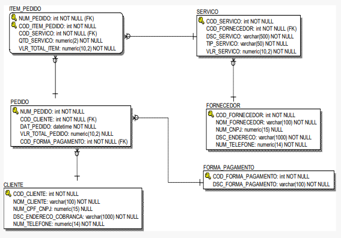
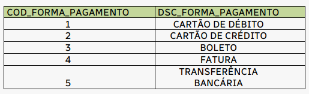

# Bootcamp: Analista de Banco de Dados  - Desafio do Módulo 2


## Objetivos de Ensino

### Exercitar os seguintes conceitos trabalhados no Módulo:


* **1. Modelo de dados relacional.**
* **2. Banco de dados relacional.**
* **3. Instruções da classe DDL para a criação de estruturas de dados.**
* **4. Instruções da classe DML para consultar, inserir, excluir e atualizar dados;**
* **5. Instruções da classe TCL para controlar transações;**
* **6. Instruções da classe DCL para conceder e revogar privilégios.**

## Enunciado:


**A XPE inaugurará, em breve, seu site de E-commerce para serviços
educacionais e necessita de uma aplicação que permita o cadastramento de
seus clientes e o controle dos serviços adquiridos por eles. A XPE trabalha
com vários fornecedores (parceiros), que oferecem diversos tipos de serviços,
como aulas particulares a distância, monitoria/tutoria/produção de conteúdo
para cursos rápidos, bootcamps, cursos de graduação, MBAs etc., bem como
consultoria para criação de conteúdo/produtos de ensino a distância. Um
mesmo fornecedor pode oferecer mais de um tipo de serviço. Quando um
cliente compra um serviço, é emitida uma nota de pedido relacionando todos
os serviços (produtos) que envolveram a transação e a forma de pagamento
selecionada pelo cliente.**
* **Para esse sistema, foi desenvolvido, inicialmente, o modelo de dados físico relacional a seguir:**



**A empresa lhe contratou como o(a) analista de banco de dados responsável
por implementar e gerenciar esse modelo de dados, construir as queries
demandadas pelos desenvolvedores e sanar as dúvidas da equipe do projeto
referentes à Linguagem SQL.**

<a name="ancora"></a>
### Os alunos deverão desempenhar as seguintes atividades:


* ## [Atividades.](#ancora0)
    * ### [Criar a conexão com o MySQL.](#ancora0.1)
    * ### [1-Gerar o script DDL para criar, no SQL Server, as respectivas estruturas de dados no banco BDecommerce.](#ancora1)
    * ### [2-Gerar o script DML para inserir dados fictícios em todas as tabelas do schema físico criado no item anterior.](#ancora2)
    
    * ### [3-Desenvolver uma query SQL para gerar uma lista única com os contatos(nome, endereço e telefone) de clientes e fornecedores, sem informações repetidas, ordenada alfabeticamente. Esse relatório deve conter as colunas com o label Nome da Pessoa, Endereço e Telefone.](#ancora3)
    * ### [4-Depois que a tabela  FORMA_PAGAMENTO já estava populada, a empresa solicitou a inclusão de mais uma coluna (IND_STATUS char(1) NOT NULL) para indicar se a forma de pagamento está disponível (‘D’) ou indisponível (‘I’). Desenvolva o script para as duas formas existentes para se incluir essa nova coluna sem ter que recriar a tabela, e considerando que todas as formas de pagamento atuais da tabela estão disponíveis.](#ancora4)
    * ### [5-A empresa solicitou que a coluna VLR_TOTAL_PEDIDO da tabela PEDIDO, que já se encontra populada, seja alterada para NOT NULL. Construa uma query DML com um SELECT para você executar previamente e verificar se o comando abaixo será concluído com sucesso ou não.](#ancora5)
            * ALTER TABLE PEDIDO
              ALTER COLUMN VLR_TOTAL_PEDIDO numeric (10,2) NOT NULL;
    
    * ### [6-Na consulta abaixo, criada por um desenvolvedor, ela deveria retornar 5 colunas, mas estão sendo retornadas 7 colunas. Foi solicitado que você corrija a query para apresentar as 5 colunas com os labels: COD_CLIENTE, NOME COMPLETO, CPF_CNPJ, DSC_ENDERECO_COBRANCA e AS CELULAR.](#ancora6)    
            *   SELECT COD_CLIENTE, NOM_CLIENTE, 'NOME COMPLETO',
                NUM_CPF_CNPJ CPF_CNPJ, DSC_ENDERECO_COBRANCA,
                NUM_TELEFONE, ‘CELULAR’
                FROM CLIENTE
                ORDER BY NOM_CLIENTE
                GO

    * ### [7-A empresa que te contratou solicitou que você explique o motivo pelo qual a query abaixo (para retornar os pedidos dos clientes) está dando erro de execução, e reescreva-a de forma que ela possa ser executada com sucesso.](#ancora7)
            *   SELECT C.NOM_CLIENTE AS "NOME DO CLIENTE", P.NUM_PEDIDO
                PEDIDO, P.DAT_PEDIDO AS "DATA DO PEDIDO",
                P.VLR_TOTAL_PEDIDO
                FROM CLIENTE C JOIN PEDIDO P
                ON C.COD_CLIENTE = P.COD_CLIENTE
                WHERE YEAR ("DATA DO PEDIDO") = '2020'
                ORDER BY "NOME DO CLIENTE";
    * ### [8-A empresa solicitou que você providencie uma query para listar todos os serviços e os respectivos fornecedores, ordenando essa lista alfabeticamente pelo nome do fornecedor e descendentemente pelo valor do serviço. A lista deve possuir as colunas NOM_FORNECEDOR, NUM_TELEFONE, DSC_SERVICO, TIP_SERVICO e VLR_SERVICO. Foi solicitado também que a query use o padrão ANSI-92 para relacionar as tabelas.](#ancora8)
    
    * ### [9- A empresa irá fazer uma enxugada no portfólio atual, de forma que consiga oferecer novos serviços que estão sendo criados pelos fornecedores. Para isso, ela precisa que você elabore uma query que liste os serviços que nunca foram vendidos, ou que tiveram um total de vendas menor que 5 em 2019. O relatório precisa conter as colunas DSC_SERVICO, TIP_SERVICO, VLR_SERVICO e NOM_FORNECEDOR. Foi solicitado que a query, neste caso, use padrão ANSI-89 para relacionar as tabelas.](#ancora9)
    
    * ### [10-Devido a algum problema na aplicação, alguns pedidos estão sem o valor total do pedido (coluna VLR_TOTAL_PEDIDO da tabela PEDIDO está nula), ou com valor calculado erroneamente (deveria ser a soma de todos os valores, do mesmo pedido, da coluna VLR_TOTAL_ITEM da tabela ITEM_PEDIDO). A empresa solicita que você desenvolva uma query para listar os pedidos que estão com esse problema. A query deve retornar as colunas NUM_PEDIDO, DAT_PEDIDO e VLR_TOTAL_PEDIDO. A empresa também solicita que você escreva a query para atualizar a coluna VLR_TOTAL_PEDIDO de forma correta.](#ancora10)
    
    * ### [11-Foi identificado um problema no modelo de dados original, no qual a coluna NUM_CPF_CNPJ da tabela CLIENTE foi criada de forma a aceitar nulo. Com o intuito de verificar o tamanho do problema, a empresa solicitou a um de seus desenvolvedores que elaborasse uma query para listar o percentual de clientes cadastrados que estão sem essa informação. O desenvolvedor criou a query abaixo:](#ancora11)
            * SELECT CAST
            (
            ( SELECT CAST(COUNT (NUM_CPF_CNPJ) AS numeric (3,2))
            FROM CLIENTE WHERE NUM_CPF_CNPJ IS NULL
            )
            /
            ( SELECT CAST(COUNT (NUM_CPF_CNPJ) AS numeric (3,2))
            FROM CLIENTE
            ) * 100 AS int
            ) AS "Percentual de Clientes sem Informação de Documento"
            A empresa constatou que não há nenhum erro de sintaxe na query, mas
            solicitou sua consultoria para informar se a query calculará o percentual
            de clientes cadastrados sem CPF/CNPJ de forma correta. Em caso
            negativo, ela solicita que você forneça a query com o ajuste necessário.
    
    * ### [12-.Foi feita uma regulamentação nova para sistemas de venda de serviços on-line, onde todas as informações disponibilizadas para os clientes no site devem ser exibidas em letras MAIÚSCULAS. A alteração na camada da aplicação para os novos dados serem inseridos já foi feita, mas é preciso tratar o backlog das informações que já se encontravam persistidas no banco de dados. De acordo com o modelo de dados, existem 7 colunas do tipo string que precisam ter os dados alterados para maiúsculo. O desenvolvedor informou que seriam necessários 7 comandos DML para fazer essa alteração, mas você disse que consegue otimizar para fazer com 4 comandos. Quais seriam esses 4 comandos?](#ancora12)
    
    * ### [13-A empresa precisará de um relatório que liste a quantidade de itens vendidos mensalmente e o valor total desses itens por fornecedor, no ano corrente. Todos os fornecedores devem estar listados, mesmo se ainda não tiver nenhum produto vendido. Selecione as instruções abaixo que serão necessárias para essa query e coloque-as na devida ordem.](#ancora13)
            * GROUP BY F.NOM_FORNECEDOR, P.DAT_PEDIDO
             SELECT F.NOM_FORNECEDOR, MONTH(P.DAT_PEDIDO) AS MÊS,
             SUM(I.QTD_SERVICO) AS "TOTAL DE ITENS",
             LEFT JOIN SERVICO S
             GROUP BY F.NOM_FORNECEDOR
             FROM FORNECEDOR F
             COUNT(I.QTD_SERVICO) AS "TOTAL DE ITENS",
             ON I.NUM_PEDIDO = P.NUM_PEDIDO
             INNER JOIN SERVICO S
             ORDER BY F.NOM_FORNECEDOR
             GROUP BY F.NOM_FORNECEDOR, MONTH (P.DAT_PEDIDO)
             JOIN ITEM_PEDIDO I
             ON S.COD_SERVICO = I.COD_SERVICO
             SUM(I.VLR_TOTAL_ITEM) AS "VALOR TOTAL"
             ON F.COD_FORNECEDOR = S.COD_FORNECEDOR
             JOIN PEDIDO P
             RIGHT JOIN PEDIDO P
             WHERE YEAR(P.DAT_PEDIDO) = YEAR(GETDATE())
             HAVING YEAR(P.DAT_PEDIDO) = YEAR(GETDATE())
    
    * ### [14-Para retornar a lista de clientes que não fizeram pedidos, foi construída a query abaixo.](#ancora14)       
          * SELECT NOM_CLIENTE, NUM_TELEFONE
            FROM CLIENTE
            WHERE COD_CLIENTE NOT IN (SELECT COD_CLIENTE FROM PEDIDO)
            ORDER BY NOM_CLIENTE;                
            A empresa solicita sua consultoria para informar se a query em questão
            atende ao requisito (listar clientes que não fizeram pedidos), se há uma
            forma mais otimizada de obter o mesmo resultado e qual seria essa query.        
        
    * ### [15-Foi encontrada a query abaixo no código da aplicação e a empresa está solicitando sua ajuda para identificar o que essa query faz. Em adição, informe uma query mais otimizada para atingir o mesmo resultado,sem utilizar uma subconsulta correlacionada ou multivalorada.](#ancora15)
          * SELECT C.NOM_CLIENTE, C.NUM_TELEFONE
            FROM CLIENTE C
            WHERE EXISTS (
            SELECT P.COD_CLIENTE
            FROM PEDIDO P
            WHERE P.COD_CLIENTE = C.COD_CLIENTE
            )
            ORDER BY C.NOM_CLIENTE;
            A empresa solicitou que você elabore uma query para gerar uma cópia dos
            dados da tabela ITEM_PEDIDO. Essa tabela com a cópia dos dados deve se
            chamar TMP_ITEM_PEDIDO.
                    
    * ### [16-A empresa solicitou que você elabore uma query para excluir os clientes que estão cadastrados no banco de dados, mas que não fizeram nenhum pedido.](#ancora16)
    
    * ### [17. Foi solicitado que você gere uma query para inserir os dados abaixo na tabela FORMA_PAGAMENTO, que funcione independentemente da ordem que as colunas foram criadas.](#ancora17)
    
    
    * ### [18-Dado o código abaixo:](#ancora18)
          *  BEGIN TRANSACTION Transacao1
            INSERT INTO FORMA_PAGAMENTO
            (COD_FORMA_PAGAMENTO, DSC_FORMA_PAGAMENTO)
            VALUES (1, 'CARTÃO DE DÉBITO');
            BEGIN TRANSACTION Transacao2
            INSERT INTO FORMA_PAGAMENTO
            (COD_FORMA_PAGAMENTO, DSC_FORMA_PAGAMENTO)
            VALUES (2, 'CARTÃO DE CRÉDITO');
            SELECT * FROM FORMA_PAGAMENTO ORDER BY 1;
            COMMIT TRANSACTION Transacao2
            INSERT INTO FORMA_PAGAMENTO
            (COD_FORMA_PAGAMENTO, DSC_FORMA_PAGAMENTO)
            VALUES (3, 'BOLETO');
            SELECT @@TRANCOUNT AS 'PRIMEIRA CONTAGEM';
            SELECT *
            FROM FORMA_PAGAMENTO
            ORDER BY DSC_FORMA_PAGAMENTO;
            COMMIT TRANSACTION Transacao1
            INSERT INTO FORMA_PAGAMENTO
            (COD_FORMA_PAGAMENTO, DSC_FORMA_PAGAMENTO)
            VALUES (4, 'FATURA');
            SELECT @@TRANCOUNT AS 'SEGUNDA CONTAGEM';
            SELECT * FROM FORMA_PAGAMENTO;
            **Informe quais os dados serão retornados para cada um dos comandos**
            SELECT executados dentro da query acima:
            • SELECT * FROM FORMA_PAGAMENTO ORDER BY 1 
            • SELECT @@TRANCOUNT AS 'PRIMEIRA CONTAGEM' 
            • SELECT * FROM FORMA_PAGAMENTO
            o ORDER BY DSC_FORMA_PAGAMENTO
            • SELECT @@TRANCOUNT AS 'SEGUNDA CONTAGEM' 
            • SELECT * FROM FORMA_PAGAMENTO 
            
    * ### [19-Após a execução do bloco SQL abaixo, quantas linhas de fato serão inseridas na tabela FORMA_PAGAMENTO?](#ancora19)
            *  BEGIN TRANSACTION Transacao1
            INSERT INTO FORMA_PAGAMENTO
            (COD_FORMA_PAGAMENTO, DSC_FORMA_PAGAMENTO)
            VALUES (199, 'CARTÃO DE DÉBITO');
            BEGIN TRANSACTION Transacao2
            INSERT INTO FORMA_PAGAMENTO
            (COD_FORMA_PAGAMENTO, DSC_FORMA_PAGAMENTO)
            VALUES (299, 'CARTÃO DE CRÉDITO');
            COMMIT TRANSACTION Transacao2
            INSERT INTO FORMA_PAGAMENTO
            (COD_FORMA_PAGAMENTO, DSC_FORMA_PAGAMENTO)
            VALUES (399, 'BOLETO');
            ROLLBACK
            COMMIT TRANSACTION Transacao1
            INSERT INTO FORMA_PAGAMENTO
            (COD_FORMA_PAGAMENTO, DSC_FORMA_PAGAMENTO)
            VALUES (499, 'FATURA')
            
    * ### [20-Foi solicitada a você a criação de um objeto de código compilado (uma procedure) para fazer a inserção de dados na tabela CLIENTE de forma que os dados sejam passados como parâmetros. Forneça o código DDL para a criação dessa procedure, de nome SP_INSERE_CLIENTE, e o exemplo de execução dela.](#ancora20)    
    
    * ### [21..A empresa solicitou que você construa o script DCL de forma que o usuário da aplicação de nome UserApp tenha permissão para selecionar, inserir, atualizar e excluir dados de todas as tabelas, mas não tenha permissão de inserção direta na tabela CLIENTE (para inserir dados de cliente, o usuário deverá usar uma procedure, de nome SP_INSERE_CLIENTE). Forneça os comandos que devem estar nesse script DCL.](#ancora21)
    
    

## Contexto.
<a id="ancora1"></a>
[voltar](#ancora).

* As tabelas Titulo e Titulo_Detalhe permitem armazenar informações básicas e técnicas sobre as produções, enquanto as tabelas Avaliacao, Direcao, Autoria e Elenco permitem armazenar informações específicas sobre os aspectos críticos, direção e elenco de cada produção.
* A tabela Pessoa é importante para garantir a integridade dos dados, pois permite que todas as pessoas envolvidas na produção sejam identificadas de maneira única.
* Além disso, é importante estabelecer relações adequadas entre as tabelas para garantir a integridade dos dados e a consistência do modelo de dados. Por exemplo, a tabela Direcao deve ter uma relação com a tabela Titulo para indicar quais diretores estão associados a quais produções, e a tabela Pessoa deve ter uma relação com as tabelas Direcao, Autoria e Elenco para identificar as pessoas envolvidas na produção.

## Atividades:
<a id="ancora3"></a>
[voltar](#ancora).

###  **Criar a conexão com o MySQL.**  
<a id="ancora0.1"></a>
[voltar](#ancora).


```python
#importação das bibliotecas para conexão 1
import mysql.connector
import pandas as pd
import warnings
warnings.filterwarnings('ignore')
```

###  **1.Solução .**
<a id="ancora1"></a>
[voltar](#ancora).


```python
# Excluír o banco de dados.
drop_bd='''
DROP DATABASE e-commerce-xpe;'''
cursor.execute(drop_bd)
cursor.execute('SHOW databases')
for i in cursor:
    if 'bdproducoes' in i:
        print(i)
```


```python
# Criando o banco de dados e-commerce-xpe e conferindo se o bd foi criado;
criar='''CREATE SCHEMA IF NOT EXISTS `e-commerce-xpe` ;'''
con = mysql.connector.connect(host='localhost',user='julio',password='')
cursor = con.cursor()
cursor.execute(criar)
cursor.execute('SHOW databases')
for i in cursor:
    if 'e-commerce-xpe' in i:
        print(i)
```

    ('e-commerce-xpe',)
    


```python
# Conectando ao database e-commerce-xpe recém criada
con = mysql.connector.connect(host='localhost',database='e-commerce-xpe',user='julio',password='')
cursor = con.cursor()
```

#### CRIANDO A TABELA CLIENTE


```python
# Criando a tabela de CLIENTE;
criar='''
CREATE TABLE IF NOT EXISTS CLIENTE (
  COD_CLIENTE INT NOT NULL,
  NOM_CLIENTE VARCHAR(100) NOT NULL,
  NUM_CPF_CNPJ DECIMAL(15) NULL,
  DSC_ENDERECO_COBRANCA VARCHAR(1000) NOT NULL,
  NUM_TELEFONE DECIMAL(14) NOT NULL,
  PRIMARY KEY (COD_CLIENTE))
ENGINE = InnoDB;
'''
cursor.execute(criar)
cursor.execute('SHOW tables')
for i in cursor:
  print(i)
```

    ('cliente',)
    

#### CRIANDO A TABELA FORMA_PAGAMENTO


```python
# Criando a tabela de FORMA_PAGAMENTO;
criar='''
CREATE TABLE IF NOT EXISTS FORMA_PAGAMENTO (
  COD_FORMA_PAGAMENTO INT NOT NULL,
  DSC_FORMA_PAGAMENTO VARCHAR(100) NOT NULL,
  PRIMARY KEY (COD_FORMA_PAGAMENTO))
ENGINE = InnoDB;
'''
cursor.execute(criar)
cursor.execute('SHOW tables')
for i in cursor:
  print(i)
```

    ('cliente',)
    ('forma_pagamento',)
    

#### CRIANDO A TABELA PEDIDO


```python
# Criando a tabela de PEDIDO;
criar='''
CREATE TABLE IF NOT EXISTS PEDIDO (
  NUM_PEDIDO VARCHAR(45) NOT NULL,
  COD_CLIENTE_FK INT NOT NULL,
  DAT_PEDIDO DATE NOT NULL,
  VLR_TOTAL_PEDIDO DECIMAL(10,2) NULL,
  COD_FORMA_PAGAMENTO_FK INT NOT NULL,
  PRIMARY KEY (NUM_PEDIDO),  
  CONSTRAINT fk_PEDIDO_CLIENTE
  FOREIGN KEY (COD_CLIENTE_FK)
    REFERENCES CLIENTE (COD_CLIENTE),    
  CONSTRAINT fk_PEDIDO_FORMA_PAGAMENTO
    FOREIGN KEY (COD_FORMA_PAGAMENTO_FK)
    REFERENCES FORMA_PAGAMENTO (COD_FORMA_PAGAMENTO))    
ENGINE = InnoDB;'''
cursor.execute(criar)
cursor.execute('SHOW tables')
for i in cursor:
  print(i)
```

    ('cliente',)
    ('forma_pagamento',)
    ('pedido',)
    

#### CRIANDO A TABELA FORNECEDOR


```python
# Criando a tabela de FORNCECEDOR;
criar='''
CREATE TABLE IF NOT EXISTS FORNECEDOR (
  COD_FORNECEDOR INT NOT NULL,
  NOM_FORNECEDOR VARCHAR(100) NOT NULL,
  NUM_CNPJ DECIMAL(15) NULL,
  DSC_ENDERECO VARCHAR(1000) NOT NULL,
  NUM_TELEFONE DECIMAL(14) NOT NULL,
  PRIMARY KEY (COD_FORNECEDOR))
ENGINE = InnoDB;
'''
cursor.execute(criar)
cursor.execute('SHOW tables')
for i in cursor:
  print(i)
```

    ('cliente',)
    ('forma_pagamento',)
    ('fornecedor',)
    ('pedido',)
    

#### CRIANDO A TABELA SERVICO


```python
# Criando a tabela de SERVICO;
criar='''
CREATE TABLE IF NOT EXISTS SERVICO (
  COD_SERVICO INT NOT NULL,
  COD_FORNECEDOR_FK INT NOT NULL,
  DSC_SERVICO VARCHAR(500) NOT NULL,
  TIP_SERVICO VARCHAR(50) NOT NULL,
  VLR_SERVICO DECIMAL(10,2) NOT NULL,
  PRIMARY KEY (COD_SERVICO),  
  CONSTRAINT fk_SERVICO_FORNECEDOR
    FOREIGN KEY (COD_FORNECEDOR_FK)
    REFERENCES FORNECEDOR (COD_FORNECEDOR))
ENGINE = InnoDB;
'''
cursor.execute(criar)
cursor.execute('SHOW tables')
for i in cursor:
  print(i)
```

    ('cliente',)
    ('forma_pagamento',)
    ('fornecedor',)
    ('pedido',)
    ('servico',)
    

#### CRIANDO A TABELA ITEM_PEDIDO


```python
# Criando a tabela de ITEM_PEDIDO;
criar='''
CREATE TABLE IF NOT EXISTS ITEM_PEDIDO (
  NUM_PEDIDO_FK VARCHAR(45) NOT NULL,
  COD_ITEM_PEDIDO INT NOT NULL,
  COD_SERVICO_FK INT NOT NULL,
  QTD_SERVICO DECIMAL(2) NOT NULL,
  VLR_TOTAL_ITEM DECIMAL(10,2) NOT NULL,
  PRIMARY KEY (NUM_PEDIDO_FK, COD_ITEM_PEDIDO),  
  CONSTRAINT fk_ITEM_PEDIDO_SERVICO
    FOREIGN KEY (COD_SERVICO_FK)
    REFERENCES SERVICO (COD_SERVICO),    
  CONSTRAINT fk_ITEM_PEDIDO_PEDIDO
    FOREIGN KEY (NUM_PEDIDO_FK)
    REFERENCES PEDIDO (NUM_PEDIDO))
ENGINE = InnoDB;
'''
cursor.execute(criar)
cursor.execute('SHOW tables')
for i in cursor:
  print(i)
```

    ('cliente',)
    ('forma_pagamento',)
    ('fornecedor',)
    ('item_pedido',)
    ('pedido',)
    ('servico',)
    

###  **2.Solução .**
<a id="ancora2"></a>
[voltar](#ancora).

###  **3.Solução.**
<a id="ancora3"></a>
[voltar](#ancora).

###  **4.Solução .**
<a id="ancora4"></a>
[voltar](#ancora).

###  **5.Solução .**
<a id="ancora5"></a>
[voltar](#ancora).

**Nota: No exemplo acima, o valor padrão de ind_status é 'A', o que significa "ativo".**

###  **6.Solução .**
<a id="ancora6"></a>
[voltar](#ancora).

### **7.Solução .** 
<a id="ancora7"></a>
[voltar](#ancora).

### **9.Solução .**
<a id="ancora9"></a>
[voltar](#ancora).

###  **10.Solução .**
<a id="ancora10"></a>
[voltar](#ancora).

###  **11.Solução .**
<a id="ancora11"></a>
[voltar](#ancora).

###  **12.Solução .**
<a id="ancora12"></a>
[voltar](#ancora).

###  **13.Solução .**
<a id="ancora13"></a>
[voltar](#ancora).


```python
# Criando a tabela de Pessoa;
Altera='''
ALTER TABLE Pessoa
MODIFY COLUMN nom_pessoa VARCHAR(1000);'''
cursor.execute(Altera)
cursor.execute('desc pessoa')
for i in cursor:
  print(i)
```

    ('cod_pessoa', b'int', 'NO', bytearray(b'PRI'), None, '')
    ('nom_pessoa', b'varchar(1000)', 'YES', bytearray(b''), None, '')
    ('ano_nascimento', b'int', 'YES', bytearray(b''), None, '')
    ('ano_falescimento', b'int', 'YES', bytearray(b''), None, '')
    ('dsc_profissao', b'varchar(1000)', 'YES', bytearray(b''), None, '')
    

###  **14.Solução .**
<a id="ancora14"></a>
[voltar](#ancora).

###  **15.Solução .**
<a id="ancora15"></a>
[voltar](#ancora).

### **16.Solução .** 
<a id="ancora16"></a>
[voltar](#ancora).

### **17.Solução .**
<a id="ancora17"></a>
[voltar](#ancora).

### **18.Solução .**
<a id="ancora18"></a>
[voltar](#ancora).

###  **19.Solução .**
<a id="ancora19"></a>
[voltar](#ancora).

###  **20.Solução .**
<a id="ancora20"></a>
[voltar](#ancora).

###  **21.Solução .**
<a id="ancora21"></a>
[voltar](#ancora).
