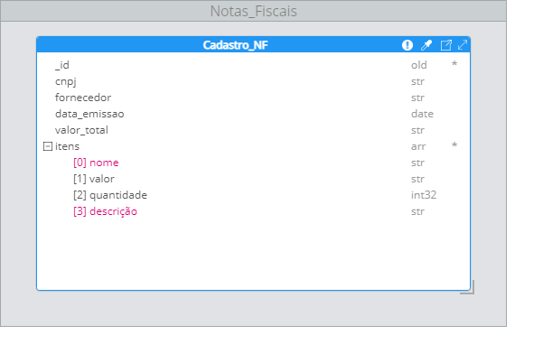
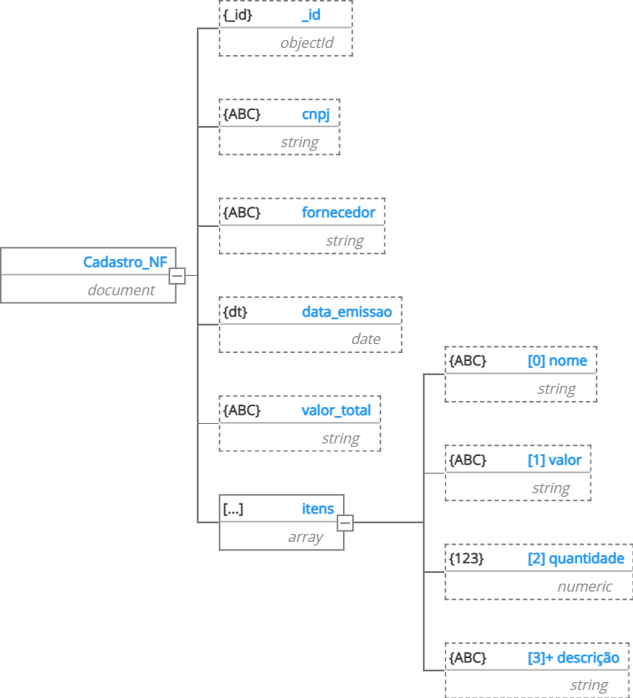
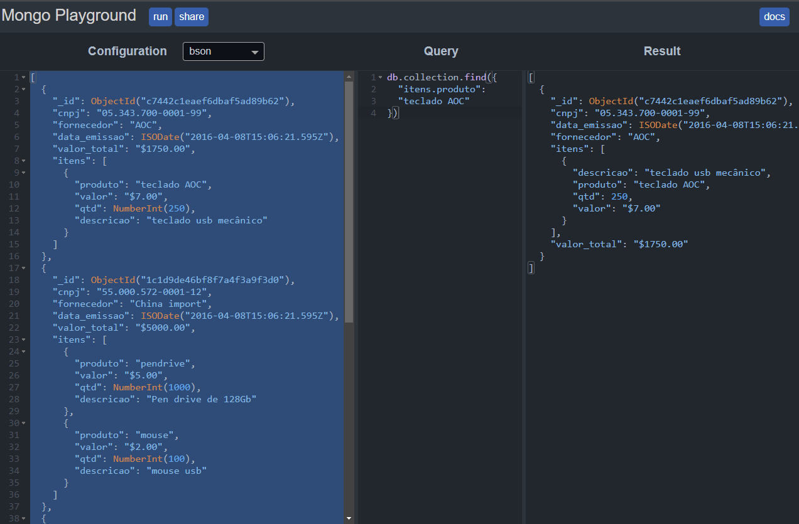
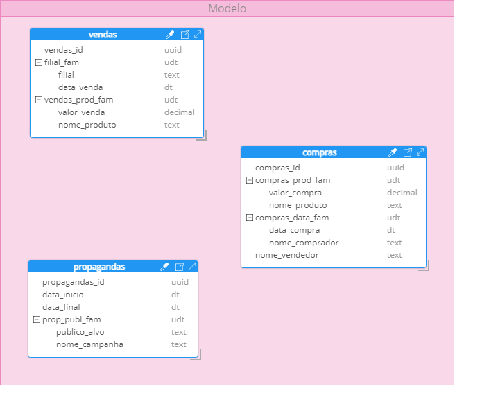
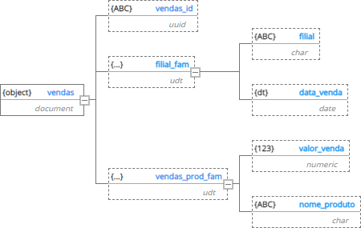
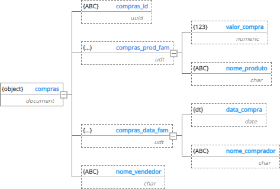
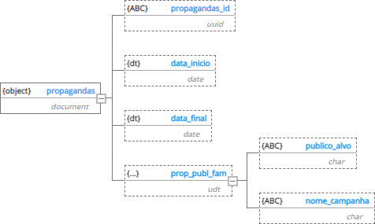

# Bootcamp: Analista de Banco de Dados

# Trabalho Desafio1: Fundamentos de Banco de Dados

## Objetivos de Ensino

* **Exercitar os seguintes conceitos trabalhados no Módulo:**

    * *Realizar o levantamento de requisitos e modelagem de Bancos de Dados NoSQL.*
    * *Desenhar o Projeto de Bancos de Dados de Documentos.*
    * *Desenhar o Projeto de Bancos de dados Colunares.*


## Enunciado:

### **Considere as duas demandas de negócio de uma empresa no segmento de comércio eletrônico:**

  * **Projeto 01 – Criar um sistema de envio e recebimento de notas fiscais da empresa, 
  cuja necessidade de gravação é transformar a estrutura original, em json, para outro formato, 
  e que seja possível recuperar as notas através de pesquisas por sua descrição ou produto, 
  ou seja, todo o conteúdo da nota sempre será recuperado quando as consultas são realizadas. 
  Para esse requisito, identificou-se uma probabilidade de modelo de dados orientado a documento 
  para armazenar os arquivos json e pesquisá-los. Você, como analista, deve analisar essa demanda 
  considerando as seguintes informações de nota que devem ser armazenadas:**
    * CNPJ.
    * Fornecedor.
    * Data de emissão.
    * Valor total da nota.
    * Nome de cada item da nota.
    * Valor de cada item da nota.
    * Quantidade de cada item da nota.
    * Descrição de cada item da nota.
    
  *Obs.:*Lembrando que cada nota contém no mínimo um item, mas pode conter vários.*
  * *Desenvolva o modelo adequado a essa demanda e responda as perguntas a seguir.*


  *#####################################################################################################
    
    
  * **Projeto 02 – Criar um sistema analítico, com massivo processamento de
    consultas aos dados, com poucos momentos de inserção e sem atualizações nos
    dados, ou seja, um sistema de relatórios. Sabe-se que a carga de dados será
    responsabilidade de outro setor, mas considerando que os relatórios são distintos
    entre si, existe uma sinalização de um modelo de dados colunar para atendimento
    dessa demanda. Sua atuação como analista é descrever esse modelo de modo a
    permitir o melhor desempenho possível das consultas. Sabe-se que temos as
    seguintes informações:**
    * Vendas:
        * i. Valor de uma venda.
        * ii. Nome do produto vendido.
        * iii. Data da venda.
        * iv. Filial.
    * Compras:
        * v. Valor de uma compra.
        * vi. Produto comprado.
        * vii. Nome do vendedor.
        * viii. Nome do comprador.
    * Propagandas:
        * ix. Nome da campanha.
        * x. Data de início da campanha.
        * xi. Data de finalização da campanha.
        * xii. Público-alvo.

  * *Em vendas, os dados utilizados em conjunto são valor e nome do produto, bem
    como filial e data de venda.*
  * *Em compras, o valor da compra é exibido sempre junto com o nome do produto,
    bem como data da venda e comprador.*
  * *Em propagandas, é importante exibir nome da campanha e público alvo sempre
    juntos.*   


## Atividades:

### **Os alunos deverão desempenhar as seguintes atividades:**
    
    * **1. Elaborar o Modelo de Dados de Documentos para o Projeto 01.**
    * **2. Elaborar o Modelo de Dados Colunar para o Projeto 02.**
    * **3. Analisar os modelos para responder às questões.**

## Resolução: Projeto01

###  **Levantamento de requisitos e modelagem:**

* **Os seguintes campos devem ser incluídos no modelo de dados:**
    * Id
    * CNPJ
    * Fornecedor
    * Data de emissão    
    * Valor total da nota
    * Itens
        * Nome
        * Valor
        * Quantidade
        * Descrição

### Modelo ER



### Schema:




```python
#JSON para teste
{   
      {
        "_id": ObjectId("c7442c1eaef6dbaf5ad89b62"),
        "cnpj": "05.343.700-0001-99",
        "fornecedor": "AOC",
        "data_emissao": ISODate("2016-04-08T15:06:21.595Z"),
        "valor_total": "$1750.00",
        "itens": [
                  {
                    "produto": "teclado AOC",
                    "valor": "$7.00",
                    "qtd": NumberInt(250),
                    "descricao": "teclado usb mecânico"
                  }
                ]
       },
      {
        "_id": ObjectId("1c1d9de46bf8f7a4f3a9f3d0"),
        "cnpj": "55.000.572-0001-12",
        "fornecedor": "China import",
        "data_emissao": ISODate("2016-04-08T15:06:21.595Z"),
        "valor_total": "$5200.00",
        "itens": [
                  {
                    "produto": "pendrive",
                    "valor": "$5.00",
                    "qtd": NumberInt(1000),
                    "descricao": "Pen drive de 128Gb"
                  },
                  {
                    "produto": "mouse",
                    "valor": "$2.00",
                    "qtd": NumberInt(100),
                    "descricao": "mouse usb"
                  }
                ]
      },
      {
        "_id": ObjectId("c7dfb5336d711c28808d8d5c"),
        "cnpj": "20.555.314-0001-18",
        "fornecedor": "Jcnok importações",
        "data_emissao": ISODate("2016-04-08T15:06:21.595Z"),
        "valor_total": "$2000.00",
        "itens": [
                  {
                    "produto": "carteira",
                    "valor": "$10.00",
                    "qtd": NumberInt(200),
                    "descricao": "carteira de bolso masculina"
                  }
                ]
      },
      {
        "_id": ObjectId("d88aadfcffaf23a838c0bf0a"),
        "cnpj": "74.356.186-0001-89",
        "fornecedor": "Shoppii",
        "data_emissao": ISODate("2016-04-08T15:06:21.5950Z"),
        "valor_total": "$1914.00",
        "itens": [
                  {
                    "produto": "relógio",
                    "valor": "$19.14",
                    "qtd": NumberInt(100),
                    "descricao": "relógio de parede"
                  }
                ]
      },   
 }

```

### Queries realizadas no simulator mongo playground:



### Conexão Mongodb com pymongo

### Acessando o banco de dados que foi criado no exercício projeto01 para realizar consultas basicas.

* **Para que possamos trabalhar com o MongoDB em Python precisamos instalar o driver PyMongo, para isso utilizaremos o PIP. Vamos então executar o seguinte comando:**
    * *pip install pymongo*
    
* **O Mongodb já foi previamente instalado utilizando a porta padrão sem configurações de usuário e senha.**


```python
# importando a lib pymongo e realizando a conexão como bando de dados mongodb.
from pymongo import MongoClient
client = MongoClient("mongodb://localhost:27017/")
```


```python
#lista o banco de dados
print(client.list_database_names()) # ['local', 'admin']
```

    ['NF', 'admin', 'config', 'julio', 'local', 'nota_fiscal', 'teste']
    


```python
# Conectando ao banco de dados nota_fiscal
db = client.nota_fiscal
```


```python
# mostra a conexão com nota_fiscal.
print(db)
```

    Database(MongoClient(host=['localhost:27017'], document_class=dict, tz_aware=False, connect=True), 'nota_fiscal')
    


```python
# exibe o nome do documento criado
print(db.list_collection_names())

```

    ['cadastro_nf']
    


```python
# conexão com o documento
colect = db['cadastro_nf']
```


```python
# acesso aos itens do documento
for itens in colect.find():
    print(itens)
```

    {'_id': ObjectId('c7442c1eaef6dbaf5ad89b62'), 'cnpj': '05.343.700-0001-99', 'fornecedor': 'AOC', 'data_emissao': datetime.datetime(2016, 4, 8, 15, 6, 21, 595000), 'valor_total': '$1750.00', 'itens': [{'produto': 'teclado AOC', 'valor': '$7.00', 'qtd': 250, 'descricao': 'teclado usb mecânico'}]}
    {'_id': ObjectId('1c1d9de46bf8f7a4f3a9f3d0'), 'cnpj': '55.000.572-0001-12', 'fornecedor': 'China import', 'data_emissao': datetime.datetime(2016, 4, 8, 15, 6, 21, 595000), 'valor_total': '$5000.00', 'itens': [{'produto': 'pendrive', 'valor': '$5.00', 'qtd': 1000, 'descricao': 'Pen drive de 128Gb'}, {'produto': 'mouse', 'valor': '$2.00', 'qtd': 100, 'descricao': 'mouse usb'}]}
    {'_id': ObjectId('c7dfb5336d711c28808d8d5c'), 'cnpj': '20.555.314-0001-18', 'fornecedor': 'Jcnok importações', 'data_emissao': datetime.datetime(2016, 4, 8, 15, 6, 21, 595000), 'valor_total': '$2000.00', 'itens': [{'produto': 'carteira', 'valor': '$10.00', 'qtd': 200, 'descricao': 'carteira de bolso masculina'}]}
    {'_id': ObjectId('d88aadfcffaf23a838c0bf0a'), 'cnpj': '74.356.186-0001-89', 'fornecedor': 'Shoppii', 'data_emissao': datetime.datetime(2016, 4, 8, 15, 6, 21, 595000), 'valor_total': '$1914.00', 'itens': [{'produto': 'relógio', 'valor': '$19.14', 'qtd': 100, 'descricao': 'relógio de parede'}]}
    


```python
for item in colect.find({'itens.produto':"teclado AOC"}):
    print(item)
```

    {'_id': ObjectId('c7442c1eaef6dbaf5ad89b62'), 'cnpj': '05.343.700-0001-99', 'fornecedor': 'AOC', 'data_emissao': datetime.datetime(2016, 4, 8, 15, 6, 21, 595000), 'valor_total': '$1750.00', 'itens': [{'produto': 'teclado AOC', 'valor': '$7.00', 'qtd': 250, 'descricao': 'teclado usb mecânico'}]}
    


```python
#importando a lib pandas para conversão em dataset
import pandas as pd 
```


```python
# exibindo a query em um dataset para melhor entendimento.
for item in colect.find({'itens.produto':"pendrive"}):
    df = pd.DataFrame(item)
df.T
```


<div>
<style scoped>
    .dataframe tbody tr th:only-of-type {
        vertical-align: middle;
    }

    .dataframe tbody tr th {
        vertical-align: top;
    }

    .dataframe thead th {
        text-align: right;
    }
</style>
<table border="1" class="dataframe">
  <thead>
    <tr style="text-align: right;">
      <th></th>
      <th>0</th>
      <th>1</th>
    </tr>
  </thead>
  <tbody>
    <tr>
      <th>_id</th>
      <td>1c1d9de46bf8f7a4f3a9f3d0</td>
      <td>1c1d9de46bf8f7a4f3a9f3d0</td>
    </tr>
    <tr>
      <th>cnpj</th>
      <td>55.000.572-0001-12</td>
      <td>55.000.572-0001-12</td>
    </tr>
    <tr>
      <th>fornecedor</th>
      <td>China import</td>
      <td>China import</td>
    </tr>
    <tr>
      <th>data_emissao</th>
      <td>2016-04-08 15:06:21.595000</td>
      <td>2016-04-08 15:06:21.595000</td>
    </tr>
    <tr>
      <th>valor_total</th>
      <td>$5000.00</td>
      <td>$5000.00</td>
    </tr>
    <tr>
      <th>itens</th>
      <td>{'produto': 'pendrive', 'valor': '$5.00', 'qtd...</td>
      <td>{'produto': 'mouse', 'valor': '$2.00', 'qtd': ...</td>
    </tr>
  </tbody>
</table>
</div>


```python
# exibindo os itens.
df.itens.to_list() 
```


    [{'produto': 'pendrive',
      'valor': '$5.00',
      'qtd': 1000,
      'descricao': 'Pen drive de 128Gb'},
     {'produto': 'mouse', 'valor': '$2.00', 'qtd': 100, 'descricao': 'mouse usb'}]


```python
# Exibindo os itens em um dataframe.
pd.DataFrame(df.itens.to_dict() )
```


<div>
<style scoped>
    .dataframe tbody tr th:only-of-type {
        vertical-align: middle;
    }

    .dataframe tbody tr th {
        vertical-align: top;
    }

    .dataframe thead th {
        text-align: right;
    }
</style>
<table border="1" class="dataframe">
  <thead>
    <tr style="text-align: right;">
      <th></th>
      <th>0</th>
      <th>1</th>
    </tr>
  </thead>
  <tbody>
    <tr>
      <th>produto</th>
      <td>pendrive</td>
      <td>mouse</td>
    </tr>
    <tr>
      <th>valor</th>
      <td>$5.00</td>
      <td>$2.00</td>
    </tr>
    <tr>
      <th>qtd</th>
      <td>1000</td>
      <td>100</td>
    </tr>
    <tr>
      <th>descricao</th>
      <td>Pen drive de 128Gb</td>
      <td>mouse usb</td>
    </tr>
  </tbody>
</table>
</div>


### Insert


```python
json = {
        "_id": "12345678910",
        "cnpj": "05.400.700-0001-99",
        "fornecedor": "Logitech",
        "data_emissao": "2023-01-27",
        "valor_total": "$1750.00",
        "itens": [
                  {
                    "produto": "webcam",
                    "valor": "$50.00",
                    "qtd": 1,
                    "descricao": "webcam C270 HD"
                  }
                ]
       }
```


```python
inserir = colect.insert_one(json)
print(inserir)
```

    <pymongo.results.InsertOneResult object at 0x000001C278C38340>
    


```python
# exibindo a query do registro inserido em um dataset para melhor entendimento.
for item in colect.find({'itens.produto':"webcam"}):
    df = pd.DataFrame(item)
df.T
```


<div>
<style scoped>
    .dataframe tbody tr th:only-of-type {
        vertical-align: middle;
    }

    .dataframe tbody tr th {
        vertical-align: top;
    }

    .dataframe thead th {
        text-align: right;
    }
</style>
<table border="1" class="dataframe">
  <thead>
    <tr style="text-align: right;">
      <th></th>
      <th>0</th>
    </tr>
  </thead>
  <tbody>
    <tr>
      <th>_id</th>
      <td>12345678910</td>
    </tr>
    <tr>
      <th>cnpj</th>
      <td>05.400.700-0001-99</td>
    </tr>
    <tr>
      <th>fornecedor</th>
      <td>Logitech</td>
    </tr>
    <tr>
      <th>data_emissao</th>
      <td>2023-01-27</td>
    </tr>
    <tr>
      <th>valor_total</th>
      <td>$1750.00</td>
    </tr>
    <tr>
      <th>itens</th>
      <td>{'produto': 'webcam', 'valor': '$50.00', 'qtd'...</td>
    </tr>
  </tbody>
</table>
</div>


```python
# Exibindo os itens do registro inserido em um dataframe.
pd.DataFrame(df.itens.to_dict() )
```


<div>
<style scoped>
    .dataframe tbody tr th:only-of-type {
        vertical-align: middle;
    }

    .dataframe tbody tr th {
        vertical-align: top;
    }

    .dataframe thead th {
        text-align: right;
    }
</style>
<table border="1" class="dataframe">
  <thead>
    <tr style="text-align: right;">
      <th></th>
      <th>0</th>
    </tr>
  </thead>
  <tbody>
    <tr>
      <th>descricao</th>
      <td>webcam C270 HD</td>
    </tr>
    <tr>
      <th>produto</th>
      <td>webcam</td>
    </tr>
    <tr>
      <th>qtd</th>
      <td>1</td>
    </tr>
    <tr>
      <th>valor</th>
      <td>$50.00</td>
    </tr>
  </tbody>
</table>
</div>


### Update:


```python
#consulta o documento
query = { "fornecedor": "Logitech" }
#Valores a serem alterados
novos_valores = {"$set":{"valor_total": "$50.00"}}
#realiza o update
atualiza = colect.update_many(query, novos_valores)

```


```python
# verificando o resultado do update
for item in colect.find(query):
    df = pd.DataFrame(item)
df.T
```


<div>
<style scoped>
    .dataframe tbody tr th:only-of-type {
        vertical-align: middle;
    }

    .dataframe tbody tr th {
        vertical-align: top;
    }

    .dataframe thead th {
        text-align: right;
    }
</style>
<table border="1" class="dataframe">
  <thead>
    <tr style="text-align: right;">
      <th></th>
      <th>0</th>
    </tr>
  </thead>
  <tbody>
    <tr>
      <th>_id</th>
      <td>12345678910</td>
    </tr>
    <tr>
      <th>cnpj</th>
      <td>05.400.700-0001-99</td>
    </tr>
    <tr>
      <th>fornecedor</th>
      <td>Logitech</td>
    </tr>
    <tr>
      <th>data_emissao</th>
      <td>2023-01-27</td>
    </tr>
    <tr>
      <th>valor_total</th>
      <td>$50.00</td>
    </tr>
    <tr>
      <th>itens</th>
      <td>{'produto': 'webcam', 'valor': '$50.00', 'qtd'...</td>
    </tr>
  </tbody>
</table>
</div>


```python
# verificando quantos documentos foram atualizados
print(f'Documentos atualizados: {atualiza.modified_count}')
```

    Documentos atualizados: 2
    


```python
# acesso aos itens do documento
for itens in colect.find():
    print(itens)
```

    {'_id': ObjectId('c7442c1eaef6dbaf5ad89b62'), 'cnpj': '05.343.700-0001-99', 'fornecedor': 'AOC', 'data_emissao': datetime.datetime(2016, 4, 8, 15, 6, 21, 595000), 'valor_total': '$1750.00', 'itens': [{'produto': 'teclado AOC', 'valor': '$7.00', 'qtd': 250, 'descricao': 'teclado usb mecânico'}]}
    {'_id': ObjectId('1c1d9de46bf8f7a4f3a9f3d0'), 'cnpj': '55.000.572-0001-12', 'fornecedor': 'China import', 'data_emissao': datetime.datetime(2016, 4, 8, 15, 6, 21, 595000), 'valor_total': '$5000.00', 'itens': [{'produto': 'pendrive', 'valor': '$5.00', 'qtd': 1000, 'descricao': 'Pen drive de 128Gb'}, {'produto': 'mouse', 'valor': '$2.00', 'qtd': 100, 'descricao': 'mouse usb'}]}
    {'_id': ObjectId('c7dfb5336d711c28808d8d5c'), 'cnpj': '20.555.314-0001-18', 'fornecedor': 'Jcnok importações', 'data_emissao': datetime.datetime(2016, 4, 8, 15, 6, 21, 595000), 'valor_total': '$2000.00', 'itens': [{'produto': 'carteira', 'valor': '$10.00', 'qtd': 200, 'descricao': 'carteira de bolso masculina'}]}
    {'_id': ObjectId('d88aadfcffaf23a838c0bf0a'), 'cnpj': '74.356.186-0001-89', 'fornecedor': 'Shoppii', 'data_emissao': datetime.datetime(2016, 4, 8, 15, 6, 21, 595000), 'valor_total': '$1914.00', 'itens': [{'produto': 'relógio', 'valor': '$19.14', 'qtd': 100, 'descricao': 'relógio de parede'}]}
    {'_id': '12345678', 'cnpj': '05.400.700-0001-99', 'fornecedor': 'Logitech', 'data_emissao': '2023-01-27', 'valor_total': '$50.00', 'itens': [{'produto': 'webcam', 'valor': '$50.00', 'qtd': 1, 'descricao': 'webcam C270 HD'}]}
    {'_id': '12345678910', 'cnpj': '05.400.700-0001-99', 'fornecedor': 'Logitech', 'data_emissao': '2023-01-27', 'valor_total': '$50.00', 'itens': [{'produto': 'webcam', 'valor': '$50.00', 'qtd': 1, 'descricao': 'webcam C270 HD'}]}
    

### Delete

* **Vamos deletar esse registro:** *{'_id': '12345678', 'cnpj': '05.400.700-0001-99', 'fornecedor': 'Logitech', 'data_emissao': '2023-01-27', 'valor_total': '$50.00', 'itens': [{'produto': 'webcam', 'valor': '$50.00', 'qtd': 1, 'descricao': 'webcam C270 HD'}]}*


```python
# Deletando o documento de id: 12345678 
query = {"_id": "12345678"}
colect.delete_one(query)
```


```python
# verificando o resultado após o delete
for item in colect.find():
    print(item)

```

    {'_id': ObjectId('c7442c1eaef6dbaf5ad89b62'), 'cnpj': '05.343.700-0001-99', 'fornecedor': 'AOC', 'data_emissao': datetime.datetime(2016, 4, 8, 15, 6, 21, 595000), 'valor_total': '$1750.00', 'itens': [{'produto': 'teclado AOC', 'valor': '$7.00', 'qtd': 250, 'descricao': 'teclado usb mecânico'}]}
    {'_id': ObjectId('1c1d9de46bf8f7a4f3a9f3d0'), 'cnpj': '55.000.572-0001-12', 'fornecedor': 'China import', 'data_emissao': datetime.datetime(2016, 4, 8, 15, 6, 21, 595000), 'valor_total': '$5000.00', 'itens': [{'produto': 'pendrive', 'valor': '$5.00', 'qtd': 1000, 'descricao': 'Pen drive de 128Gb'}, {'produto': 'mouse', 'valor': '$2.00', 'qtd': 100, 'descricao': 'mouse usb'}]}
    {'_id': ObjectId('c7dfb5336d711c28808d8d5c'), 'cnpj': '20.555.314-0001-18', 'fornecedor': 'Jcnok importações', 'data_emissao': datetime.datetime(2016, 4, 8, 15, 6, 21, 595000), 'valor_total': '$2000.00', 'itens': [{'produto': 'carteira', 'valor': '$10.00', 'qtd': 200, 'descricao': 'carteira de bolso masculina'}]}
    {'_id': ObjectId('d88aadfcffaf23a838c0bf0a'), 'cnpj': '74.356.186-0001-89', 'fornecedor': 'Shoppii', 'data_emissao': datetime.datetime(2016, 4, 8, 15, 6, 21, 595000), 'valor_total': '$1914.00', 'itens': [{'produto': 'relógio', 'valor': '$19.14', 'qtd': 100, 'descricao': 'relógio de parede'}]}
    {'_id': '12345678910', 'cnpj': '05.400.700-0001-99', 'fornecedor': 'Logitech', 'data_emissao': '2023-01-27', 'valor_total': '$50.00', 'itens': [{'produto': 'webcam', 'valor': '$50.00', 'qtd': 1, 'descricao': 'webcam C270 HD'}]}
    


```python

```

## Resolução: Projeto02

### Levantamento de requisitos:

* **Abaixo, segue o esquema do projeto com as tabelas, família de colunas e atríbutos:**

    * **Vendas**:

        * *familia de coluna*
            * valor
            * nome_produto
        * *familia de coluna*
            * data_venda
            * filial
        
    * **Compras**:
        * *familia de coluna*    
            * valor
            * nome_produto
        * *familia de coluna*    
            * data_compra
            * nome_comprador
        * nome_vendedor
        
    * **Propagandas**:
        * data_inicio
        * data_finalizacao
        * *familia de coluna*
            * publico_alvo
            * nome_campanha

### Modelo 



#### Schema - Table: Vendas



#### Schema - Table: Compras



#### Schema - Table: Propagandas



# Perguntas:

### 1- Considerando o Projeto 01, qual é o modelo mais adequado para o projeto de banco de dados?

* **R.: Modelo de documentos.**

### 2- Considerando o Projeto 01, a hierarquia criada contemplaria o valor total da nota em qual nível?

* **R.:  Primeiro nível.**

### 3- Considerando o Projeto 01, quantos documentos precisam ser criados no modelo?


* **R.:Apenas um.**

### 4- Se for necessário transportar o modelo criado para uma base relacional, como ficariam os relacionamentos?

* **R.:Uma NF para N itens, pois uma nota pode possuir de 1 a muitos itens.**

### 5- Na modelagem, podemos “obrigar” o campo valor total ser exatamente a soma dos campos de valores de itens?

* **R.: Sim, através da criação de uma check constraint.** 

### 6- Considerando o Projeto 02, quantas tabelas foram necessárias?

* **R.:  3 tabelas.**

### 7- Considerando o Projeto 02, qual a vantagem de criar uma família de colunas que une campanha e público-alvo?

* **R.:A vantagem de criar uma família de colunas que une campanha e público-alvo é que esses dois campos estariam agrupados juntos, o que permitiria consultas mais rápidas e eficientes, pois seria possível recuperar os dados de uma campanha específica e seu público-alvo de forma mais rápida. Isso também pode ajudar a reduzir a complexidade do banco de dados e aumentar a facilidade de manutenção. Além disso, ao agrupar esses campos em uma família de colunas, pode-se também garantir que eles estejam sempre juntos.**

### 8- Tanto modelo lógico quanto modelo conceitual, neste exemplo, possuiriam o mesmo número de entidades / tabelas?

* **R.:Sim, mas o desempenho é inferior em relação à exibição de uma família apenas.**

### 9- Existem chaves estrangeiras nessas tabelas?

* **R.:Não foram mencionadas chaves estrangeiras nas tabelas especificadas no projeto. No Apache Cassandra, as chaves estrangeiras não são suportadas. Em vez disso, as relações entre tabelas são geralmente implementadas através de chaves primárias compostas e consultas de junção..**

### 10- Na tabela vendas, qual é o tipo de dado aplicado ao campo filial?

* **R.:Um campo texto tipo string.**

### 11- O campo público-alvo deve ocorrer preferencialmente em conjunto com qual outro campo em uma consulta?

* **R.:O campo público-alvo deve ocorrer preferencialmente em conjunto com o nome da campanha em uma consulta. Isso porque as informações de campanha e público-alvo são relacionadas e geralmente são exibidas juntas nos relatórios.**

### 12- Em compras, o campo nome do produto deve aparecer preferencialmente em conjunto com qual outro campo em uma consulta?

* **R.:Em compras, o campo nome do produto deve aparecer preferencialmente em conjunto com o campo valor da compra em uma consulta.**


```python

```
