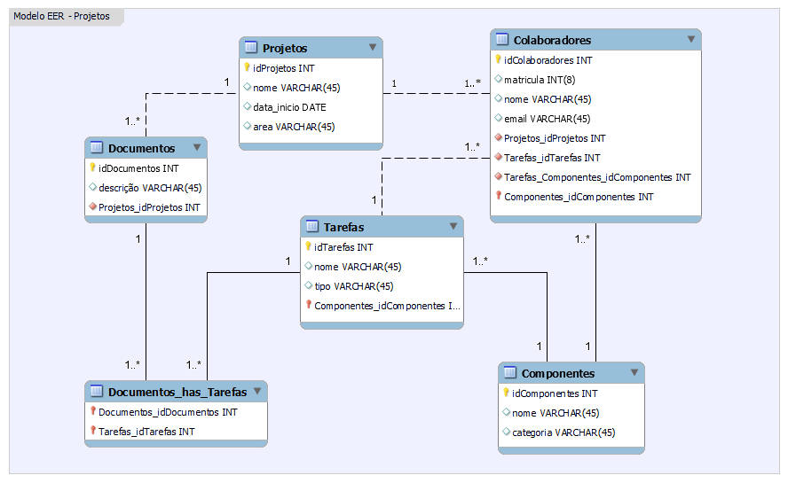

# Bootcamp: Analista de Banco de Dados

## Trabalho Prático1: Fundamentos de Banco de Dados

### Objetivos de Ensino

* **Exercitar os seguintes conceitos vistos em sala de aula:**

    * *Estimular as habilidades de levantamentos de requisitos, especificação de
entidades e relacionamentos, bem como a criação de um projeto de banco
de dados.*


### Enunciado:

* **Considere a seguinte demanda de uma área de projetos de uma empresa:**
    * **Para controlar os projetos de software, uma Fábrica de Software deseja
desenvolver um sistema de gestão de seus projetos. Para que seja possível
controlar seu ciclo de vida, será necessário armazenar o cadastro de
projetos com seu nome, data de início, área e colaboradores que estão
alocados em sua execução com matrícula, nome e e-mail.**
    * **Cada colaborador está dedicado exclusivamente a um projeto, mesmo que
um projeto possa ter uma equipe composta por várias pessoas.**
    * **Cada projeto possui uma série de documentos que são utilizados para
especificação, nos quais temos um título e a descrição. Cada documento
pode gerar uma ou mais tarefas para o time, e cada tarefa pode ter sido
gerada por um ou mais documentos.**
    * **As tarefas possuem nome e tipo (desenvolvimento, teste ou artefatos).**
    * **Todas as tarefas geram um componente de software que, por sua vez, pode
ser gerado por uma ou mais tarefas. Cada componente de software tem
nome e categoria (tela, backend etc.).**
    * **Cada tarefa possui um ou mais colaboradores responsáveis.**
    * **Cada componente é validado por um ou mais colaboradores.**
    * **Todos os projetos possuem um colaborador que é o Gerente do Projeto.**


### Atividades:

* **Os alunos deverão desempenhar as seguintes atividades:**
    
    * **1. Realizar o levantamento de quais entidades são partes do modelo. O modelo
escolhido pode ser o modelo conceitual ou lógico.**
    * **2. Definir os atributos necessários para o entendimento do modelo.**
    * **3. Estabelecer as relações entre as entidades.**

## Resolução:

###  **Entidades e atributos:**

* **Projetos**
    * Id
    * nome
    * data de início

* **Colaboradores**
    * Id
    * matrícula
    * nome
    * email

* **Documentos**
    * Id
    * descrição

* **Tarefas**
    * Id
    * nome
    * tipo

* **Componentes**
    * ID
    * nome
    * categoria

### Modelo EER



# Perguntas:

### 1- Qual é a principal entidade desse modelo de dados?

* **R.: Projetos.**

### 2- Qual é a cardinalidade / classe na relação entre projetos e colaboradores?

* **R.:  Projeto 1 x N Colaboradores.**

### 3- Em qual entidade armazenamos o nome do gerente do projeto?


* **R.:Colaboradores.**

### 4- Quantos relacionamentos possui a entidade tarefas?

* **R.:3 relacionamentos.**

### 5- O atributo categoria refere-se ao tipo de software que é desenvolvido, esse atributo está presente em qual entidade?

* **R.: Componente.** 

### 6- De acordo com o levantamento de requisitos, qual seria uma chave primária possível para colaboradores?

* **R.:  Matrícula.**

### 7- Podemos afirmar que projetos possuem um relacionamento direto com tarefas?

* **R.:Não, um projeto se relaciona indiretamente às tarefas.**

### 8- Tanto modelo lógico quanto modelo conceitual, neste exemplo, possuiriam o mesmo número de entidades / tabelas?

* **R.:Não, em qualquer cenário, pois existem relações NxN.**

### 9- Existe algum auto relacionamento nesse modelo?

* **R.:Não.**

### 10- Podemos indicar que um componente é uma entidade fraca?

* **R.:Sim, pois sem uma tarefa, não existe um componente.**

### 11- É CORRETO realizar a modelagem de gerentes como uma entidade?

* **R.:Não, porque o requisito diz que um colaborador é gerente de projetos.**

### 12- Em nosso modelo, no contexto conceitual, qual dos atributos abaixo poderiam ser multivalorados?

* **R.:Nenhuma das alternativas está correta.**

### 13- A entidade departamentos poderia ser parte desse modelo?

* **R.:Não, a especificação não menciona departamentos.**

### 14- Ao final do ciclo de um projeto, temos componentes. Que entidades estão diretamente relacionadas a eles?

* **R.:Colaboradores e Tarefas.**


```python

```
