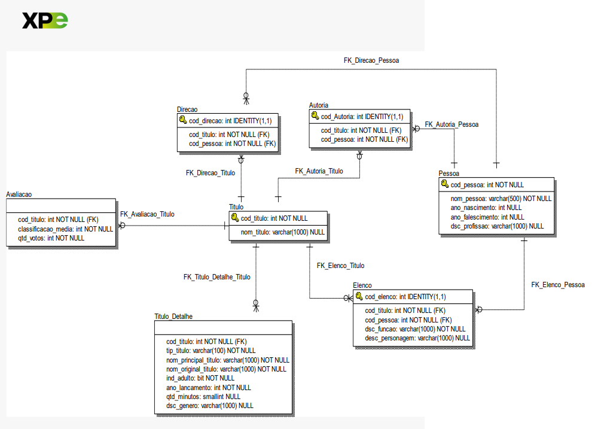

# Bootcamp: Analista de Banco de Dados  - Trabalho Prático do Módulo 2


## Objetivos de Ensino

### Exercitar os seguintes conceitos trabalhados no Módulo:


* **1. Modelo de dados relacional.**
* **2. Banco de dados relacional.**
* **3. Instruções da classe DDL para a criação de estruturas de dados.**
* **4. Instruções da classe DML para consultar dados.**

## Enunciado:


**Uma grande empresa do setor de comércio on-line necessita construir um
sistema para armazenar as informações acerca das produções que serão
comercializadas em sua plataforma. Para armazenar essas informações, foi
proposto o seguinte modelo de dados relacional:**
* **As produções (filmes, séries, curtas metragens etc.) serão armazenadas na tabela Titulo, e os detalhes mais técnicos na tabela Titulo_Detalhe.**
* **As avaliações feitas pelos expectadores serão armazenadas na tabela Avaliacao.**
* **Nas tabelas Direcao e Autoria, serão armazenadas as informações dos diretores e autores (escritores) de cada título, respectivamente.**
* **O elenco que participou de cada produção será armazenado na tabela Elenco.**
* **Todas as pessoas envolvidas com a produção, seja ela do elenco, diretor ou autor, serão cadastradas na tabela Pessoa.**

<a name="ancora"></a>
# Com base nesse modelo de dados, você foi contratado pela empresa para desempenhar as seguintes atividades:
* ## [Contexto](#ancora1)    
        
* ## [Diagrama EER - BDProduções](#ancora2)

* ## [Atividades.](#ancora3)
    * ### [Criar a conexão com o MySQL.](#ancora3.1)
    * ### [1-Desenvolver o script DDL para criar um banco de dados com o nome BDProducoes.](#ancora3.2)
    * ### [2-Desenvolver o script DDL para criar, no banco elaborado no item anterior,todos os objetos existentes no modelo de dados.](#ancora3.3)
    
    * ### [3-Desenvolver o script DDL para garantir que todos os títulos tenham nome.](#ancora3.4)
    * ### [4-Após o schema físico ter sido criado, apareceu a necessidade de aumentar a coluna nom_pessoa da tabela Pessoa para 1.000 caracteres. Monte o comando DDL para realizar essa ação, considerando que a tabela não pode ser recriada.](#ancora3.5)
    * ### [5-Após o banco de dados ter sido populado com dados de exemplo, a empresa viu a necessidade de incluir um campo ind_status char(1) NOT NULL) para informar se o título (produção) se encontra disponível para comercialização (ativo) ou se foi descontinuado (inativo). Qual(is) seria(m) o(s) comando(s) DDL para realizar essa alteração, sem ter que recriar a tabela Titulo?.](#ancora3.6)
    
    * ### [6-Realizar a carga dos dados que foram fornecidos pela empresa no formatode arquivo (txt).](#ancora3.7)
        * [link para download](https://1drv.ms/u/s!AnQw47iLLy1dxc1CHhuVvilRvkJheA?e=1eocGv.)
        * [Persistindo dados na tabela Pessoa](#ancora3.7.1)
        * [Persistindo dados na tabela Titulo](#ancora3.8)
        * [Persistindo dados na tabela Direção](#ancora3.9)
        * [Persistindo dados na tabela Titulo_Detalhe](#ancora3.10)
        * [Persistindo dados na tabela Elenco](#ancora3.11)
        * [Persistindo dados na tabela Autoria](#ancora3.12)
        * [Persistindo dados na tabela Avaliação](#ancora3.13)       
        
    * ### [7-Para finalizar essa primeira parte do projeto, a empresa solicitou que você elaborasse os comandos DML para realizar as consultas básicas abaixo, que alimentarão o dashboard do portfólio dos produtos da plataforma:](#ancora4)
        * [a. Total de títulos ativos.](#ancora4.2)
        * [b. Relação dos títulos em ordem alfabética e seus detalhes.](#ancora4.3)
        * [c. Relação dos títulos em ordem alfabética, seus autores e diretores(quando existirem essas duas últimas informações).](#ancora4.4)
        * [d. Relação dos 100 títulos mais bem avaliados, suas avaliações e total de votos.](#ancora4.5)

    * ### [8-A empresa solicitou que você faça uma espécie de “auditoria da qualidade dos dados”. Para isso, você precisa criar uma query para cada uma das situações abaixo:](#ancora5)
        * [a. Títulos sem avaliação.](#ancora5.1)
        * [b. Títulos sem o detalhe da duração (qtd_minutos) ou informação do gênero (dsc_genero).](#ancora5.2)
        * [c. Títulos sem autor.](#ancora5.3)
        * [d. Títulos sem diretor.](#ancora5.4)
        * [e. Títulos sem elenco.](#ancora5.5)        
        
    * ### [9-Por fim, a empresa solicitou que você desenvolva uma query que retorne as seguintes colunas acerca dos  títulos ativos, ordenados alfabeticamente pelo nome do título.](#ancora6)
        * a. Nome do Título: coluna nom_titulo da tabela Titulo.
        * b. Tipo do Título: coluna tip_titulo da tabela Titulo_Detalhe (em maiúsculo).
        * c. Ano de Lançamento: coluna ano_lancamento da tabela Titulo_Detalhe.
        * d. Duração: coluna qtd_minutos da tabela Titulo_Detalhe (se existir ou não).
        * e. Gênero(s): coluna dsc_genero da tabela Titulo_Detalhe (se existir ou não).
        * f. Nota: coluna classificacao_media da tabela Avaliacao (se existir ou não).
        * g. Autor: nom_pessoa da tabela Pessoa (se existir ou não).
        * h. Diretor: nom_pessoa da tabela Pessoa (se existir ou não). 

## Contexto.
<a id="ancora1"></a>
[voltar](#ancora).

* As tabelas Titulo e Titulo_Detalhe permitem armazenar informações básicas e técnicas sobre as produções, enquanto as tabelas Avaliacao, Direcao, Autoria e Elenco permitem armazenar informações específicas sobre os aspectos críticos, direção e elenco de cada produção.
* A tabela Pessoa é importante para garantir a integridade dos dados, pois permite que todas as pessoas envolvidas na produção sejam identificadas de maneira única.
* Além disso, é importante estabelecer relações adequadas entre as tabelas para garantir a integridade dos dados e a consistência do modelo de dados. Por exemplo, a tabela Direcao deve ter uma relação com a tabela Titulo para indicar quais diretores estão associados a quais produções, e a tabela Pessoa deve ter uma relação com as tabelas Direcao, Autoria e Elenco para identificar as pessoas envolvidas na produção.

## Diagrama EER - BDProduções.
<a id="ancora2"></a>
[voltar](#ancora).



## Atividades:
<a id="ancora3"></a>
[voltar](#ancora).

###  **Criar a conexão com o MySQL.**  
<a id="ancora3.1"></a>
[voltar](#ancora).


```python
#importação das bibliotecas para conexão 1
import mysql.connector
import pandas as pd
import warnings
warnings.filterwarnings('ignore')
```

###  **1. Criar o banco de dados BDProducoes.**
<a id="ancora3.2"></a>
[voltar](#ancora).


```python
# Excluír o banco de dados.
# drop database teste; -- Deleta o bd teste --
# Criando a tabela de Pessoa;
drop_bd='''
DROP DATABASE bdproducoes;'''
cursor.execute(drop_bd)
cursor.execute('SHOW databases')
for i in cursor:
    if 'bdproducoes' in i:
        print(i)
```


```python
# Criando o banco de dados BDProducoes e conferindo se o bd foi criado;
criar='''
CREATE SCHEMA IF NOT EXISTS `BDProducoes` DEFAULT CHARACTER SET utf8 COLLATE utf8_unicode_ci;'''
con = mysql.connector.connect(host='localhost',user='julio',password='')
cursor = con.cursor()
cursor.execute(criar)
cursor.execute('SHOW databases')
for i in cursor:
    if 'bdproducoes' in i:
        print(i)
```

    ('bdproducoes',)
    


```python
# Conectando ao database bdproducoes recém criada
con = mysql.connector.connect(host='localhost',database='bdproducoes',user='julio',password='')
cursor = con.cursor()
```

###  **2. Script DDL para criar todos os objetos existentes no modelo de dados.**
<a id="ancora3.3"></a>
[voltar](#ancora).

#### Criando a tabela de Pessoa;


```python
# Criando a tabela de Pessoa;
criar='''
CREATE TABLE IF NOT EXISTS Pessoa (
  cod_pessoa INT PRIMARY KEY,
  nom_pessoa VARCHAR(500) NOT NULL,
  ano_nascimento INT NULL,
  ano_falescimento INT NULL,
  dsc_profissao VARCHAR(1000) NULL
);'''
cursor.execute(criar)
cursor.execute('SHOW tables')
for i in cursor:
  print(i)
```

    ('pessoa',)
    

#### Criando a tabela de Titulo;


```python
#Criando a tabela de Titulo;
criar='''
CREATE TABLE IF NOT EXISTS Titulo (
  cod_titulo INT NOT NULL PRIMARY KEY,
  nom_titulo VARCHAR(1000) NULL  
);'''
cursor.execute(criar)
cursor.execute('SHOW tables')
for i in cursor:
  print(i)
```

    ('pessoa',)
    ('titulo',)
    

#### Criando a tabela de Direção;


```python
#Criando a tabela de Direcao;
criar='''
CREATE TABLE IF NOT EXISTS Direcao (
  cod_direcao INT PRIMARY KEY AUTO_INCREMENT,
  cod_titulo INT NOT NULL,
  cod_pessoa INT NOT NULL,
  FOREIGN KEY (cod_pessoa) REFERENCES Pessoa(cod_pessoa),
  FOREIGN KEY (cod_titulo) REFERENCES Titulo(cod_titulo)
);'''
cursor.execute(criar)
cursor.execute('SHOW tables')
for i in cursor:
  print(i)
```

    ('direcao',)
    ('pessoa',)
    ('titulo',)
    

#### Criando a tabela de Titulo_Detalhe;


```python
#Criando a tabela de Titulo_Detalhe;
criar='''
CREATE TABLE IF NOT EXISTS Titulo_Detalhe (
  cod_titulo INT NOT NULL,
  tip_titulo VARCHAR(100) NOT NULL,
  nom_principal_titulo VARCHAR(1000) NOT NULL,
  nom_original_titulo VARCHAR(1000) NOT NULL,
  ind_adulto BIT NOT NULL,
  ano_lancamento INT NOT NULL,
  qtd_minutos SMALLINT NULL,
  dsc_genero VARCHAR(1000) NULL,
  genero VARCHAR(50) NOT NULL,
  FOREIGN KEY (cod_titulo) REFERENCES Titulo(cod_titulo)
);'''
cursor.execute(criar)
cursor.execute('SHOW tables')
for i in cursor:
  print(i)
```

    ('direcao',)
    ('pessoa',)
    ('titulo',)
    ('titulo_detalhe',)
    

#### Criando a tabela de Elenco;


```python
#Criando a tabela de Elenco;
criar='''
CREATE TABLE IF NOT EXISTS Elenco (
  cod_elenco INT PRIMARY KEY AUTO_INCREMENT,
  cod_titulo INT NOT NULL,
  cod_pessoa INT NOT NULL,
  dsc_funcao VARCHAR(1000) NOT NULL,
  dsc_personagem VARCHAR(1000) NOT NULL,
  FOREIGN KEY (cod_titulo) REFERENCES Titulo(cod_titulo),
  FOREIGN KEY (cod_pessoa) REFERENCES Pessoa(cod_pessoa)
);'''
cursor.execute(criar)
cursor.execute('SHOW tables')
for i in cursor:
  print(i)
```

    ('direcao',)
    ('elenco',)
    ('pessoa',)
    ('titulo',)
    ('titulo_detalhe',)
    

#### Criando a tabela de Autoria;


```python
#Criando a tabela de Autoria;
criar='''
CREATE TABLE IF NOT EXISTS Autoria (
  cod_autoria INT PRIMARY KEY AUTO_INCREMENT,
  cod_titulo INT NOT NULL,
  cod_pessoa INT NOT NULL,
  FOREIGN KEY (cod_titulo) REFERENCES Titulo(cod_titulo),
  FOREIGN KEY (cod_pessoa) REFERENCES Pessoa(cod_pessoa)
);'''
cursor.execute(criar)
cursor.execute('SHOW tables')
for i in cursor:
  print(i)
```

    ('autoria',)
    ('direcao',)
    ('elenco',)
    ('pessoa',)
    ('titulo',)
    ('titulo_detalhe',)
    

#### Criando a tabela de Avaliacao;


```python
#Criando a tabela de Avaliacao;
criar='''
CREATE TABLE IF NOT EXISTS Avaliacao (
  cod_titulo INT NOT NULL,
  classificacao_media INT NOT NULL,
  qtd_votos INT NOT NULL,
  FOREIGN KEY (cod_titulo) REFERENCES Titulo(cod_titulo)
);'''
cursor.execute(criar)
cursor.execute('SHOW tables')
for i in cursor:
  print(i)
```

    ('autoria',)
    ('avaliacao',)
    ('direcao',)
    ('elenco',)
    ('pessoa',)
    ('titulo',)
    ('titulo_detalhe',)
    

###  **3. Script DDL para garantir que todos os títulos tenham nome.**
<a id="ancora3.4"></a>
[voltar](#ancora).


```python
# Alterando a tabela titulo;
Altera='''
ALTER TABLE titulo
MODIFY COLUMN nom_titulo VARCHAR(1000) NOT NULL;'''
cursor.execute(Altera)
cursor.execute('desc titulo')
for i in cursor:
  print(i)
```

    ('cod_titulo', b'int', 'NO', bytearray(b'PRI'), None, '')
    ('nom_titulo', b'varchar(1000)', 'NO', bytearray(b''), None, '')
    

###  **4. Alterar a coluna nome da tabela Pessoa para um tamanho de 1.000 caracteres.**
<a id="ancora3.5"></a>
[voltar](#ancora).


```python
# Criando a tabela de Pessoa;
Altera='''
ALTER TABLE Pessoa
MODIFY COLUMN nom_pessoa VARCHAR(1000);'''
cursor.execute(Altera)
cursor.execute('desc pessoa')
for i in cursor:
  print(i)
```

    ('cod_pessoa', b'int', 'NO', bytearray(b'PRI'), None, '')
    ('nom_pessoa', b'varchar(1000)', 'YES', bytearray(b''), None, '')
    ('ano_nascimento', b'int', 'YES', bytearray(b''), None, '')
    ('ano_falescimento', b'int', 'YES', bytearray(b''), None, '')
    ('dsc_profissao', b'varchar(1000)', 'YES', bytearray(b''), None, '')
    

###  **5. Incluir o campo ind_status na tabela Titulo, sem ter que recriá-la.**
<a id="ancora3.6"></a>
[voltar](#ancora).


```python
# Criando a tabela de Titulo;
Altera='''
ALTER TABLE titulo
ADD COLUMN ind_status CHAR(1) NOT NULL DEFAULT 'A';'''
cursor.execute(Altera)
cursor.execute('desc titulo')
for i in cursor:
  print(i)
```

    ('cod_titulo', b'int', 'NO', bytearray(b'PRI'), None, '')
    ('nom_titulo', b'varchar(1000)', 'NO', bytearray(b''), None, '')
    ('ind_status', b'char(1)', 'NO', bytearray(b''), b'A', '')
    

**Nota: No exemplo acima, o valor padrão de ind_status é 'A', o que significa "ativo".**

###  **6. Realizar a carga dos dados que foram fornecidos pela empresa no formatode arquivo (txt).**
<a id="ancora3.7"></a>
[voltar](#ancora).

####  **Persistindo dados na tabela Pessoa.**
<a id="ancora3.7.1"></a>
[voltar](#ancora).


```python
cursor.execute('SET sql_mode = "" ') # necessário pois não estava aceitando carregar os valores em branco.
```


```python
load = '''LOAD DATA INFILE 'C://ProgramData//MySQL//MySQL Server 8.0//Uploads//Pessoa.txt'
                INTO TABLE pessoa 
                CHARACTER SET LATIN1
                FIELDS TERMINATED BY '\t'
                LINES TERMINATED BY '\r\n';
        '''
# Consultando uma tabela.
cursor = con.cursor()
cursor.execute(load)
```


```python
# Consultando a tabela.
cursor = con.cursor()
cursor.execute('SELECT * FROM pessoa LIMIT 10')
result = cursor.fetchall()
for i in result:
    print(i)
```

    (1, 'Fred Astaire', 1899, 1987, 'soundtrack,actor,miscellaneous')
    (2, 'Lauren Bacall', 1924, 2014, 'actress,soundtrack')
    (3, 'Brigitte Bardot', 1934, 0, 'actress,soundtrack,producer')
    (4, 'John Belushi', 1949, 1982, 'actor,writer,soundtrack')
    (5, 'Ingmar Bergman', 1918, 2007, 'writer,director,actor')
    (6, 'Ingrid Bergman', 1915, 1982, 'actress,soundtrack,producer')
    (7, 'Humphrey Bogart', 1899, 1957, 'actor,soundtrack,producer')
    (8, 'Marlon Brando', 1924, 2004, 'actor,soundtrack,director')
    (9, 'Richard Burton', 1925, 1984, 'actor,producer,soundtrack')
    (10, 'James Cagney', 1899, 1986, 'actor,soundtrack,director')
    


```python
# Lib para visualizar as consultas em formato de dataframe.
import pandas as pd
```


```python
# Convertendo as consulta para o tipo pandas dataset - apenas para facilitar a visualização.
pd.read_sql('SELECT * FROM pessoa LIMIT 10',con=con)
```


<div>

<table border="1" class="dataframe">
  <thead>
    <tr style="text-align: right;">
      <th></th>
      <th>cod_pessoa</th>
      <th>nom_pessoa</th>
      <th>ano_nascimento</th>
      <th>ano_falescimento</th>
      <th>dsc_profissao</th>
    </tr>
  </thead>
  <tbody>
    <tr>
      <th>0</th>
      <td>1</td>
      <td>Fred Astaire</td>
      <td>1899</td>
      <td>1987</td>
      <td>soundtrack,actor,miscellaneous</td>
    </tr>
    <tr>
      <th>1</th>
      <td>2</td>
      <td>Lauren Bacall</td>
      <td>1924</td>
      <td>2014</td>
      <td>actress,soundtrack</td>
    </tr>
    <tr>
      <th>2</th>
      <td>3</td>
      <td>Brigitte Bardot</td>
      <td>1934</td>
      <td>0</td>
      <td>actress,soundtrack,producer</td>
    </tr>
    <tr>
      <th>3</th>
      <td>4</td>
      <td>John Belushi</td>
      <td>1949</td>
      <td>1982</td>
      <td>actor,writer,soundtrack</td>
    </tr>
    <tr>
      <th>4</th>
      <td>5</td>
      <td>Ingmar Bergman</td>
      <td>1918</td>
      <td>2007</td>
      <td>writer,director,actor</td>
    </tr>
    <tr>
      <th>5</th>
      <td>6</td>
      <td>Ingrid Bergman</td>
      <td>1915</td>
      <td>1982</td>
      <td>actress,soundtrack,producer</td>
    </tr>
    <tr>
      <th>6</th>
      <td>7</td>
      <td>Humphrey Bogart</td>
      <td>1899</td>
      <td>1957</td>
      <td>actor,soundtrack,producer</td>
    </tr>
    <tr>
      <th>7</th>
      <td>8</td>
      <td>Marlon Brando</td>
      <td>1924</td>
      <td>2004</td>
      <td>actor,soundtrack,director</td>
    </tr>
    <tr>
      <th>8</th>
      <td>9</td>
      <td>Richard Burton</td>
      <td>1925</td>
      <td>1984</td>
      <td>actor,producer,soundtrack</td>
    </tr>
    <tr>
      <th>9</th>
      <td>10</td>
      <td>James Cagney</td>
      <td>1899</td>
      <td>1986</td>
      <td>actor,soundtrack,director</td>
    </tr>
  </tbody>
</table>
</div>


####  **Persistindo dados na tabela Título.**
<a id="ancora3.8"></a>
[voltar](#ancora).


```python
# -- persistindo registros na tabela Titulo --
load = '''LOAD DATA INFILE 'C://ProgramData//MySQL//MySQL Server 8.0//Uploads//Titulo.txt' 
                INTO TABLE titulo 
                CHARACTER SET LATIN1
                FIELDS TERMINATED BY '\t'
                LINES TERMINATED BY '\r\n';
        '''
# Consultando uma tabela.
cursor = con.cursor()
cursor.execute(load)
```


```python
# Convertendo as consulta para o tipo pandas dataset - apenas para facilitar a visualização.
pd.read_sql('SELECT * FROM titulo LIMIT 10',con=con)
```


<div>

<table border="1" class="dataframe">
  <thead>
    <tr style="text-align: right;">
      <th></th>
      <th>cod_titulo</th>
      <th>nom_titulo</th>
      <th>ind_status</th>
    </tr>
  </thead>
  <tbody>
    <tr>
      <th>0</th>
      <td>1</td>
      <td>Carmencita</td>
      <td>A</td>
    </tr>
    <tr>
      <th>1</th>
      <td>2</td>
      <td>Le clown et ses chiens</td>
      <td>A</td>
    </tr>
    <tr>
      <th>2</th>
      <td>3</td>
      <td>Pauvre Pierrot</td>
      <td>A</td>
    </tr>
    <tr>
      <th>3</th>
      <td>4</td>
      <td>Un bon bock</td>
      <td>A</td>
    </tr>
    <tr>
      <th>4</th>
      <td>5</td>
      <td>Blacksmith Scene</td>
      <td>A</td>
    </tr>
    <tr>
      <th>5</th>
      <td>6</td>
      <td>Chinese Opium Den</td>
      <td>A</td>
    </tr>
    <tr>
      <th>6</th>
      <td>7</td>
      <td>Corbett and Courtney Before the Kinetograph</td>
      <td>A</td>
    </tr>
    <tr>
      <th>7</th>
      <td>8</td>
      <td>Edison Kinetoscopic Record of a Sneeze</td>
      <td>A</td>
    </tr>
    <tr>
      <th>8</th>
      <td>9</td>
      <td>Miss Jerry</td>
      <td>A</td>
    </tr>
    <tr>
      <th>9</th>
      <td>10</td>
      <td>La sortie de l'usine Lumière à Lyon</td>
      <td>A</td>
    </tr>
  </tbody>
</table>
</div>


####  **Persistindo dados na tabela Direção.**
<a id="ancora3.9"></a>
[voltar](#ancora).


```python
# -- persistindo registros na tabela Direção --
load = '''LOAD DATA INFILE 'C://ProgramData//MySQL//MySQL Server 8.0//Uploads//Direcao.txt' 
                INTO TABLE direcao 
                CHARACTER SET LATIN1
                FIELDS TERMINATED BY '\t'
                LINES TERMINATED BY '\r\n'; 
        '''
# Consultando uma tabela.
cursor = con.cursor()
cursor.execute(load)
```


```python
# Convertendo as consulta para o tipo pandas dataset - apenas para facilitar a visualização.
pd.read_sql('SELECT * FROM direcao LIMIT 10',con=con)
```


<div>

<table border="1" class="dataframe">
  <thead>
    <tr style="text-align: right;">
      <th></th>
      <th>cod_direcao</th>
      <th>cod_titulo</th>
      <th>cod_pessoa</th>
    </tr>
  </thead>
  <tbody>
    <tr>
      <th>0</th>
      <td>1</td>
      <td>1</td>
      <td>5690</td>
    </tr>
    <tr>
      <th>1</th>
      <td>2</td>
      <td>2</td>
      <td>721526</td>
    </tr>
    <tr>
      <th>2</th>
      <td>3</td>
      <td>3</td>
      <td>721526</td>
    </tr>
    <tr>
      <th>3</th>
      <td>4</td>
      <td>4</td>
      <td>721526</td>
    </tr>
    <tr>
      <th>4</th>
      <td>5</td>
      <td>5</td>
      <td>5690</td>
    </tr>
    <tr>
      <th>5</th>
      <td>6</td>
      <td>6</td>
      <td>5690</td>
    </tr>
    <tr>
      <th>6</th>
      <td>7</td>
      <td>8</td>
      <td>5690</td>
    </tr>
    <tr>
      <th>7</th>
      <td>8</td>
      <td>9</td>
      <td>85156</td>
    </tr>
    <tr>
      <th>8</th>
      <td>9</td>
      <td>10</td>
      <td>525910</td>
    </tr>
    <tr>
      <th>9</th>
      <td>10</td>
      <td>11</td>
      <td>804434</td>
    </tr>
  </tbody>
</table>
</div>


####  **Persistindo dados na tabela Titulo_Detalhe.**
<a id="ancora3.10"></a>
[voltar](#ancora).


```python
# -- persistindo registros na tabela Titulo_Detalhe --
load = '''LOAD DATA INFILE 'C://ProgramData//MySQL//MySQL Server 8.0//Uploads//Titulo_Detalhe.txt' 
                INTO TABLE titulo_detalhe 
                CHARACTER SET LATIN1
                FIELDS TERMINATED BY '\t'
                LINES TERMINATED BY '\r\n'; 
        '''
# Consultando uma tabela.
cursor = con.cursor()
cursor.execute(load)
```


```python
# Convertendo as consulta para o tipo pandas dataset - apenas para facilitar a visualização.
pd.read_sql('SELECT * FROM titulo_detalhe LIMIT 10',con=con)
```


<div>

<table border="1" class="dataframe">
  <thead>
    <tr style="text-align: right;">
      <th></th>
      <th>cod_titulo</th>
      <th>tip_titulo</th>
      <th>nom_principal_titulo</th>
      <th>nom_original_titulo</th>
      <th>ind_adulto</th>
      <th>ano_lancamento</th>
      <th>qtd_minutos</th>
      <th>dsc_genero</th>
      <th>genero</th>
    </tr>
  </thead>
  <tbody>
    <tr>
      <th>0</th>
      <td>1</td>
      <td>short</td>
      <td>Carmencita</td>
      <td>Carmencita</td>
      <td>1</td>
      <td>1894</td>
      <td>1</td>
      <td>Documentary,Short</td>
      <td></td>
    </tr>
    <tr>
      <th>1</th>
      <td>2</td>
      <td>short</td>
      <td>Le clown et ses chiens</td>
      <td>Le clown et ses chiens</td>
      <td>1</td>
      <td>1892</td>
      <td>5</td>
      <td>Animation,Short</td>
      <td></td>
    </tr>
    <tr>
      <th>2</th>
      <td>3</td>
      <td>short</td>
      <td>Pauvre Pierrot</td>
      <td>Pauvre Pierrot</td>
      <td>1</td>
      <td>1892</td>
      <td>4</td>
      <td>Animation,Comedy,Romance</td>
      <td></td>
    </tr>
    <tr>
      <th>3</th>
      <td>4</td>
      <td>short</td>
      <td>Un bon bock</td>
      <td>Un bon bock</td>
      <td>1</td>
      <td>1892</td>
      <td>0</td>
      <td>Animation,Short</td>
      <td></td>
    </tr>
    <tr>
      <th>4</th>
      <td>5</td>
      <td>short</td>
      <td>Blacksmith Scene</td>
      <td>Blacksmith Scene</td>
      <td>1</td>
      <td>1893</td>
      <td>1</td>
      <td>Comedy,Short</td>
      <td></td>
    </tr>
    <tr>
      <th>5</th>
      <td>6</td>
      <td>short</td>
      <td>Chinese Opium Den</td>
      <td>Chinese Opium Den</td>
      <td>1</td>
      <td>1894</td>
      <td>1</td>
      <td>Short</td>
      <td></td>
    </tr>
    <tr>
      <th>6</th>
      <td>7</td>
      <td>short</td>
      <td>Corbett and Courtney Before the Kinetograph</td>
      <td>Corbett and Courtney Before the Kinetograph</td>
      <td>1</td>
      <td>1894</td>
      <td>1</td>
      <td>Short,Sport</td>
      <td></td>
    </tr>
    <tr>
      <th>7</th>
      <td>8</td>
      <td>short</td>
      <td>Edison Kinetoscopic Record of a Sneeze</td>
      <td>Edison Kinetoscopic Record of a Sneeze</td>
      <td>1</td>
      <td>1894</td>
      <td>1</td>
      <td>Documentary,Short</td>
      <td></td>
    </tr>
    <tr>
      <th>8</th>
      <td>9</td>
      <td>movie</td>
      <td>Miss Jerry</td>
      <td>Miss Jerry</td>
      <td>1</td>
      <td>1894</td>
      <td>45</td>
      <td>Romance</td>
      <td></td>
    </tr>
    <tr>
      <th>9</th>
      <td>10</td>
      <td>short</td>
      <td>Exiting the Factory</td>
      <td>La sortie de l'usine Lumière à Lyon</td>
      <td>1</td>
      <td>1895</td>
      <td>1</td>
      <td>Documentary,Short</td>
      <td></td>
    </tr>
  </tbody>
</table>
</div>


####  **Persistindo dados na tabela Elenco.**
<a id="ancora3.11"></a>
[voltar](#ancora).


```python
# -- persistindo registros na tabela Elenco --
load = '''LOAD DATA INFILE 'C://ProgramData//MySQL//MySQL Server 8.0//Uploads//Elenco.txt' 
                INTO TABLE Elenco 
                CHARACTER SET LATIN1
                FIELDS TERMINATED BY '\t'
                LINES TERMINATED BY '\r\n'; 
        '''
# Consultando uma tabela.
cursor = con.cursor()
cursor.execute(load)
```


```python
# Convertendo as consulta para o tipo pandas dataset - apenas para facilitar a visualização.
pd.read_sql('SELECT * FROM elenco LIMIT 10',con=con)
```


<div>

<table border="1" class="dataframe">
  <thead>
    <tr style="text-align: right;">
      <th></th>
      <th>cod_elenco</th>
      <th>cod_titulo</th>
      <th>cod_pessoa</th>
      <th>dsc_funcao</th>
      <th>dsc_personagem</th>
    </tr>
  </thead>
  <tbody>
    <tr>
      <th>0</th>
      <td>1</td>
      <td>1</td>
      <td>1588970</td>
      <td>self</td>
      <td>["Herself"]</td>
    </tr>
    <tr>
      <th>1</th>
      <td>2</td>
      <td>1</td>
      <td>5690</td>
      <td>director</td>
      <td></td>
    </tr>
    <tr>
      <th>2</th>
      <td>3</td>
      <td>1</td>
      <td>374658</td>
      <td>cinematographer</td>
      <td></td>
    </tr>
    <tr>
      <th>3</th>
      <td>4</td>
      <td>2</td>
      <td>721526</td>
      <td>director</td>
      <td></td>
    </tr>
    <tr>
      <th>4</th>
      <td>5</td>
      <td>2</td>
      <td>1335271</td>
      <td>composer</td>
      <td></td>
    </tr>
    <tr>
      <th>5</th>
      <td>6</td>
      <td>3</td>
      <td>721526</td>
      <td>director</td>
      <td></td>
    </tr>
    <tr>
      <th>6</th>
      <td>7</td>
      <td>3</td>
      <td>1335271</td>
      <td>composer</td>
      <td></td>
    </tr>
    <tr>
      <th>7</th>
      <td>8</td>
      <td>4</td>
      <td>721526</td>
      <td>director</td>
      <td></td>
    </tr>
    <tr>
      <th>8</th>
      <td>9</td>
      <td>4</td>
      <td>1335271</td>
      <td>composer</td>
      <td></td>
    </tr>
    <tr>
      <th>9</th>
      <td>10</td>
      <td>5</td>
      <td>443482</td>
      <td>actor</td>
      <td>["Blacksmith"]</td>
    </tr>
  </tbody>
</table>
</div>


####  **Persistindo dados na tabela Autoria.**
<a id="ancora3.12"></a>
[voltar](#ancora).


```python
# -- persistindo registros na tabela Autoria --
load = '''LOAD DATA INFILE 'C://ProgramData//MySQL//MySQL Server 8.0//Uploads//Autoria.txt' 
                INTO TABLE Autoria 
                CHARACTER SET LATIN1
                FIELDS TERMINATED BY '\t'
                LINES TERMINATED BY '\r\n'; 
        '''
# Consultando uma tabela.
cursor = con.cursor()
cursor.execute(load)
```


```python
# Convertendo as consulta para o tipo pandas dataset - apenas para facilitar a visualização.
pd.read_sql('SELECT * FROM autoria LIMIT 10',con=con)
```


<div>

<table border="1" class="dataframe">
  <thead>
    <tr style="text-align: right;">
      <th></th>
      <th>cod_autoria</th>
      <th>cod_titulo</th>
      <th>cod_pessoa</th>
    </tr>
  </thead>
  <tbody>
    <tr>
      <th>0</th>
      <td>1</td>
      <td>9</td>
      <td>85156</td>
    </tr>
    <tr>
      <th>1</th>
      <td>2</td>
      <td>36</td>
      <td>410331</td>
    </tr>
    <tr>
      <th>2</th>
      <td>3</td>
      <td>76</td>
      <td>410331</td>
    </tr>
    <tr>
      <th>3</th>
      <td>4</td>
      <td>91</td>
      <td>617588</td>
    </tr>
    <tr>
      <th>4</th>
      <td>5</td>
      <td>108</td>
      <td>410331</td>
    </tr>
    <tr>
      <th>5</th>
      <td>6</td>
      <td>109</td>
      <td>410331</td>
    </tr>
    <tr>
      <th>6</th>
      <td>7</td>
      <td>110</td>
      <td>410331</td>
    </tr>
    <tr>
      <th>7</th>
      <td>8</td>
      <td>111</td>
      <td>410331</td>
    </tr>
    <tr>
      <th>8</th>
      <td>9</td>
      <td>112</td>
      <td>410331</td>
    </tr>
    <tr>
      <th>9</th>
      <td>10</td>
      <td>113</td>
      <td>410331</td>
    </tr>
  </tbody>
</table>
</div>


####  **Persistindo dados na tabela Avaliacao.**
<a id="ancora3.13"></a>
[voltar](#ancora).


```python
# -- persistindo registros na tabela Avaliacao --
load = '''LOAD DATA INFILE 'C://ProgramData//MySQL//MySQL Server 8.0//Uploads//Avaliacao.txt' 
                INTO TABLE Avaliacao 
                CHARACTER SET LATIN1
                FIELDS TERMINATED BY '\t'
                LINES TERMINATED BY '\r\n'; 
        '''
# Consultando uma tabela.
cursor = con.cursor()
cursor.execute(load)
```


```python
# Convertendo as consulta para o tipo pandas dataset - apenas para facilitar a visualização.
pd.read_sql('SELECT * FROM Avaliacao LIMIT 10',con=con)
```


<div>

<table border="1" class="dataframe">
  <thead>
    <tr style="text-align: right;">
      <th></th>
      <th>cod_titulo</th>
      <th>classificacao_media</th>
      <th>qtd_votos</th>
    </tr>
  </thead>
  <tbody>
    <tr>
      <th>0</th>
      <td>1049</td>
      <td>36</td>
      <td>8</td>
    </tr>
    <tr>
      <th>1</th>
      <td>1062</td>
      <td>61</td>
      <td>956</td>
    </tr>
    <tr>
      <th>2</th>
      <td>1066</td>
      <td>38</td>
      <td>5</td>
    </tr>
    <tr>
      <th>3</th>
      <td>1072</td>
      <td>56</td>
      <td>206</td>
    </tr>
    <tr>
      <th>4</th>
      <td>1083</td>
      <td>54</td>
      <td>82</td>
    </tr>
    <tr>
      <th>5</th>
      <td>1084</td>
      <td>51</td>
      <td>124</td>
    </tr>
    <tr>
      <th>6</th>
      <td>1091</td>
      <td>54</td>
      <td>139</td>
    </tr>
    <tr>
      <th>7</th>
      <td>1101</td>
      <td>45</td>
      <td>14</td>
    </tr>
    <tr>
      <th>8</th>
      <td>1105</td>
      <td>65</td>
      <td>685</td>
    </tr>
    <tr>
      <th>9</th>
      <td>1112</td>
      <td>33</td>
      <td>14</td>
    </tr>
  </tbody>
</table>
</div>


### 7. Comandos DML para realizar as consultas básicas abaixo:
<a id="ancora4"></a>
[voltar](#ancora).

#### **a. Total de títulos ativos.**
<a id="ancora4.2"></a>
[voltar](#ancora).


```python
# Total de titulos Ativos.
query = '''SELECT 
    COUNT(*)
FROM
    titulo
WHERE
    ind_status = 'A';
        '''
cursor = con.cursor()
cursor.execute(query)
result = cursor.fetchall()
for i in result:
    print(i)
```

    (19614,)
    

#### **b. Relação dos títulos em ordem alfabética e seus detalhes.**
<a id="ancora4.3"></a>
[voltar](#ancora).


```python
# Relação da tab. titulo com titulos detalhes ordenado por nome.
query = '''SELECT 
    t.cod_titulo AS codigo,
    t.nom_titulo AS nome,
    d.tip_titulo AS tipo,
    d.ano_lancamento AS ano,
    d.qtd_minutos AS duração,
    d.dsc_genero AS genero
FROM
    titulo t
        JOIN
    titulo_detalhe d ON t.cod_titulo = d.cod_titulo
ORDER BY t.nom_titulo;
        '''
pd.read_sql(query,con).head(10)
```


<div>

<table border="1" class="dataframe">
  <thead>
    <tr style="text-align: right;">
      <th></th>
      <th>codigo</th>
      <th>nome</th>
      <th>tipo</th>
      <th>ano</th>
      <th>duração</th>
      <th>genero</th>
    </tr>
  </thead>
  <tbody>
    <tr>
      <th>0</th>
      <td>22731</td>
      <td>-But the Flesh Is Weak</td>
      <td>movie</td>
      <td>1932</td>
      <td>77</td>
      <td>Comedy</td>
    </tr>
    <tr>
      <th>1</th>
      <td>28533</td>
      <td>¡Centinela, alerta!</td>
      <td>movie</td>
      <td>1937</td>
      <td>80</td>
      <td>Musical</td>
    </tr>
    <tr>
      <th>2</th>
      <td>22756</td>
      <td>¡Que viva Mexico!</td>
      <td>movie</td>
      <td>1932</td>
      <td>88</td>
      <td>History</td>
    </tr>
    <tr>
      <th>3</th>
      <td>24642</td>
      <td>¡Tango!</td>
      <td>movie</td>
      <td>1933</td>
      <td>80</td>
      <td>Musical,Romance</td>
    </tr>
    <tr>
      <th>4</th>
      <td>8805</td>
      <td>¿Quién me hará olvidar sin morir?</td>
      <td>movie</td>
      <td>1916</td>
      <td>0</td>
      <td></td>
    </tr>
    <tr>
      <th>5</th>
      <td>28534</td>
      <td>¿Quién me quiere a mí?</td>
      <td>movie</td>
      <td>1936</td>
      <td>84</td>
      <td>Drama</td>
    </tr>
    <tr>
      <th>6</th>
      <td>24806</td>
      <td>...heute abend bei mir</td>
      <td>movie</td>
      <td>1934</td>
      <td>91</td>
      <td></td>
    </tr>
    <tr>
      <th>7</th>
      <td>26026</td>
      <td>...nur ein Komödiant</td>
      <td>movie</td>
      <td>1935</td>
      <td>95</td>
      <td></td>
    </tr>
    <tr>
      <th>8</th>
      <td>31761</td>
      <td>...One Third of a Nation...</td>
      <td>movie</td>
      <td>1939</td>
      <td>79</td>
      <td>Drama</td>
    </tr>
    <tr>
      <th>9</th>
      <td>32177</td>
      <td>...som en tjuv om natten</td>
      <td>movie</td>
      <td>1940</td>
      <td>98</td>
      <td>Comedy</td>
    </tr>
  </tbody>
</table>
</div>


* **Apesar de nome estar ordenado podemos ver que existem os critérios dos caracteres**

#### **c. Relação dos títulos em ordem alfabética, seus autores e diretores(quando existirem essas duas últimas informações).**
<a id="ancora4.4"></a>
[voltar](#ancora).


```python
query ='''SELECT 
    T.nom_titulo AS 'Nome do Título',
    aut.nom_pessoa AS 'Autor',
    dir.nom_pessoa AS 'Diretor'
FROM
    Titulo AS T
        LEFT JOIN
    autoria AS TA ON T.cod_titulo = TA.cod_titulo
        LEFT JOIN
    pessoa AS aut ON TA.cod_pessoa = aut.cod_pessoa
        LEFT JOIN
    direcao AS TD ON T.cod_titulo = TD.cod_titulo
        LEFT JOIN
    pessoa AS dir ON TD.cod_pessoa = dir.cod_pessoa
WHERE
    aut.nom_pessoa IS NOT NULL
        AND dir.nom_pessoa IS NOT NULL
ORDER BY T.nom_titulo ASC; '''
pd.read_sql(query,con).head(10)
```


<div>

<table border="1" class="dataframe">
  <thead>
    <tr style="text-align: right;">
      <th></th>
      <th>Nome do Título</th>
      <th>Autor</th>
      <th>Diretor</th>
    </tr>
  </thead>
  <tbody>
    <tr>
      <th>0</th>
      <td>-But the Flesh Is Weak</td>
      <td>Ivor Novello</td>
      <td>Jack Conway</td>
    </tr>
    <tr>
      <th>1</th>
      <td>.45 Calibre War</td>
      <td>Ford Beebe</td>
      <td>Leo D. Maloney</td>
    </tr>
    <tr>
      <th>2</th>
      <td>'Blue Blazes' Rawden</td>
      <td>J.G. Hawks</td>
      <td>William S. Hart</td>
    </tr>
    <tr>
      <th>3</th>
      <td>'Midst Woodland Shadows</td>
      <td>Ralph Ince</td>
      <td>Ralph Ince</td>
    </tr>
    <tr>
      <th>4</th>
      <td>'Neath the Arizona Skies</td>
      <td>Burl R. Tuttle</td>
      <td>Harry L. Fraser</td>
    </tr>
    <tr>
      <th>5</th>
      <td>'Neath Western Skies</td>
      <td>Sally Winters</td>
      <td>J.P. McGowan</td>
    </tr>
    <tr>
      <th>6</th>
      <td>'Round the World in 80 Days</td>
      <td>Jules Verne</td>
      <td>Ralph Ince</td>
    </tr>
    <tr>
      <th>7</th>
      <td>$1000 a Touchdown</td>
      <td>Delmer Daves</td>
      <td>James P. Hogan</td>
    </tr>
    <tr>
      <th>8</th>
      <td>$50,000 Reward</td>
      <td>Frank Howard Clark</td>
      <td>Clifford S. Elfelt</td>
    </tr>
    <tr>
      <th>9</th>
      <td>10,000 Dollars</td>
      <td>Frank Lloyd</td>
      <td>Frank Lloyd</td>
    </tr>
  </tbody>
</table>
</div>


#### **d. Relação dos 100 títulos mais bem avaliados, suas avaliações e total de votos.**
<a id="ancora4.5"></a>
[voltar](#ancora).


```python
query = '''SELECT 
  nom_titulo, 
  classificacao_media, 
  COUNT(classificacao_media) AS total_votos 
FROM 
  Titulo 
  LEFT JOIN Avaliacao ON Titulo.cod_titulo = Avaliacao.cod_titulo 
GROUP BY 
  nom_titulo 
ORDER BY 
  classificacao_media DESC 
LIMIT 100; 
'''
pd.read_sql(query,con)
```


<div>

<table border="1" class="dataframe">
  <thead>
    <tr style="text-align: right;">
      <th></th>
      <th>nom_titulo</th>
      <th>classificacao_media</th>
      <th>total_votos</th>
    </tr>
  </thead>
  <tbody>
    <tr>
      <th>0</th>
      <td>Golod... golod... golod</td>
      <td>94</td>
      <td>1</td>
    </tr>
    <tr>
      <th>1</th>
      <td>Milionar pentru o zi</td>
      <td>90</td>
      <td>1</td>
    </tr>
    <tr>
      <th>2</th>
      <td>It's a Wise Child</td>
      <td>89</td>
      <td>1</td>
    </tr>
    <tr>
      <th>3</th>
      <td>His Glorious Night</td>
      <td>88</td>
      <td>1</td>
    </tr>
    <tr>
      <th>4</th>
      <td>Nishizumi senshacho-den</td>
      <td>88</td>
      <td>1</td>
    </tr>
    <tr>
      <th>...</th>
      <td>...</td>
      <td>...</td>
      <td>...</td>
    </tr>
    <tr>
      <th>95</th>
      <td>Otona no miru ehon - Umarete wa mita keredo</td>
      <td>80</td>
      <td>1</td>
    </tr>
    <tr>
      <th>96</th>
      <td>Der Sträfling aus Stambul</td>
      <td>80</td>
      <td>1</td>
    </tr>
    <tr>
      <th>97</th>
      <td>Free Eats</td>
      <td>80</td>
      <td>1</td>
    </tr>
    <tr>
      <th>98</th>
      <td>Igloo</td>
      <td>80</td>
      <td>1</td>
    </tr>
    <tr>
      <th>99</th>
      <td>My Man Godfrey</td>
      <td>80</td>
      <td>1</td>
    </tr>
  </tbody>
</table>
<p>100 rows × 3 columns</p>
</div>


### 8. Auditoria da qualidade dos dados(Queries):.
<a id="ancora5"></a>
[voltar](#ancora).

#### **a ‒ Títulos sem avaliação.**
<a id="ancora5.1"></a>
[voltar](#ancora).


```python
query = '''SELECT 
    nom_titulo as "Titulos sem votação"
FROM
    Titulo
        LEFT JOIN
    avaliacao ON titulo.cod_titulo = avaliacao.cod_titulo
WHERE
    avaliacao.qtd_votos < 1;
'''
pd.read_sql(query,con)
```


<div>

<table border="1" class="dataframe">
  <thead>
    <tr style="text-align: right;">
      <th></th>
      <th>Titulos sem votação</th>
    </tr>
  </thead>
  <tbody>
  </tbody>
</table>
</div>


* **Todos os títulos possuem avaliações.**

#### **b ‒ Títulos sem o detalhe da duração (qtd_minutos) ou informação do gênero (dsc_genero).**
<a id="ancora5.2"></a>
[voltar](#ancora).


```python
query = '''SELECT 
    nom_titulo AS 'Titulos sem duração ou sem informação do genero'
FROM
    titulo
        LEFT JOIN
    titulo_detalhe ON titulo.cod_titulo = titulo_detalhe.cod_titulo
WHERE
    titulo_detalhe.qtd_minutos < 1
        OR dsc_genero IS NULL; 
'''
pd.read_sql(query,con)
```


<div>

<table border="1" class="dataframe">
  <thead>
    <tr style="text-align: right;">
      <th></th>
      <th>Titulos sem duração ou sem informação do genero</th>
    </tr>
  </thead>
  <tbody>
    <tr>
      <th>0</th>
      <td>Un bon bock</td>
    </tr>
    <tr>
      <th>1</th>
      <td>Opening of the Kiel Canal</td>
    </tr>
    <tr>
      <th>2</th>
      <td>Awakening of Rip</td>
    </tr>
    <tr>
      <th>3</th>
      <td>Barque sortant du port de Trouville</td>
    </tr>
    <tr>
      <th>4</th>
      <td>Bateau-mouche sur la Seine</td>
    </tr>
    <tr>
      <th>...</th>
      <td>...</td>
    </tr>
    <tr>
      <th>4656</th>
      <td>Kalyani</td>
    </tr>
    <tr>
      <th>4657</th>
      <td>Miyamoto Musashi - Dai-ichi-bu: Kusawake no hi...</td>
    </tr>
    <tr>
      <th>4658</th>
      <td>Peter, Paul und Nanette</td>
    </tr>
    <tr>
      <th>4659</th>
      <td>Sibiryaki</td>
    </tr>
    <tr>
      <th>4660</th>
      <td>Simón Bolívar</td>
    </tr>
  </tbody>
</table>
<p>4661 rows × 1 columns</p>
</div>


* **Foram encontrados 4661 registros de titulos sem duração ou sem informações de dsc_genero.**

#### **c - Títulos sem autor;.**
<a id="ancora5.3"></a>
[voltar](#ancora).


```python
query = '''SELECT 
    t.nom_titulo AS "Títulos sem Autor"
FROM
    titulo t
        LEFT JOIN
    autoria aut ON t.cod_titulo = aut.cod_titulo
        LEFT JOIN
    pessoa pes ON aut.cod_pessoa = pes.cod_pessoa
WHERE
    pes.nom_pessoa IS NULL; 
'''
pd.read_sql(query,con)
```


<div>

<table border="1" class="dataframe">
  <thead>
    <tr style="text-align: right;">
      <th></th>
      <th>Títulos sem Autor</th>
    </tr>
  </thead>
  <tbody>
    <tr>
      <th>0</th>
      <td>Carmencita</td>
    </tr>
    <tr>
      <th>1</th>
      <td>Le clown et ses chiens</td>
    </tr>
    <tr>
      <th>2</th>
      <td>Pauvre Pierrot</td>
    </tr>
    <tr>
      <th>3</th>
      <td>Un bon bock</td>
    </tr>
    <tr>
      <th>4</th>
      <td>Blacksmith Scene</td>
    </tr>
    <tr>
      <th>...</th>
      <td>...</td>
    </tr>
    <tr>
      <th>15155</th>
      <td>Sued for Libel</td>
    </tr>
    <tr>
      <th>15156</th>
      <td>Suotorpan tyttö</td>
    </tr>
    <tr>
      <th>15157</th>
      <td>Susan and God</td>
    </tr>
    <tr>
      <th>15158</th>
      <td>Suvorov</td>
    </tr>
    <tr>
      <th>15159</th>
      <td>Swing Social</td>
    </tr>
  </tbody>
</table>
<p>15160 rows × 1 columns</p>
</div>


* **Encontramos 15160 nome de titulos sem autor**.

#### **d - Títulos sem diretor.**
<a id="ancora5.4"></a>
[voltar](#ancora).


```python
query = '''SELECT 
    t.nom_titulo as "titulos sem Diretor"
FROM
    titulo t
        LEFT JOIN
    direcao dir ON t.cod_titulo = dir.cod_titulo
        LEFT JOIN
    pessoa pes ON dir.cod_pessoa = pes.cod_pessoa
WHERE
    pes.nom_pessoa IS NULL;
'''
pd.read_sql(query,con)
```


<div>

<table border="1" class="dataframe">
  <thead>
    <tr style="text-align: right;">
      <th></th>
      <th>titulos sem Diretor</th>
    </tr>
  </thead>
  <tbody>
    <tr>
      <th>0</th>
      <td>Corbett and Courtney Before the Kinetograph</td>
    </tr>
    <tr>
      <th>1</th>
      <td>L'arrivée d'un train à La Ciotat</td>
    </tr>
    <tr>
      <th>2</th>
      <td>Italienischer Bauerntanz</td>
    </tr>
    <tr>
      <th>3</th>
      <td>Rough Sea at Dover</td>
    </tr>
    <tr>
      <th>4</th>
      <td>Départ de Jérusalem en chemin de fer</td>
    </tr>
    <tr>
      <th>...</th>
      <td>...</td>
    </tr>
    <tr>
      <th>1849</th>
      <td>Shakespearian Spinach</td>
    </tr>
    <tr>
      <th>1850</th>
      <td>Il sogno di tutti</td>
    </tr>
    <tr>
      <th>1851</th>
      <td>Spring Meeting</td>
    </tr>
    <tr>
      <th>1852</th>
      <td>Suvorov</td>
    </tr>
    <tr>
      <th>1853</th>
      <td>Swing Social</td>
    </tr>
  </tbody>
</table>
<p>1854 rows × 1 columns</p>
</div>


* **Foram encontrados 1854 registros de títulos sem Diretor**.

#### **e - Títulos sem elenco.**
<a id="ancora5.5"></a>
[voltar](#ancora).


```python
query = '''SELECT 
    t.nom_titulo as "titulos sem Elenco"
FROM
    titulo t
        LEFT JOIN
    elenco ON t.cod_titulo = elenco.cod_titulo
        LEFT JOIN
    pessoa pes ON elenco.cod_pessoa = pes.cod_pessoa
WHERE
    pes.nom_pessoa IS NULL;
'''
pd.read_sql(query,con)
```


<div>

<table border="1" class="dataframe">
  <thead>
    <tr style="text-align: right;">
      <th></th>
      <th>titulos sem Elenco</th>
    </tr>
  </thead>
  <tbody>
    <tr>
      <th>0</th>
      <td>Branden i Frihavnen</td>
    </tr>
    <tr>
      <th>1</th>
      <td>Fæstningskrigen</td>
    </tr>
    <tr>
      <th>2</th>
      <td>Mellem Aber og Bjørne</td>
    </tr>
    <tr>
      <th>3</th>
      <td>Det løbske gasrør</td>
    </tr>
    <tr>
      <th>4</th>
      <td>Episódios da Terrível Explosão de Bombas no Porto</td>
    </tr>
    <tr>
      <th>...</th>
      <td>...</td>
    </tr>
    <tr>
      <th>2384</th>
      <td>Suotorpan tyttö</td>
    </tr>
    <tr>
      <th>2385</th>
      <td>Susan and God</td>
    </tr>
    <tr>
      <th>2386</th>
      <td>Suvorov</td>
    </tr>
    <tr>
      <th>2387</th>
      <td>Svetlyy put</td>
    </tr>
    <tr>
      <th>2388</th>
      <td>Swing Social</td>
    </tr>
  </tbody>
</table>
<p>2389 rows × 1 columns</p>
</div>


* **Forma encontados 2389 registros de títulos sem elenco.**

### **9-Por fim, a empresa solicitou que você desenvolva uma query que retorne as seguintes colunas acerca dos  títulos ativos, ordenados alfabeticamente pelo nome do título..**
<a id="ancora6"></a>
[voltar](#ancora).


* **a. Nome do Título: coluna nom_titulo da tabela Titulo.**
* **b. Tipo do Título: coluna tip_titulo da tabela Titulo_Detalhe (em maiúsculo).**
* **c. Ano de Lançamento: coluna ano_lancamento da tabela Titulo_Detalhe.**
* **d. Duração: coluna qtd_minutos da tabela Titulo_Detalhe (se existir ou não).**
* **e. Gênero(s): coluna dsc_genero da tabela Titulo_Detalhe (se existir ou não).**
* **f. Nota: coluna classificacao_media da tabela Avaliacao (se existir ou não).**
* **g. Autor: nom_pessoa da tabela Pessoa (se existir ou não).**
* **h. Diretor: nom_pessoa da tabela Pessoa (se existir ou não).** 


```python
query = '''SELECT 
                Titulo.nom_titulo,
                UPPER(Titulo_Detalhe.tip_titulo) AS tip_titulo,
                Titulo_Detalhe.ano_lancamento,
                Titulo_Detalhe.qtd_minutos,
                Titulo_Detalhe.dsc_genero,
                Avaliacao.classificacao_media,
                P1.nom_pessoa AS autor,
                P2.nom_pessoa AS diretor
            FROM
                Titulo
                    LEFT JOIN
                Titulo_Detalhe ON Titulo.cod_titulo = Titulo_Detalhe.cod_titulo
                    LEFT JOIN
                Avaliacao ON Titulo.cod_titulo = Avaliacao.cod_titulo
                    LEFT JOIN
                Autoria ON Titulo.cod_titulo = Autoria.cod_titulo
                    LEFT JOIN
                Direcao ON Titulo.cod_titulo = Direcao.cod_titulo
                    LEFT JOIN
                Pessoa P1 ON autoria.cod_pessoa = P1.cod_pessoa
                    LEFT JOIN
                Pessoa P2 ON direcao.cod_pessoa = P2.cod_pessoa
            WHERE
                Titulo.ind_status = 'A'
            ORDER BY Titulo.nom_titulo;
'''

pd.read_sql(query,con)
```


<div>

<table border="1" class="dataframe">
  <thead>
    <tr style="text-align: right;">
      <th></th>
      <th>nom_titulo</th>
      <th>tip_titulo</th>
      <th>ano_lancamento</th>
      <th>qtd_minutos</th>
      <th>dsc_genero</th>
      <th>classificacao_media</th>
      <th>autor</th>
      <th>diretor</th>
    </tr>
  </thead>
  <tbody>
    <tr>
      <th>0</th>
      <td>-But the Flesh Is Weak</td>
      <td>MOVIE</td>
      <td>1932</td>
      <td>77</td>
      <td>Comedy</td>
      <td>57.0</td>
      <td>Ivor Novello</td>
      <td>Jack Conway</td>
    </tr>
    <tr>
      <th>1</th>
      <td>¡Centinela, alerta!</td>
      <td>MOVIE</td>
      <td>1937</td>
      <td>80</td>
      <td>Musical</td>
      <td>51.0</td>
      <td>None</td>
      <td>None</td>
    </tr>
    <tr>
      <th>2</th>
      <td>¡Que viva Mexico!</td>
      <td>MOVIE</td>
      <td>1932</td>
      <td>88</td>
      <td>History</td>
      <td>NaN</td>
      <td>Grigoriy Aleksandrov</td>
      <td>None</td>
    </tr>
    <tr>
      <th>3</th>
      <td>¡Tango!</td>
      <td>MOVIE</td>
      <td>1933</td>
      <td>80</td>
      <td>Musical,Romance</td>
      <td>63.0</td>
      <td>None</td>
      <td>Luis Moglia Barth</td>
    </tr>
    <tr>
      <th>4</th>
      <td>¿Quién me hará olvidar sin morir?</td>
      <td>MOVIE</td>
      <td>1916</td>
      <td>0</td>
      <td></td>
      <td>NaN</td>
      <td>None</td>
      <td>Mario Caserini</td>
    </tr>
    <tr>
      <th>...</th>
      <td>...</td>
      <td>...</td>
      <td>...</td>
      <td>...</td>
      <td>...</td>
      <td>...</td>
      <td>...</td>
      <td>...</td>
    </tr>
    <tr>
      <th>19609</th>
      <td>Zwischen Nacht und Morgen</td>
      <td>MOVIE</td>
      <td>1920</td>
      <td>0</td>
      <td></td>
      <td>NaN</td>
      <td>None</td>
      <td>Siegfried Philippi</td>
    </tr>
    <tr>
      <th>19610</th>
      <td>Zwischen Nacht und Morgen</td>
      <td>MOVIE</td>
      <td>1931</td>
      <td>79</td>
      <td>Drama</td>
      <td>NaN</td>
      <td>None</td>
      <td>Gerhard Lamprecht</td>
    </tr>
    <tr>
      <th>19611</th>
      <td>Zwischen Strom und Steppe</td>
      <td>MOVIE</td>
      <td>1939</td>
      <td>85</td>
      <td></td>
      <td>NaN</td>
      <td>None</td>
      <td>Géza von Bolváry</td>
    </tr>
    <tr>
      <th>19612</th>
      <td>Zwischen zwei Herzen</td>
      <td>MOVIE</td>
      <td>1934</td>
      <td>0</td>
      <td></td>
      <td>NaN</td>
      <td>None</td>
      <td>Herbert Selpin</td>
    </tr>
    <tr>
      <th>19613</th>
      <td>Zwölf Minuten nach zwölf</td>
      <td>MOVIE</td>
      <td>1939</td>
      <td>87</td>
      <td>Comedy,Crime</td>
      <td>NaN</td>
      <td>None</td>
      <td>Johannes Guter</td>
    </tr>
  </tbody>
</table>
<p>19614 rows × 8 columns</p>
</div>


