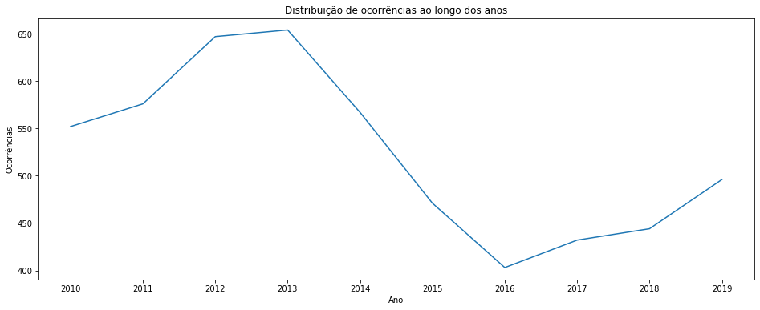
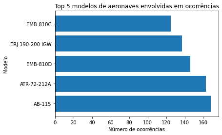

# Bootcamp: Analista de Banco de Dados  - Desafio do Módulo 03


# Objetivos de Ensino


### Exercitar os conceitos vistos em aulas em relação ao banco de dados NoSQL
 * **A partir de dados da Força Aérea Brasileira sobre a aviação civil
Brasileira (CENIPA - Ocorrências Aeronáuticas na Aviação Civil),vamos importar algumas informações no MongoDB para executar análises.**
 * **Arquivos com os quais trabalharemos:**
     * **Ocorrencia.csv - Informações sobre as ocorrências.**
     * **Ocorrencia_tipo.csv - Informações sobre o tipo de ocorrência.**
     * **Aeronave.csv - Informações sobre as aeronaves envolvidas nas ocorrências.**
 * **Alguns ajustes foram executados para facilitar nosso estudo, tais como
eliminação de caracteres especiais, acentos e ajustes nos campos data e hora
para facilitar a importação no MongoDB.**

*Fonte: [dados abertos](https://dados.gov.br/dados/conjuntos-dados/ocorrencias-aeronauticas-da-aviacao-civil-brasileira)*


# Enunciado


 * **A base de dados de ocorrências aeronáuticas é gerenciada pelo Centro de
Investigação e Prevenção de Acidentes Aeronáuticos (CENIPA). Constam nesta
base de dados as ocorrências aeronáuticas notificadas ao CENIPA nos últimos
10 anos que ocorreram em solo brasileiro.**
**Dentre as informações disponíveis estão os dados sobre as aeronaves
envolvidas, fatalidades, local, data, horário dos eventos e informações
taxonômicas típicas das investigações de acidentes (AIG).**

# Etapas do trabalho:
<a name="ancora"></a>

### [a) Abrir o prompt de comando do MongoDB. Vamos criar o database e as collections por lá.](#ancora1.0)
### [b) Criar o Database chamado “desafio”.](#ancora1.1)
### [c) Criar as collections com validator.](#ancora1.2)
### [d) Criar a collection “ocorrencia”.](#ancora1.3)
### [e) Criar a collection “ocorrencia_tipo”.](#ancora1.4)
### [f) Criar a collection “aeronave”.](#ancora1.5)
### [g) Abrir o MongoDB Compass para fazer as importações dos dados.](#ancora1.6)
### [h) Carregar a collection “aeronave”.](#ancora1.7)
### [i) Carregar a collection “ocorrencia_tipo”.](#ancora1.8)
### [j) Carregar a collection “ocorrencia”.](#ancora1.9)

# Atividades
<a name="ancora2"></a>

#### [1. Verifique o número de documentos carregados na collection “ocorrencia”.](#ancora2.1)
* Você pode usar a função count() ou db.collection.aggregate com {$sum:1}\.

#### [2. Verifique o número de documentos carregados na collection “ocorrencia_tipo”.](#ancora2.2)
* Você pode usar a função count() ou db.collection.aggregate com {$sum:1}.

#### [3. Verifique o número de documentos carregados na collection “aeronave”.](#ancora2.3)
* Você pode usar a função count() ou db.collection.aggregate com {$sum:1\}.

#### [4. Execute um comando find() na collection aeronave com modelo= 'AB-115' OU tipo_veiculo = 'AVIAO'.](#ancora2.4)
* Limite a consulta para trazer apenas os 5 primeiros documentos.
    
#### [5. Execute um comando find() na collection aeronave onde o tipo_veiculo não são os seguintes tipos: ['AVIAO', 'HELICOPTERO', 'HIDROAVIAO','PLANADOR', 'ANFIBIO']](#ancora2.5)
* Limite o resultado da consulta para trazer apenas os 10 primeiros documentos.
* A dica é que podemos usar a condição IN para retornar apenas valores que estão dentro de uma lista e o NOT IN para retornar os valores que não estão dentro de uma lista.

#### [6. Execute um comando aggregate() na collection aeronave para agrupar os documentos pelo campo tipo_veiculo fazendo uma contagem ($sum:1) para cada tipo_veiculo.](#ancora2.6)

#### [7. Execute um comando find() na collection ocorrencia para buscar os documentos com o field num_recomendacoes menor ou igual ($lte) a 2 (<=2). Limite o resultado da sua consulta para 10 documentos.](#ancora2.7)

#### [8. Execute um comando aggregate() na collection ocorrencia para buscar os documentos conforme abaixo.](#ancora2.8)
* Field num_recomendacoes menor ou igual ($lte) a 2 (<=2).

* Agrupar pelo field uf ($uf).

* Fazer a contagem ($sum:1).

* Ordenar de forma descendente.    
             
#### [9. Execute um comando aggregate() na collection ocorrencia para buscar amédia dos números de recomendações ($num_recomendacoes).](#ancora2.9)

#### [10.Execute um comando lookup aggregate() na collection aeronave fazendo uma junção com a collection ocorrencia. Limite o resultado do lookup aggregate() em dois documentos para facilitar a visão do que acontece.](#ancora2.10)

#### [11.Execute um comando lookup aggregate() na collection ocorrencia fazendo uma junção com a collection ocorrencia_tipo. Limite o resultado do lookup aggregate() em dois documentos para facilitar a visão do que acontece.](#ancora2.11)          
      


# Resolução das etapas:

<a id="ancora1.0"></a>
**a) Abrir o prompt de comando do MongoDB. Vamos criar o database e as collections por lá.**
* **Esse procedimento será realizado com a lib pymongo através de um script em python**.


```python
# import das libs
import pymongo
```


```python
# Conectar ao servidor do MongoDB
client = pymongo.MongoClient('localhost', 27017)
```

<a id="ancora1.1"></a>
**b) Criar o Database chamado “desafio”.**


```python
db = client['desafio']
```


```python
print(db)
```

    Database(MongoClient(host=['localhost:27017'], document_class=dict, tz_aware=False, connect=True), 'desafio')
    

* [voltar](#ancora).

<a id="ancora1.2"></a>
### **c) Criar as collections com validator.**

<a id="ancora1.3"></a>
**d) Criar a collection “ocorrencia”.**


```python
db = client["desafio"]
ocorrencia_collection = db.create_collection("ocorrencia", validator={
    "$jsonSchema": {
        "bsonType": "object",
        "properties": {
            "id_ocorrencia": {
                "bsonType": "int",
                "description": "ID da ocorrência"
            },
            "classificacao": {
                "bsonType": "string",
                "description": "is not required"
            },
            "cidade": {
                "bsonType": "string",
                "description": "is not required"
            },
            "uf": {
                "bsonType": "string",
                "description": "is not required"
            },
            "pais": {
                "bsonType": "string",
                "description": "is not required"
            },
            "data": {
                "bsonType": "date",
                "description": "is not required"
            },
            "num_recomendacoes": {
                "bsonType": "int",
                "description": "is not required"
            }
        }
    }
})

# verifica se a collection foi criada com o validator
collection_info = db.get_collection("ocorrencia").options()
if "validator" in collection_info:
    print("A collection 'ocorrencia' foi criada com o validator.")
else:
    print("A collection 'ocorrencia' não foi criada com o validator.")
```

    A collection 'ocorrencia' foi criada com o validator.
    

* **O validator é definido como um dicionário JSON, que define as regras para os campos que serão inseridos na coleção. Neste caso, são definidos os tipos de dados e as propriedades obrigatórias para cada campo.**

* [voltar](#ancora).

<a id="ancora1.4"></a>
**e) Criar a collection “ocorrencia_tipo” com validator.**


```python
# Seleciona o database e cria a collection ocorrencia_tipo com validator
db = client.desafio
db.create_collection('ocorrencia_tipo', validator={
    '$jsonSchema': {
        'bsonType': 'object',
        'properties': {
            'id_ocorrencia_t': {
                'bsonType': 'int',
                'description': 'is not required'
            },
            'tipo': {
                'bsonType': 'string',
                'description': 'is not required'
            }
        }
    }
})

# verifica se a collection foi criada com o validator
collection_info = db.get_collection("ocorrencia_tipo").options()
if "validator" in collection_info:
    print("A collection 'ocorrencia_tipo' foi criada com o validator.")
else:
    print("A collection 'ocorrencia_tipo' não foi criada com o validator.")

```

    A collection 'ocorrencia_tipo' foi criada com o validator.
    

* [voltar](#ancora).

<a id="ancora1.5"></a>
**f) Criar a collection “aeronave”.**


```python
# Seleciona o database e cria a collection aeronave com validator
db = client["desafio"]
aeronave_collection = db["aeronave"] # var para armazenar o nome da collection a ser criada

# var para armazenar as configurações do validator
aeronave_validator = {
    "$jsonSchema": {
        "bsonType": "object",
        "required": ["assentos", "ano_fabricacao"],
        "properties": {
            "id_ocorrencia_a": {
                "bsonType": "int",
                "description": "is not required"
            },
            "matricula": {
                "bsonType": "string",
                "description": "is not required"
            },
            "operador_categoria": {
                "bsonType": "string"
            },
            "tipo_veiculo": {
                "bsonType": "string",
                "description": "is not required"
            },
            "fabricante": {
                "bsonType": "string",
                "description": "is not required"
            },
            "modelo": {
                "bsonType": "string",
                "description": "is not required"
            },
            "motor_tipo": {
                "bsonType": "string"
            },
            "motor_quantidade": {
                "bsonType": "string"
            },
            "assentos": {
                "bsonType": "int",
                "minimum": 1,
                "maximum": 1000,
                "description": "must be an integer in [1, 1000] and is required"
            },
            "ano_fabricacao": {
                "bsonType": "int",
                "minimum": 1950,
                "maximum": 2030,
                "description": "must be an integer in [1950, 2030] and is required"
            },
            "pais_fabricante": {
                "bsonType": "string"
            },
            "registro_segmento": {
                "bsonType": "string"
            },
            "voo_origem": {
                "bsonType": "string"
            },
            "voo_destino": {
                "bsonType": "string"
            },
            "fase_operacao": {
                "bsonType": "string"
            }
        }
    }
}

aeronave_collection.drop() # remove a collection se já existir

aeronave_collection = db.create_collection("aeronave", validator=aeronave_validator) # cria a collection com o validator.


# verifica se a collection foi criada com o validator
collection_info = db.get_collection("aeronave").options()
if "validator" in collection_info:
    print("A collection 'aeronave' foi criada com o validator.")
else:
    print("A collection 'aeronave' não foi criada com o validator.")

```

    A collection 'aeronave' foi criada com o validator.
    

* [voltar](#ancora).

<a id="ancora1.6"></a>
### g) Abrir o MongoDB Compass para fazer as importações dos dados.

<a id="ancora1.7"></a>
**h) Carregar a collection “aeronave”.**


```python
import pandas as pd

# Selecionar o banco de dados
db = client['desafio']

# Selecionar a coleção
collection = db['aeronave']

# Limpar a coleção antes de importar
# collection.remove({})

# Ler o arquivo CSV com o pandas
df = pd.read_csv('./aeronave.csv', delimiter=';',encoding="iso-8859-1") # necessário usar o encoding pois estava com erro.

# Converter o DataFrame para uma lista de dicionários
data = df.to_dict('records')

# Inserir os documentos na coleção
collection.insert_many(data)
```
BulkWriteError: batch op errors occurred, full error: {'writeErrors': [{'index': 97, 'code': 121, 'errmsg': 'Document failed validation', 'errInfo': {'failingDocumentId': ObjectId('63f94d0617a43afe40cc737a'), 'details': {'operatorName': '$jsonSchema', 'schemaRulesNotSatisfied': [{'operatorName': 'properties', 'propertiesNotSatisfied': [{'propertyName': 'ano_fabricacao', 'description': 'must be an integer in [1950, 2030] and is required', 'details': [{'operatorName': 'minimum', 'specifiedAs': {'minimum': 1950}, 'reason': 'comparison failed', 'consideredValue': 1946}]}]}]}}, 'op': {'id_ocorrencia_a': 40271, 'matricula': 'PPRTO', 'operador_categoria': '***', 'tipo_veiculo': 'AVIAO', 'fabricante': 'CIA AERONAUTICA PAULISTA', 'modelo': 'CAP-4', 'motor_tipo': 'PISTAO', 'motor_quantidade': 'MONOMOTOR', 'assentos': 2, 'ano_fabricacao': 1946, 'pais_fabricante': 'BRASIL', 'registro_segmento': 'INSTRUCAO', 'voo_origem': 'ENCANTA MOCA', 'voo_destino': 'FAZENDA BUSATO 1', 'fase_operacao': 'DECOLAGEM', '_id': ObjectId('63f94d0617a43afe40cc737a')}}], 'writeConcernErrors': [], 'nInserted': 97, 'nUpserted': 0, 'nMatched': 0, 'nModified': 0, 'nRemoved': 0, 'upserted': []}
* **Se observarmos o erro, podemos entender que nosso validator foi criado com restrição para 'ano_fabricação com minimo:1950 e foram encontrados valores abaixo disso como 1946.**
* **O erro foi proposital, para verificarmos na pratica as restrições impostas pelo validador.**
* **Após corrigir esse erro, conforme o enunciado já sabemos que existe um outro erro com assentos menor do que o mínimo imposto, para poupar o retrabalho vamos realizar as devidas correções, visto que já foi possível entender o propósito.**

**Para solução desse erro vamos alterar "ano_fabricação" mínimo para 1900 e "assentos" mínimo para 0, assim conseguimos importar todos os documentos do arquivo aeronave.csv**.


```python
# Realizando as alterações na collection aeronave.
# Seleciona o database "Desafio"
db = client["desafio"]

# Define a nova validação para a collection "aeronave"
validator = {
    "$jsonSchema": {
        "bsonType": "object",
        "required": ["assentos", "ano_fabricacao"],
        "properties": {
            "id_ocorrencia_a": {
                "bsonType": "int",
                "description": "is not required"
            },
            "matricula": {
                "bsonType": "string",
                "description": "is not required"
            },
            "operador_categoria": {
                "bsonType": "string"
            },
            "tipo_veiculo": {
                "bsonType": "string",
                "description": "is not required"
            },
            "fabricante": {
                "bsonType": "string",
                "description": "is not required"
            },
            "modelo": {
                "bsonType": "string",
                "description": "is not required"
            },
            "motor_tipo": {
                "bsonType": "string"
            },
            "motor_quantidade": {
                "bsonType": "string"
            },
            "assentos": {
                "bsonType": "int",
                "minimum": 0,
                "maximum": 1000,
                "description": "must be an integer in [ 0, 1000 ] and is required"
            },
            "ano_fabricacao": {
                "bsonType": "int",
                "minimum": 1900,
                "maximum": 2030,
                "description": "must be an integer in [ 1900, 2030 ] and is required"
            },
            "pais_fabricante": {
                "bsonType": "string"
            },
            "registro_segmento": {
                "bsonType": "string"
            },
            "voo_origem": {
                "bsonType": "string"
            },
            "voo_destino": {
                "bsonType": "string"
            },
            "fase_operacao": {
                "bsonType": "string"
            }
        }
    }
}

# Executa o comando "collMod" para atualizar a validação da collection "aeronave"
db.command({"collMod": "aeronave", "validator": validator})
```


    {'ok': 1.0}


```python
# Quantidade de registro inclusos no arquivo csv.
df.count()[0]
```


    5303


**Agora vamos realizar a carga novamente**


```python
# Selecionar o banco de dados
db = client['desafio']

# Selecionar a coleção
collection = db['aeronave']

# Limpar a coleção antes de importar para evitar erros
collection.delete_many({})

# Ler o arquivo CSV com o pandas
df = pd.read_csv('./aeronave.csv', delimiter=';',encoding="iso-8859-1")

# Converter o DataFrame para uma lista de dicionários
data = df.to_dict('records')

# Inserir os documentos na coleção
collection.insert_many(data)

# Verifique o número de documentos na coleção
num_docs = db.aeronave.count_documents({})
expected_num_docs = 5303  # número de documentos esperados no arquivo csv já verificado

if num_docs == expected_num_docs:
    print("O arquivo foi carregado com sucesso!")
    print('='*50)
    print(f'Total de documentos:{num_docs}')
    print('='*50)
else:
    print("Ocorreu um erro durante o carregamento do arquivo.")

```

    O arquivo foi carregado com sucesso!
    ==================================================
    Total de documentos:5303
    ==================================================
    

* [voltar](#ancora).

<a id="ancora1.8"></a>
**i) Carregar a collection “ocorrencia_tipo”.**


```python
# Selecionar o banco de dados
db = client['desafio']

# Selecionar a coleção
collection = db['ocorrencia_tipo']

# Limpar a coleção antes de importar para evitar erros
collection.delete_many({})

# Ler o arquivo CSV com o pandas
df = pd.read_csv('./ocorrencia_tipo.csv', delimiter=';',encoding="iso-8859-1")

# Converter o DataFrame para uma lista de dicionários
data = df.to_dict('records')

# Inserir os documentos na coleção
collection.insert_many(data)

# Verifique o número de documentos na coleção
num_docs = db.ocorrencia_tipo.count_documents({})
expected_num_docs = df.count()[0]  # número de documentos esperados no arquivo csv

if num_docs == expected_num_docs:
    print("O arquivo foi carregado com sucesso!")
    print('='*50)
    print(f'Total de documentos:{num_docs}')
    print('='*50)
else:
    print("Ocorreu um erro durante o carregamento do arquivo.")
```

    O arquivo foi carregado com sucesso!
    ==================================================
    Total de documentos:5337
    ==================================================
    

* [voltar](#ancora).

<a id="ancora1.9"></a>
**j) Carregar a collection “ocorrencia”.**


```python
# Selecionar o banco de dados
db = client['desafio']

# Selecionar a coleção
collection = db['ocorrencia']

# Limpar a coleção antes de importar para evitar erros
collection.delete_many({})

# Ler o arquivo CSV com o pandas
df = pd.read_csv('./ocorrencia.csv', delimiter=';',encoding="iso-8859-1")

# Converter o DataFrame para uma lista de dicionários
data = df.to_dict('records')

# Inserir os documentos na coleção
collection.insert_many(data)

# Verifique o número de documentos na coleção
num_docs = db.ocorrencia.count_documents({})
expected_num_docs = df.count()[0]  # número de documentos esperados no arquivo csv

if num_docs == expected_num_docs:
    print("O arquivo foi carregado com sucesso!")
    print('='*50)
    print(f'Total de documentos:{num_docs}')
    print('='*50)
else:
    print("Ocorreu um erro durante o carregamento do arquivo.")
```
BulkWriteError: batch op errors occurred, full error: {'writeErrors': [{'index': 0, 'code': 121, 'errmsg': 'Document failed validation', 'errInfo': {'failingDocumentId': ObjectId('63f9581517a43afe40cd045f'), 'details': {'operatorName': '$jsonSchema', 'schemaRulesNotSatisfied': [{'operatorName': 'properties', 'propertiesNotSatisfied': [{'propertyName': 'data', 'description': 'is not required', 'details': [{'operatorName': 'bsonType', 'specifiedAs': {'bsonType': 'date'}, 'reason': 'type did not match', 'consideredValue': '2010-02-07T17:40:00Z', 'consideredType': 'string'}]}]}]}}, 'op': {'id_ocorrencia': 39115, 'classificacao': 'ACIDENTE', 'cidade': 'CORRENTINA', 'uf': 'BA', 'pais': 'BRASIL', 'data': '2010-02-07T17:40:00Z', 'num_recomendacoes': 2, '_id': ObjectId('63f9581517a43afe40cd045f')}}], 'writeConcernErrors': [], 'nInserted': 0, 'nUpserted': 0, 'nMatched': 0, 'nModified': 0, 'nRemoved': 0, 'upserted': []}
* **Ocorreu esse erro inesperado que está fora do enunciado pois estamos realizando o desafio todo via python.**
* **Bom aqui podemos perceber que o erro ocorre em Data pois nosso resultado foi do tipo string e a validação imposta foi tipo data.**
* **Vamos examinar o formato que o pandas carregou para descobrirmos se o erro ocorreu durante ou após o carregamento do dataframe.**


```python
df.info()
```

    <class 'pandas.core.frame.DataFrame'>
    RangeIndex: 5242 entries, 0 to 5241
    Data columns (total 7 columns):
     #   Column             Non-Null Count  Dtype 
    ---  ------             --------------  ----- 
     0   id_ocorrencia      5242 non-null   int64 
     1   classificacao      5242 non-null   object
     2   cidade             5242 non-null   object
     3   uf                 5242 non-null   object
     4   pais               5242 non-null   object
     5   data               5242 non-null   object
     6   num_recomendacoes  5242 non-null   int64 
    dtypes: int64(2), object(5)
    memory usage: 286.8+ KB
    

* **Conforme as informações acima, podemos concluir que 'data' foi carregado como object e não como data, causa possível do erro**
* **Podemos converter essa variável durante o próprio carregamento, vamos experimentar**.


```python
# necessário a intalação para conveter 'data' para o tipo date
#!pip install iso8601

```

    Defaulting to user installation because normal site-packages is not writeable
    Collecting iso8601
      Downloading iso8601-1.1.0-py3-none-any.whl (9.9 kB)
    Installing collected packages: iso8601
    Successfully installed iso8601-1.1.0
    


```python
from iso8601 import parse_date # import for !pip install iso8601 pois o pandas não conseguiu converter sozinho.

#função para converter o atributo 'data' para o tipo date.
def my_date_parser(date_string):
    return parse_date(date_string)

# Selecionar o banco de dados
db = client['desafio']

# Selecionar a coleção
collection = db['ocorrencia']

# Limpar a coleção antes de importar para evitar erros
collection.delete_many({})

# Ler o arquivo CSV com o pandas
df = pd.read_csv('./ocorrencia.csv', delimiter=';', parse_dates=['data'], date_parser=my_date_parser, encoding="iso-8859-1") # resolvendo o problema do tipo date

# Converter o DataFrame para uma lista de dicionários
data = df.to_dict('records')

# Inserir os documentos na coleção
collection.insert_many(data)

# Verifique o número de documentos na coleção
num_docs = db.ocorrencia.count_documents({})
expected_num_docs = df.count()[0]  # número de documentos esperados no arquivo csv

if num_docs == expected_num_docs:
    print("O arquivo foi carregado com sucesso!")
    print('='*50)
    print(f'Total de documentos:{num_docs}')
    print('='*50)
else:
    print("Ocorreu um erro durante o carregamento do arquivo.")
```

    O arquivo foi carregado com sucesso!
    ==================================================
    Total de documentos:5242
    ==================================================
    

* **Com isso termimanos a parte Carregamento, vamos seguir com as atividades propostas.**

* [voltar](#ancora).

# Resolução das atividades:

<a id="ancora2.1"></a>
**1. Verifique o número de documentos carregados na collection “ocorrencia”.**
* Você pode usar a função count() ou db.collection.aggregate com {$sum:1}.*

* **Usando a função count()**.


```python
#Acesso a collection
ocorrencia = db['ocorrencia']

# Contagem de documentos na collection
count = ocorrencia.count_documents({})
print('='*50)
print(f'Total de documentos com a função count:{count}')
print('='*50)
```

    ==================================================
    Total de documentos com a função count:5242
    ==================================================
    

* **Usando a função aggregate().**


```python
#Acesso a collection
ocorrencia = db['ocorrencia']

# Contagem de documentos na collection
count = ocorrencia.aggregate([{"$group": {"_id": None, "count": {"$sum": 1}}}])
print('='*50)
print(f'Total de documentos com a função aggregate:{count.next()["count"]}')
print('='*50)
```

    ==================================================
    Total de documentos com a função aggregate:5242
    ==================================================
    

[voltar](#ancora2).

<a id="ancora2.2"></a>
**2. Verifique o número de documentos carregados na collection “ocorrencia_tipo”.** 
* Você pode usar a função count() ou db.collection.aggregate com {$sum:1}.*

* **Usando a função count()**.


```python
#Acesso a collection
ocorrencia_tipo = db['ocorrencia_tipo']

# Contagem de documentos na collection
count = ocorrencia_tipo.count_documents({})
print('='*50)
print(f'Total de documentos com a função count:{count}')
print('='*50)
```

    ==================================================
    Total de documentos com a função count:5337
    ==================================================
    

 **Usando a função aggregate().**


```python
#Acesso a collection
ocorrencia_tipo = db['ocorrencia_tipo']

# Contagem de documentos na collection
count = ocorrencia_tipo.aggregate([{"$group": {"_id": None, "count": {"$sum": 1}}}])
print('='*50)
print(f'Total de documentos com a função aggregate:{count.next()["count"]}')
print('='*50)
```

    ==================================================
    Total de documentos com a função aggregate:5337
    ==================================================
    

[voltar](#ancora2).

<a id="ancora2.3"></a>
## 3. Verifique o número de documentos carregados na collection “aeronave”. 
*Você pode usar a função count() ou db.collection.aggregate com {$sum:1}.*

* **Usando a função count()**.


```python
#Acesso a collection
aeronave = db['aeronave']

# Contagem de documentos na collection
count = aeronave.count_documents({})
print('='*50)
print(f'Total de documentos com a função count:{count}')
print('='*50)
```

    ==================================================
    Total de documentos com a função count:5303
    ==================================================
    

 **Usando a função aggregate().**


```python
#Acesso a collection
aeronave = db['aeronave']

# Contagem de documentos na collection
count = aeronave.aggregate([{"$group": {"_id": None, "count": {"$sum": 1}}}])
print('='*50)
print(f'Total de documentos com a função aggregate:{count.next()["count"]}')
print('='*50)
```

    ==================================================
    Total de documentos com a função aggregate:5303
    ==================================================
    

[voltar](#ancora2).

<a id="ancora2.4"></a>
## 4. Execute um comando find() na collection aeronave com modelo= 'AB-115' OU tipo_veiculo = 'AVIAO'.

*Limite a consulta para trazer apenas os 5 primeiros documentos.*


```python
# Acessando a coleção 'aeronave'
aeronave = db["aeronave"]

# Consultando aeronaves onde o modelo é 'AB-115' OU o tipo_veiculo é 'AVIAO'
query = {"$or": [{"modelo": "AB-115"}, {"tipo_veiculo": "AVIAO"}]}
result = aeronave.find(query).limit(5)

# Imprimindo os resultados
for r in result:
    print(r)
```

    {'_id': ObjectId('63f9579917a43afe40ccdacf'), 'id_ocorrencia_a': 39115, 'matricula': 'PTNQX', 'operador_categoria': '***', 'tipo_veiculo': 'AVIAO', 'fabricante': 'NEIVA INDUSTRIA AERONAUTICA', 'modelo': 'EMB-711A', 'motor_tipo': 'PISTAO', 'motor_quantidade': 'MONOMOTOR', 'assentos': 4, 'ano_fabricacao': 1979, 'pais_fabricante': 'BRASIL', 'registro_segmento': 'PARTICULAR', 'voo_origem': 'BRIGADEIRO ARARIPE MACEDO', 'voo_destino': 'CORRENTINA', 'fase_operacao': 'DECOLAGEM'}
    {'_id': ObjectId('63f9579917a43afe40ccdad0'), 'id_ocorrencia_a': 39155, 'matricula': 'PTLVI', 'operador_categoria': '***', 'tipo_veiculo': 'AVIAO', 'fabricante': 'BEECH AIRCRAFT', 'modelo': 'C90', 'motor_tipo': 'TURBOELICE', 'motor_quantidade': 'BIMOTOR', 'assentos': 8, 'ano_fabricacao': 1979, 'pais_fabricante': 'BRASIL', 'registro_segmento': 'PARTICULAR', 'voo_origem': 'FORA DE AERODROMO', 'voo_destino': 'FORA DE AERODROMO', 'fase_operacao': 'DECOLAGEM'}
    {'_id': ObjectId('63f9579917a43afe40ccdad1'), 'id_ocorrencia_a': 39156, 'matricula': 'PPPTO', 'operador_categoria': '***', 'tipo_veiculo': 'AVIAO', 'fabricante': 'AEROSPATIALE AND ALENIA', 'modelo': 'ATR-72-212A', 'motor_tipo': 'TURBOELICE', 'motor_quantidade': 'BIMOTOR', 'assentos': 73, 'ano_fabricacao': 2008, 'pais_fabricante': 'BRASIL', 'registro_segmento': 'REGULAR', 'voo_origem': 'AFONSO PENA', 'voo_destino': 'ADALBERTO MENDES DA SILVA', 'fase_operacao': 'ARREMETIDA NO AR'}
    {'_id': ObjectId('63f9579917a43afe40ccdad2'), 'id_ocorrencia_a': 39158, 'matricula': 'PRLGJ', 'operador_categoria': 'REGULAR', 'tipo_veiculo': 'AVIAO', 'fabricante': 'BOEING COMPANY', 'modelo': '757-225', 'motor_tipo': 'JATO', 'motor_quantidade': 'BIMOTOR', 'assentos': 5, 'ano_fabricacao': 1984, 'pais_fabricante': 'BRASIL', 'registro_segmento': 'REGULAR', 'voo_origem': 'FORA DE AERODROMO', 'voo_destino': 'FORA DE AERODROMO', 'fase_operacao': 'SUBIDA'}
    {'_id': ObjectId('63f9579917a43afe40ccdad3'), 'id_ocorrencia_a': 39176, 'matricula': 'PRMAA', 'operador_categoria': 'REGULAR', 'tipo_veiculo': 'AVIAO', 'fabricante': 'AIRBUS INDUSTRIE', 'modelo': 'A320-232', 'motor_tipo': 'JATO', 'motor_quantidade': 'BIMOTOR', 'assentos': 184, 'ano_fabricacao': 2001, 'pais_fabricante': 'BRASIL', 'registro_segmento': 'REGULAR', 'voo_origem': 'FORA DE AERODROMO', 'voo_destino': 'FORA DE AERODROMO', 'fase_operacao': 'SUBIDA'}
    

* **OU podemos exibir de uma forma mais elegante com Pandas DataFrame**.


```python
pd.DataFrame(list(aeronave.find(query).limit(5)))
```


<div>
<table border="1" class="dataframe">
  <thead>
    <tr style="text-align: right;">
      <th></th>
      <th>_id</th>
      <th>id_ocorrencia_a</th>
      <th>matricula</th>
      <th>operador_categoria</th>
      <th>tipo_veiculo</th>
      <th>fabricante</th>
      <th>modelo</th>
      <th>motor_tipo</th>
      <th>motor_quantidade</th>
      <th>assentos</th>
      <th>ano_fabricacao</th>
      <th>pais_fabricante</th>
      <th>registro_segmento</th>
      <th>voo_origem</th>
      <th>voo_destino</th>
      <th>fase_operacao</th>
    </tr>
  </thead>
  <tbody>
    <tr>
      <th>0</th>
      <td>63f9579917a43afe40ccdacf</td>
      <td>39115</td>
      <td>PTNQX</td>
      <td>***</td>
      <td>AVIAO</td>
      <td>NEIVA INDUSTRIA AERONAUTICA</td>
      <td>EMB-711A</td>
      <td>PISTAO</td>
      <td>MONOMOTOR</td>
      <td>4</td>
      <td>1979</td>
      <td>BRASIL</td>
      <td>PARTICULAR</td>
      <td>BRIGADEIRO ARARIPE MACEDO</td>
      <td>CORRENTINA</td>
      <td>DECOLAGEM</td>
    </tr>
    <tr>
      <th>1</th>
      <td>63f9579917a43afe40ccdad0</td>
      <td>39155</td>
      <td>PTLVI</td>
      <td>***</td>
      <td>AVIAO</td>
      <td>BEECH AIRCRAFT</td>
      <td>C90</td>
      <td>TURBOELICE</td>
      <td>BIMOTOR</td>
      <td>8</td>
      <td>1979</td>
      <td>BRASIL</td>
      <td>PARTICULAR</td>
      <td>FORA DE AERODROMO</td>
      <td>FORA DE AERODROMO</td>
      <td>DECOLAGEM</td>
    </tr>
    <tr>
      <th>2</th>
      <td>63f9579917a43afe40ccdad1</td>
      <td>39156</td>
      <td>PPPTO</td>
      <td>***</td>
      <td>AVIAO</td>
      <td>AEROSPATIALE AND ALENIA</td>
      <td>ATR-72-212A</td>
      <td>TURBOELICE</td>
      <td>BIMOTOR</td>
      <td>73</td>
      <td>2008</td>
      <td>BRASIL</td>
      <td>REGULAR</td>
      <td>AFONSO PENA</td>
      <td>ADALBERTO MENDES DA SILVA</td>
      <td>ARREMETIDA NO AR</td>
    </tr>
    <tr>
      <th>3</th>
      <td>63f9579917a43afe40ccdad2</td>
      <td>39158</td>
      <td>PRLGJ</td>
      <td>REGULAR</td>
      <td>AVIAO</td>
      <td>BOEING COMPANY</td>
      <td>757-225</td>
      <td>JATO</td>
      <td>BIMOTOR</td>
      <td>5</td>
      <td>1984</td>
      <td>BRASIL</td>
      <td>REGULAR</td>
      <td>FORA DE AERODROMO</td>
      <td>FORA DE AERODROMO</td>
      <td>SUBIDA</td>
    </tr>
    <tr>
      <th>4</th>
      <td>63f9579917a43afe40ccdad3</td>
      <td>39176</td>
      <td>PRMAA</td>
      <td>REGULAR</td>
      <td>AVIAO</td>
      <td>AIRBUS INDUSTRIE</td>
      <td>A320-232</td>
      <td>JATO</td>
      <td>BIMOTOR</td>
      <td>184</td>
      <td>2001</td>
      <td>BRASIL</td>
      <td>REGULAR</td>
      <td>FORA DE AERODROMO</td>
      <td>FORA DE AERODROMO</td>
      <td>SUBIDA</td>
    </tr>
  </tbody>
</table>
</div>


[voltar](#ancora2).

<a id="ancora2.5"></a>
## 5. Execute um comando find() na collection aeronave onde o tipo_veiculo não são os seguintes tipos: ['AVIAO', 'HELICOPTERO', 'HIDROAVIAO','PLANADOR', 'ANFIBIO']

*Limite o resultado da consulta para trazer apenas os 10 primeiros documentos.*
*A dica é que podemos usar a condição IN para retornar apenas valores que estão dentro de uma lista e o NOT IN para retornar os valores que não estão dentro de uma lista.*


```python
#var para collection 
aeronave = db["aeronave"]
#var para resultados não desejados
tipos_excluidos = ['AVIAO', 'HELICOPTERO', 'HIDROAVIAO', 'PLANADOR', 'ANFIBIO']

resultado = aeronave.find({"tipo_veiculo": {"$nin": tipos_excluidos}}).limit(10)

for r in resultado:
    print(r)

```

    {'_id': ObjectId('63f9579917a43afe40ccdad7'), 'id_ocorrencia_a': 39295, 'matricula': 'PUFLK', 'operador_categoria': 'EXPERIMENTAL', 'tipo_veiculo': 'ULTRALEVE', 'fabricante': '***', 'modelo': 'RV-9', 'motor_tipo': 'PISTAO', 'motor_quantidade': 'MONOMOTOR', 'assentos': 2, 'ano_fabricacao': 2004, 'pais_fabricante': 'BRASIL', 'registro_segmento': 'EXPERIMENTAL', 'voo_origem': 'FORA DE AERODROMO', 'voo_destino': 'FORA DE AERODROMO', 'fase_operacao': 'APROXIMACAO FINAL'}
    {'_id': ObjectId('63f9579917a43afe40ccdae0'), 'id_ocorrencia_a': 39323, 'matricula': 'PUMEL', 'operador_categoria': 'EXPERIMENTAL', 'tipo_veiculo': 'ULTRALEVE', 'fabricante': '***', 'modelo': 'MISTRAL 582C', 'motor_tipo': 'PISTAO', 'motor_quantidade': 'MONOMOTOR', 'assentos': 2, 'ano_fabricacao': 2000, 'pais_fabricante': 'BRASIL', 'registro_segmento': 'EXPERIMENTAL', 'voo_origem': 'FORA DE AERODROMO', 'voo_destino': 'FORA DE AERODROMO', 'fase_operacao': 'SUBIDA'}
    {'_id': ObjectId('63f9579917a43afe40ccdb2a'), 'id_ocorrencia_a': 40261, 'matricula': 'PUEPM', 'operador_categoria': 'EXPERIMENTAL', 'tipo_veiculo': 'ULTRALEVE', 'fabricante': 'EDSON PIMENTEL MATHEUS', 'modelo': 'MAX M22', 'motor_tipo': 'PISTAO', 'motor_quantidade': 'MONOMOTOR', 'assentos': 2, 'ano_fabricacao': 2002, 'pais_fabricante': 'BRASIL', 'registro_segmento': 'EXPERIMENTAL', 'voo_origem': 'FORA DE AERODROMO', 'voo_destino': 'FORA DE AERODROMO', 'fase_operacao': 'POUSO'}
    {'_id': ObjectId('63f9579917a43afe40ccdb42'), 'id_ocorrencia_a': 40318, 'matricula': 'PUDAB', 'operador_categoria': 'EXPERIMENTAL', 'tipo_veiculo': 'ULTRALEVE', 'fabricante': '***', 'modelo': 'FK9 MK3', 'motor_tipo': 'PISTAO', 'motor_quantidade': 'MONOMOTOR', 'assentos': 2, 'ano_fabricacao': 2000, 'pais_fabricante': 'BRASIL', 'registro_segmento': 'EXPERIMENTAL', 'voo_origem': 'FORA DE AERODROMO', 'voo_destino': 'FORA DE AERODROMO', 'fase_operacao': 'SUBIDA'}
    {'_id': ObjectId('63f9579917a43afe40ccdb6f'), 'id_ocorrencia_a': 40821, 'matricula': 'PUFDN', 'operador_categoria': 'EXPERIMENTAL', 'tipo_veiculo': 'ULTRALEVE', 'fabricante': 'CHS AMAZONAS IMP E EXP LTDA', 'modelo': 'SEAMAX M22', 'motor_tipo': 'PISTAO', 'motor_quantidade': 'MONOMOTOR', 'assentos': 2, 'ano_fabricacao': 2008, 'pais_fabricante': 'BRASIL', 'registro_segmento': 'EXPERIMENTAL', 'voo_origem': 'FORA DE AERODROMO', 'voo_destino': 'FORA DE AERODROMO', 'fase_operacao': 'DECOLAGEM'}
    {'_id': ObjectId('63f9579917a43afe40ccdb79'), 'id_ocorrencia_a': 40843, 'matricula': 'PURIZ', 'operador_categoria': 'EXPERIMENTAL', 'tipo_veiculo': 'ULTRALEVE', 'fabricante': '***', 'modelo': 'CONQUEST 180', 'motor_tipo': 'PISTAO', 'motor_quantidade': 'MONOMOTOR', 'assentos': 2, 'ano_fabricacao': 2009, 'pais_fabricante': 'BRASIL', 'registro_segmento': 'EXPERIMENTAL', 'voo_origem': 'FORA DE AERODROMO', 'voo_destino': 'FORA DE AERODROMO', 'fase_operacao': 'DECOLAGEM'}
    {'_id': ObjectId('63f9579917a43afe40ccdb99'), 'id_ocorrencia_a': 41482, 'matricula': 'PUCEP', 'operador_categoria': 'EXPERIMENTAL', 'tipo_veiculo': 'ULTRALEVE', 'fabricante': '***', 'modelo': 'EXCEL CARGO', 'motor_tipo': 'PISTAO', 'motor_quantidade': 'MONOMOTOR', 'assentos': 2, 'ano_fabricacao': 2009, 'pais_fabricante': 'BRASIL', 'registro_segmento': 'EXPERIMENTAL', 'voo_origem': 'FORA DE AERODROMO', 'voo_destino': 'FORA DE AERODROMO', 'fase_operacao': 'MANOBRA'}
    {'_id': ObjectId('63f9579917a43afe40ccdb9d'), 'id_ocorrencia_a': 41488, 'matricula': 'PUJPF', 'operador_categoria': 'EXPERIMENTAL', 'tipo_veiculo': 'ULTRALEVE', 'fabricante': '***', 'modelo': 'PARADISE', 'motor_tipo': 'PISTAO', 'motor_quantidade': 'MONOMOTOR', 'assentos': 2, 'ano_fabricacao': 2005, 'pais_fabricante': 'BRASIL', 'registro_segmento': 'EXPERIMENTAL', 'voo_origem': 'FORA DE AERODROMO', 'voo_destino': 'FORA DE AERODROMO', 'fase_operacao': 'POUSO'}
    {'_id': ObjectId('63f9579917a43afe40ccdba3'), 'id_ocorrencia_a': 41573, 'matricula': 'PULAY', 'operador_categoria': 'EXPERIMENTAL', 'tipo_veiculo': 'ULTRALEVE', 'fabricante': '***', 'modelo': 'LIGHTNING', 'motor_tipo': 'PISTAO', 'motor_quantidade': 'MONOMOTOR', 'assentos': 2, 'ano_fabricacao': 2008, 'pais_fabricante': 'BRASIL', 'registro_segmento': 'EXPERIMENTAL', 'voo_origem': 'FORA DE AERODROMO', 'voo_destino': 'FORA DE AERODROMO', 'fase_operacao': 'CIRCUITO DE TRAFEGO'}
    {'_id': ObjectId('63f9579917a43afe40ccdbbc'), 'id_ocorrencia_a': 41729, 'matricula': 'PUHRJ', 'operador_categoria': 'EXPERIMENTAL', 'tipo_veiculo': 'ULTRALEVE', 'fabricante': 'FABRICACAO PROPRIA', 'modelo': 'TRIKE', 'motor_tipo': 'PISTAO', 'motor_quantidade': 'MONOMOTOR', 'assentos': 1, 'ano_fabricacao': 1900, 'pais_fabricante': 'BRASIL', 'registro_segmento': 'EXPERIMENTAL', 'voo_origem': 'FORA DE AERODROMO', 'voo_destino': 'FORA DE AERODROMO', 'fase_operacao': 'VOO A BAIXA ALTURA'}
    

* **Melhorando a visualização**.


```python
pd.DataFrame(list(aeronave.find({"tipo_veiculo": {"$nin": tipos_excluidos}}).limit(10)))
```


<div>

<table border="1" class="dataframe">
  <thead>
    <tr style="text-align: right;">
      <th></th>
      <th>_id</th>
      <th>id_ocorrencia_a</th>
      <th>matricula</th>
      <th>operador_categoria</th>
      <th>tipo_veiculo</th>
      <th>fabricante</th>
      <th>modelo</th>
      <th>motor_tipo</th>
      <th>motor_quantidade</th>
      <th>assentos</th>
      <th>ano_fabricacao</th>
      <th>pais_fabricante</th>
      <th>registro_segmento</th>
      <th>voo_origem</th>
      <th>voo_destino</th>
      <th>fase_operacao</th>
    </tr>
  </thead>
  <tbody>
    <tr>
      <th>0</th>
      <td>63f9579917a43afe40ccdad7</td>
      <td>39295</td>
      <td>PUFLK</td>
      <td>EXPERIMENTAL</td>
      <td>ULTRALEVE</td>
      <td>***</td>
      <td>RV-9</td>
      <td>PISTAO</td>
      <td>MONOMOTOR</td>
      <td>2</td>
      <td>2004</td>
      <td>BRASIL</td>
      <td>EXPERIMENTAL</td>
      <td>FORA DE AERODROMO</td>
      <td>FORA DE AERODROMO</td>
      <td>APROXIMACAO FINAL</td>
    </tr>
    <tr>
      <th>1</th>
      <td>63f9579917a43afe40ccdae0</td>
      <td>39323</td>
      <td>PUMEL</td>
      <td>EXPERIMENTAL</td>
      <td>ULTRALEVE</td>
      <td>***</td>
      <td>MISTRAL 582C</td>
      <td>PISTAO</td>
      <td>MONOMOTOR</td>
      <td>2</td>
      <td>2000</td>
      <td>BRASIL</td>
      <td>EXPERIMENTAL</td>
      <td>FORA DE AERODROMO</td>
      <td>FORA DE AERODROMO</td>
      <td>SUBIDA</td>
    </tr>
    <tr>
      <th>2</th>
      <td>63f9579917a43afe40ccdb2a</td>
      <td>40261</td>
      <td>PUEPM</td>
      <td>EXPERIMENTAL</td>
      <td>ULTRALEVE</td>
      <td>EDSON PIMENTEL MATHEUS</td>
      <td>MAX M22</td>
      <td>PISTAO</td>
      <td>MONOMOTOR</td>
      <td>2</td>
      <td>2002</td>
      <td>BRASIL</td>
      <td>EXPERIMENTAL</td>
      <td>FORA DE AERODROMO</td>
      <td>FORA DE AERODROMO</td>
      <td>POUSO</td>
    </tr>
    <tr>
      <th>3</th>
      <td>63f9579917a43afe40ccdb42</td>
      <td>40318</td>
      <td>PUDAB</td>
      <td>EXPERIMENTAL</td>
      <td>ULTRALEVE</td>
      <td>***</td>
      <td>FK9 MK3</td>
      <td>PISTAO</td>
      <td>MONOMOTOR</td>
      <td>2</td>
      <td>2000</td>
      <td>BRASIL</td>
      <td>EXPERIMENTAL</td>
      <td>FORA DE AERODROMO</td>
      <td>FORA DE AERODROMO</td>
      <td>SUBIDA</td>
    </tr>
    <tr>
      <th>4</th>
      <td>63f9579917a43afe40ccdb6f</td>
      <td>40821</td>
      <td>PUFDN</td>
      <td>EXPERIMENTAL</td>
      <td>ULTRALEVE</td>
      <td>CHS AMAZONAS IMP E EXP LTDA</td>
      <td>SEAMAX M22</td>
      <td>PISTAO</td>
      <td>MONOMOTOR</td>
      <td>2</td>
      <td>2008</td>
      <td>BRASIL</td>
      <td>EXPERIMENTAL</td>
      <td>FORA DE AERODROMO</td>
      <td>FORA DE AERODROMO</td>
      <td>DECOLAGEM</td>
    </tr>
    <tr>
      <th>5</th>
      <td>63f9579917a43afe40ccdb79</td>
      <td>40843</td>
      <td>PURIZ</td>
      <td>EXPERIMENTAL</td>
      <td>ULTRALEVE</td>
      <td>***</td>
      <td>CONQUEST 180</td>
      <td>PISTAO</td>
      <td>MONOMOTOR</td>
      <td>2</td>
      <td>2009</td>
      <td>BRASIL</td>
      <td>EXPERIMENTAL</td>
      <td>FORA DE AERODROMO</td>
      <td>FORA DE AERODROMO</td>
      <td>DECOLAGEM</td>
    </tr>
    <tr>
      <th>6</th>
      <td>63f9579917a43afe40ccdb99</td>
      <td>41482</td>
      <td>PUCEP</td>
      <td>EXPERIMENTAL</td>
      <td>ULTRALEVE</td>
      <td>***</td>
      <td>EXCEL CARGO</td>
      <td>PISTAO</td>
      <td>MONOMOTOR</td>
      <td>2</td>
      <td>2009</td>
      <td>BRASIL</td>
      <td>EXPERIMENTAL</td>
      <td>FORA DE AERODROMO</td>
      <td>FORA DE AERODROMO</td>
      <td>MANOBRA</td>
    </tr>
    <tr>
      <th>7</th>
      <td>63f9579917a43afe40ccdb9d</td>
      <td>41488</td>
      <td>PUJPF</td>
      <td>EXPERIMENTAL</td>
      <td>ULTRALEVE</td>
      <td>***</td>
      <td>PARADISE</td>
      <td>PISTAO</td>
      <td>MONOMOTOR</td>
      <td>2</td>
      <td>2005</td>
      <td>BRASIL</td>
      <td>EXPERIMENTAL</td>
      <td>FORA DE AERODROMO</td>
      <td>FORA DE AERODROMO</td>
      <td>POUSO</td>
    </tr>
    <tr>
      <th>8</th>
      <td>63f9579917a43afe40ccdba3</td>
      <td>41573</td>
      <td>PULAY</td>
      <td>EXPERIMENTAL</td>
      <td>ULTRALEVE</td>
      <td>***</td>
      <td>LIGHTNING</td>
      <td>PISTAO</td>
      <td>MONOMOTOR</td>
      <td>2</td>
      <td>2008</td>
      <td>BRASIL</td>
      <td>EXPERIMENTAL</td>
      <td>FORA DE AERODROMO</td>
      <td>FORA DE AERODROMO</td>
      <td>CIRCUITO DE TRAFEGO</td>
    </tr>
    <tr>
      <th>9</th>
      <td>63f9579917a43afe40ccdbbc</td>
      <td>41729</td>
      <td>PUHRJ</td>
      <td>EXPERIMENTAL</td>
      <td>ULTRALEVE</td>
      <td>FABRICACAO PROPRIA</td>
      <td>TRIKE</td>
      <td>PISTAO</td>
      <td>MONOMOTOR</td>
      <td>1</td>
      <td>1900</td>
      <td>BRASIL</td>
      <td>EXPERIMENTAL</td>
      <td>FORA DE AERODROMO</td>
      <td>FORA DE AERODROMO</td>
      <td>VOO A BAIXA ALTURA</td>
    </tr>
  </tbody>
</table>
</div>


[voltar](#ancora2).

<a id="ancora2.6"></a>
## 6. Execute um comando aggregate() na collection aeronave para agrupar os documentos pelo campo tipo_veiculo fazendo uma contagem *($sum:1) para cada tipo_veiculo.*


```python
#Acesso a coleção
aeronave = db["aeronave"]

# Definir a operação de agregação
pipeline = [
    {"$group": {"_id": "$tipo_veiculo", "count": {"$sum": 1}}}
]

# Executar a operação de agregação
result = aeronave.aggregate(pipeline)

# Exibir o resultado
for doc in result:
    print(doc)

```

    {'_id': 'DIRIGIVEL', 'count': 2}
    {'_id': 'ANFIBIO', 'count': 12}
    {'_id': 'TRIKE', 'count': 5}
    {'_id': 'HIDROAVIAO', 'count': 1}
    {'_id': 'ULTRALEVE', 'count': 312}
    {'_id': 'PLANADOR', 'count': 15}
    {'_id': 'AVIAO', 'count': 4268}
    {'_id': '***', 'count': 81}
    {'_id': 'BALAO', 'count': 1}
    {'_id': 'HELICOPTERO', 'count': 606}
    


```python
pd.DataFrame(list(aeronave.aggregate(pipeline)))
```


<div>

<table border="1" class="dataframe">
  <thead>
    <tr style="text-align: right;">
      <th></th>
      <th>_id</th>
      <th>count</th>
    </tr>
  </thead>
  <tbody>
    <tr>
      <th>0</th>
      <td>DIRIGIVEL</td>
      <td>2</td>
    </tr>
    <tr>
      <th>1</th>
      <td>ANFIBIO</td>
      <td>12</td>
    </tr>
    <tr>
      <th>2</th>
      <td>TRIKE</td>
      <td>5</td>
    </tr>
    <tr>
      <th>3</th>
      <td>HIDROAVIAO</td>
      <td>1</td>
    </tr>
    <tr>
      <th>4</th>
      <td>ULTRALEVE</td>
      <td>312</td>
    </tr>
    <tr>
      <th>5</th>
      <td>PLANADOR</td>
      <td>15</td>
    </tr>
    <tr>
      <th>6</th>
      <td>AVIAO</td>
      <td>4268</td>
    </tr>
    <tr>
      <th>7</th>
      <td>***</td>
      <td>81</td>
    </tr>
    <tr>
      <th>8</th>
      <td>BALAO</td>
      <td>1</td>
    </tr>
    <tr>
      <th>9</th>
      <td>HELICOPTERO</td>
      <td>606</td>
    </tr>
  </tbody>
</table>
</div>


[voltar](#ancora2).

<a id="ancora2.7"></a>
## 7. Execute um comando find() na collection ocorrencia para buscar os documentos com o field num_recomendacoes menor ou igual ($lte) a 2 (<=2). Limite o resultado da sua consulta para 10 documentos.


```python
#Seleciona a collection
collection = db.ocorrencia

# Executa a consulta
result = collection.find({"num_recomendacoes": {"$lte": 2}}).limit(10)

# Exibe o resultado
for doc in result:
    print(doc)

```

    {'_id': ObjectId('63f96b1f17a43afe40cdfa17'), 'id_ocorrencia': 39115, 'classificacao': 'ACIDENTE', 'cidade': 'CORRENTINA', 'uf': 'BA', 'pais': 'BRASIL', 'data': datetime.datetime(2010, 2, 7, 17, 40), 'num_recomendacoes': 2}
    {'_id': ObjectId('63f96b1f17a43afe40cdfa18'), 'id_ocorrencia': 39155, 'classificacao': 'INCIDENTE', 'cidade': 'BELO HORIZONTE', 'uf': 'MG', 'pais': 'BRASIL', 'data': datetime.datetime(2010, 2, 5, 12, 55), 'num_recomendacoes': 0}
    {'_id': ObjectId('63f96b1f17a43afe40cdfa19'), 'id_ocorrencia': 39156, 'classificacao': 'INCIDENTE GRAVE', 'cidade': 'CASCAVEL', 'uf': 'PR', 'pais': 'BRASIL', 'data': datetime.datetime(2010, 1, 10, 23, 15), 'num_recomendacoes': 2}
    {'_id': ObjectId('63f96b1f17a43afe40cdfa1a'), 'id_ocorrencia': 39158, 'classificacao': 'INCIDENTE', 'cidade': 'BELEM', 'uf': 'PA', 'pais': 'BRASIL', 'data': datetime.datetime(2010, 1, 28, 16, 0), 'num_recomendacoes': 0}
    {'_id': ObjectId('63f96b1f17a43afe40cdfa1b'), 'id_ocorrencia': 39176, 'classificacao': 'INCIDENTE', 'cidade': 'SAO LUIS', 'uf': 'MA', 'pais': 'BRASIL', 'data': datetime.datetime(2010, 2, 5, 9, 30), 'num_recomendacoes': 0}
    {'_id': ObjectId('63f96b1f17a43afe40cdfa1c'), 'id_ocorrencia': 39178, 'classificacao': 'INCIDENTE', 'cidade': 'CAMPINAS', 'uf': 'SP', 'pais': 'BRASIL', 'data': datetime.datetime(2010, 2, 8, 12, 33), 'num_recomendacoes': 0}
    {'_id': ObjectId('63f96b1f17a43afe40cdfa1f'), 'id_ocorrencia': 39295, 'classificacao': 'ACIDENTE', 'cidade': 'RIO DE JANEIRO', 'uf': 'RJ', 'pais': 'BRASIL', 'data': datetime.datetime(2010, 2, 6, 21, 9), 'num_recomendacoes': 0}
    {'_id': ObjectId('63f96b1f17a43afe40cdfa20'), 'id_ocorrencia': 39315, 'classificacao': 'ACIDENTE', 'cidade': 'CANUTAMA', 'uf': 'AM', 'pais': 'BRASIL', 'data': datetime.datetime(2010, 1, 15, 21, 22), 'num_recomendacoes': 0}
    {'_id': ObjectId('63f96b1f17a43afe40cdfa21'), 'id_ocorrencia': 39316, 'classificacao': 'ACIDENTE', 'cidade': 'RIO DO OESTE', 'uf': 'SC', 'pais': 'BRASIL', 'data': datetime.datetime(2010, 2, 4, 17, 55), 'num_recomendacoes': 2}
    {'_id': ObjectId('63f96b1f17a43afe40cdfa22'), 'id_ocorrencia': 39317, 'classificacao': 'ACIDENTE', 'cidade': 'RIO VERDE', 'uf': 'GO', 'pais': 'BRASIL', 'data': datetime.datetime(2010, 2, 24, 13, 0), 'num_recomendacoes': 0}
    


```python
pd.DataFrame(list(collection.find({"num_recomendacoes": {"$lte": 2}}).limit(10)))
```


<div>

<table border="1" class="dataframe">
  <thead>
    <tr style="text-align: right;">
      <th></th>
      <th>_id</th>
      <th>id_ocorrencia</th>
      <th>classificacao</th>
      <th>cidade</th>
      <th>uf</th>
      <th>pais</th>
      <th>data</th>
      <th>num_recomendacoes</th>
    </tr>
  </thead>
  <tbody>
    <tr>
      <th>0</th>
      <td>63f96b1f17a43afe40cdfa17</td>
      <td>39115</td>
      <td>ACIDENTE</td>
      <td>CORRENTINA</td>
      <td>BA</td>
      <td>BRASIL</td>
      <td>2010-02-07 17:40:00</td>
      <td>2</td>
    </tr>
    <tr>
      <th>1</th>
      <td>63f96b1f17a43afe40cdfa18</td>
      <td>39155</td>
      <td>INCIDENTE</td>
      <td>BELO HORIZONTE</td>
      <td>MG</td>
      <td>BRASIL</td>
      <td>2010-02-05 12:55:00</td>
      <td>0</td>
    </tr>
    <tr>
      <th>2</th>
      <td>63f96b1f17a43afe40cdfa19</td>
      <td>39156</td>
      <td>INCIDENTE GRAVE</td>
      <td>CASCAVEL</td>
      <td>PR</td>
      <td>BRASIL</td>
      <td>2010-01-10 23:15:00</td>
      <td>2</td>
    </tr>
    <tr>
      <th>3</th>
      <td>63f96b1f17a43afe40cdfa1a</td>
      <td>39158</td>
      <td>INCIDENTE</td>
      <td>BELEM</td>
      <td>PA</td>
      <td>BRASIL</td>
      <td>2010-01-28 16:00:00</td>
      <td>0</td>
    </tr>
    <tr>
      <th>4</th>
      <td>63f96b1f17a43afe40cdfa1b</td>
      <td>39176</td>
      <td>INCIDENTE</td>
      <td>SAO LUIS</td>
      <td>MA</td>
      <td>BRASIL</td>
      <td>2010-02-05 09:30:00</td>
      <td>0</td>
    </tr>
    <tr>
      <th>5</th>
      <td>63f96b1f17a43afe40cdfa1c</td>
      <td>39178</td>
      <td>INCIDENTE</td>
      <td>CAMPINAS</td>
      <td>SP</td>
      <td>BRASIL</td>
      <td>2010-02-08 12:33:00</td>
      <td>0</td>
    </tr>
    <tr>
      <th>6</th>
      <td>63f96b1f17a43afe40cdfa1f</td>
      <td>39295</td>
      <td>ACIDENTE</td>
      <td>RIO DE JANEIRO</td>
      <td>RJ</td>
      <td>BRASIL</td>
      <td>2010-02-06 21:09:00</td>
      <td>0</td>
    </tr>
    <tr>
      <th>7</th>
      <td>63f96b1f17a43afe40cdfa20</td>
      <td>39315</td>
      <td>ACIDENTE</td>
      <td>CANUTAMA</td>
      <td>AM</td>
      <td>BRASIL</td>
      <td>2010-01-15 21:22:00</td>
      <td>0</td>
    </tr>
    <tr>
      <th>8</th>
      <td>63f96b1f17a43afe40cdfa21</td>
      <td>39316</td>
      <td>ACIDENTE</td>
      <td>RIO DO OESTE</td>
      <td>SC</td>
      <td>BRASIL</td>
      <td>2010-02-04 17:55:00</td>
      <td>2</td>
    </tr>
    <tr>
      <th>9</th>
      <td>63f96b1f17a43afe40cdfa22</td>
      <td>39317</td>
      <td>ACIDENTE</td>
      <td>RIO VERDE</td>
      <td>GO</td>
      <td>BRASIL</td>
      <td>2010-02-24 13:00:00</td>
      <td>0</td>
    </tr>
  </tbody>
</table>
</div>


[voltar](#ancora2).

<a id="ancora2.8"></a>
## 8. Execute um comando aggregate() na collection ocorrencia para buscar os documentos conforme abaixo.

*Field num_recomendacoes menor ou igual ($lte) a 2 (<=2).*

*Agrupar pelo field uf ($uf).*

*Fazer a contagem ($sum:1).*

*Ordenar de forma descendente.*


```python
# acesso a collection
ocorrencia = db['ocorrencia']

# criar a pipeline do aggregate
pipeline = [
    {'$match': {'num_recomendacoes': {'$lte': 2}}},
    {'$group': {'_id': '$uf', 'count': {'$sum': 1}}},
    {'$sort': {'count': -1}}
]

# executar o aggregate e imprimir o resultado
result = ocorrencia.aggregate(pipeline)
for doc in result:
    print(doc)

```

    {'_id': 'SP', 'count': 1208}
    {'_id': 'MG', 'count': 472}
    {'_id': 'RJ', 'count': 465}
    {'_id': 'PR', 'count': 425}
    {'_id': 'RS', 'count': 315}
    {'_id': 'GO', 'count': 272}
    {'_id': 'MT', 'count': 250}
    {'_id': 'PA', 'count': 242}
    {'_id': 'AM', 'count': 204}
    {'_id': 'BA', 'count': 182}
    {'_id': 'SC', 'count': 162}
    {'_id': 'MS', 'count': 130}
    {'_id': 'DF', 'count': 123}
    {'_id': 'PE', 'count': 88}
    {'_id': 'CE', 'count': 75}
    {'_id': 'ES', 'count': 66}
    {'_id': 'MA', 'count': 63}
    {'_id': 'AC', 'count': 50}
    {'_id': 'TO', 'count': 46}
    {'_id': 'RR', 'count': 45}
    {'_id': 'PI', 'count': 34}
    {'_id': 'RO', 'count': 27}
    {'_id': 'AL', 'count': 25}
    {'_id': 'PB', 'count': 23}
    {'_id': 'SE', 'count': 19}
    {'_id': 'RN', 'count': 13}
    {'_id': 'AP', 'count': 9}
    {'_id': '***', 'count': 2}
    

**Explicando o código:**
* O comando aggregate() na coleção ocorrencia está realizando uma consulta mais complexa que envolve várias etapas. Abaixo, segue a explicação das etapas:

    * Match: Na primeira etapa, a função match é utilizada para filtrar os documentos da coleção ocorrencia que possuem o campo num_recomendacoes com valor menor ou igual a 2.

    * Group: Na segunda etapa, a função group é utilizada para agrupar os documentos filtrados pelo campo uf. A função sum é utilizada para contar o número de ocorrências em cada estado.

    * Sort: Na terceira etapa, a função sort é utilizada para ordenar os documentos de forma descendente com base no número de ocorrências em cada estado.

    * Ao final do processo, teremos uma lista com os estados ordenados de forma decrescente pelo número de ocorrências com num_recomendacoes menor ou igual a 2.


```python
pd.DataFrame(list(ocorrencia.aggregate(pipeline)))
```


<div>

<table border="1" class="dataframe">
  <thead>
    <tr style="text-align: right;">
      <th></th>
      <th>_id</th>
      <th>count</th>
    </tr>
  </thead>
  <tbody>
    <tr>
      <th>0</th>
      <td>SP</td>
      <td>1208</td>
    </tr>
    <tr>
      <th>1</th>
      <td>MG</td>
      <td>472</td>
    </tr>
    <tr>
      <th>2</th>
      <td>RJ</td>
      <td>465</td>
    </tr>
    <tr>
      <th>3</th>
      <td>PR</td>
      <td>425</td>
    </tr>
    <tr>
      <th>4</th>
      <td>RS</td>
      <td>315</td>
    </tr>
    <tr>
      <th>5</th>
      <td>GO</td>
      <td>272</td>
    </tr>
    <tr>
      <th>6</th>
      <td>MT</td>
      <td>250</td>
    </tr>
    <tr>
      <th>7</th>
      <td>PA</td>
      <td>242</td>
    </tr>
    <tr>
      <th>8</th>
      <td>AM</td>
      <td>204</td>
    </tr>
    <tr>
      <th>9</th>
      <td>BA</td>
      <td>182</td>
    </tr>
    <tr>
      <th>10</th>
      <td>SC</td>
      <td>162</td>
    </tr>
    <tr>
      <th>11</th>
      <td>MS</td>
      <td>130</td>
    </tr>
    <tr>
      <th>12</th>
      <td>DF</td>
      <td>123</td>
    </tr>
    <tr>
      <th>13</th>
      <td>PE</td>
      <td>88</td>
    </tr>
    <tr>
      <th>14</th>
      <td>CE</td>
      <td>75</td>
    </tr>
    <tr>
      <th>15</th>
      <td>ES</td>
      <td>66</td>
    </tr>
    <tr>
      <th>16</th>
      <td>MA</td>
      <td>63</td>
    </tr>
    <tr>
      <th>17</th>
      <td>AC</td>
      <td>50</td>
    </tr>
    <tr>
      <th>18</th>
      <td>TO</td>
      <td>46</td>
    </tr>
    <tr>
      <th>19</th>
      <td>RR</td>
      <td>45</td>
    </tr>
    <tr>
      <th>20</th>
      <td>PI</td>
      <td>34</td>
    </tr>
    <tr>
      <th>21</th>
      <td>RO</td>
      <td>27</td>
    </tr>
    <tr>
      <th>22</th>
      <td>AL</td>
      <td>25</td>
    </tr>
    <tr>
      <th>23</th>
      <td>PB</td>
      <td>23</td>
    </tr>
    <tr>
      <th>24</th>
      <td>SE</td>
      <td>19</td>
    </tr>
    <tr>
      <th>25</th>
      <td>RN</td>
      <td>13</td>
    </tr>
    <tr>
      <th>26</th>
      <td>AP</td>
      <td>9</td>
    </tr>
    <tr>
      <th>27</th>
      <td>***</td>
      <td>2</td>
    </tr>
  </tbody>
</table>
</div>


[voltar](#ancora2).

<a id="ancora2.9"></a>
## 9. Execute um comando aggregate() na collection ocorrencia para buscar amédia dos números de recomendações ($num_recomendacoes).


```python
pipeline = [
    {
        '$group': {
            '_id': None,
            'media_recomendacoes': {
                '$avg': "$num_recomendacoes"
            }
        }
    }
]

result = db.ocorrencia.aggregate(pipeline)

for doc in result:
    print(doc)

```

    {'_id': None, 'media_recomendacoes': 0.32048836322014496}
    

**Explicação do pipeline:**

* group: agrupa todos os documentos da collection
* id: None: define o campo pelo qual os documentos serão agrupados, neste caso não há agrupamento, pois queremos a média de todos os documentos da collection.
* media_recomendacoes: novo campo criado que irá conter a média dos valores do campo num_recomendacoes.
* avg: "num_recomendacoes": operador de agregação que calcula a média dos valores do campo num_recomendacoes.

[voltar](#ancora2).

<a id="ancora2.10"></a>
## 10.Execute um comando lookup aggregate() na collection aeronave fazendo uma junção com a collection ocorrencia. Limite o resultado do lookup aggregate() em dois documentos para facilitar a visão do que acontece.

**Para realizar o lookup aggregate na coleção aeronave com a coleção ocorrencia, podemos seguir os passos abaixo:**

* Executar o método aggregate() na coleção aeronave e passar o estágio lookup como um dos parâmetros. O lookup tem como objetivo realizar uma junção com a coleção ocorrencia.

* O estágio lookup exige que o parâmetro from seja informado, indicando a coleção com a qual será realizada a junção. Neste caso, vamos informar a coleção ocorrencia.

* O estágio lookup também exige que seja informada a chave estrangeira (campo) da coleção local (coleção aeronave) e o campo correspondente da coleção externa (coleção ocorrencia), através dos parâmetros localField e foreignField, respectivamente.

* Podemos selecionar os campos que desejamos retornar na consulta utilizando o estágio project.

* Podemos utilizar o estágio limit para limitar a quantidade de documentos retornados pela consulta.


```python
# selecionar a coleção aeronave
aeronave = db["aeronave"]

# estágio $lookup
lookup_stage = {
    "$lookup": {
        "from": "ocorrencia",
        "localField": "id_ocorrencia_a",
        "foreignField": "id_ocorrencia",
        "as": "ocorrencias"
    }
}

# estágio $project para selecionar campos específicos
project_stage = {
    "$project": {
        "_id": 0,
        "fabricante": 1,
        "modelo": 1,
        "ocorrencias": 1
    }
}

# estágio $limit para limitar a quantidade de documentos retornados
limit_stage = {"$limit": 2}

# executar a consulta com os estágios definidos
result = aeronave.aggregate([lookup_stage, project_stage, limit_stage])

# exibir o resultado
for doc in result:
    print(doc)

```

    {'fabricante': 'NEIVA INDUSTRIA AERONAUTICA', 'modelo': 'EMB-711A', 'ocorrencias': [{'_id': ObjectId('63f96b1f17a43afe40cdfa17'), 'id_ocorrencia': 39115, 'classificacao': 'ACIDENTE', 'cidade': 'CORRENTINA', 'uf': 'BA', 'pais': 'BRASIL', 'data': datetime.datetime(2010, 2, 7, 17, 40), 'num_recomendacoes': 2}]}
    {'fabricante': 'BEECH AIRCRAFT', 'modelo': 'C90', 'ocorrencias': [{'_id': ObjectId('63f96b1f17a43afe40cdfa18'), 'id_ocorrencia': 39155, 'classificacao': 'INCIDENTE', 'cidade': 'BELO HORIZONTE', 'uf': 'MG', 'pais': 'BRASIL', 'data': datetime.datetime(2010, 2, 5, 12, 55), 'num_recomendacoes': 0}]}
    


```python
df = pd.DataFrame(list(aeronave.aggregate([lookup_stage, project_stage, limit_stage])))
df
```


<div>

<table border="1" class="dataframe">
  <thead>
    <tr style="text-align: right;">
      <th></th>
      <th>fabricante</th>
      <th>modelo</th>
      <th>ocorrencias</th>
    </tr>
  </thead>
  <tbody>
    <tr>
      <th>0</th>
      <td>NEIVA INDUSTRIA AERONAUTICA</td>
      <td>EMB-711A</td>
      <td>[{'_id': 63f96b1f17a43afe40cdfa17, 'id_ocorren...</td>
    </tr>
    <tr>
      <th>1</th>
      <td>BEECH AIRCRAFT</td>
      <td>C90</td>
      <td>[{'_id': 63f96b1f17a43afe40cdfa18, 'id_ocorren...</td>
    </tr>
  </tbody>
</table>
</div>


```python
df.ocorrencias.to_dict()
```


    {0: [{'_id': ObjectId('63f96b1f17a43afe40cdfa17'),
       'id_ocorrencia': 39115,
       'classificacao': 'ACIDENTE',
       'cidade': 'CORRENTINA',
       'uf': 'BA',
       'pais': 'BRASIL',
       'data': datetime.datetime(2010, 2, 7, 17, 40),
       'num_recomendacoes': 2}],
     1: [{'_id': ObjectId('63f96b1f17a43afe40cdfa18'),
       'id_ocorrencia': 39155,
       'classificacao': 'INCIDENTE',
       'cidade': 'BELO HORIZONTE',
       'uf': 'MG',
       'pais': 'BRASIL',
       'data': datetime.datetime(2010, 2, 5, 12, 55),
       'num_recomendacoes': 0}]}


[voltar](#ancora2).

<a id="ancora2.11"></a>
## 11.Execute um comando lookup aggregate() na collection ocorrencia fazendo uma junção com a collection ocorrencia_tipo. Limite o resultado do lookup aggregate() em dois documentos para facilitar a visão do que acontece.

* **Antes de executar o comando lookup aggregate(), precisamos entender o que é uma junção ou join. Em bancos de dados relacionais, um join é uma operação que combina colunas de duas ou mais tabelas com base em uma coluna relacionada entre elas. No MongoDB, o comando lookup é o equivalente ao join em bancos de dados relacionais.**

* **O comando lookup permite que você faça uma junção entre documentos de duas ou mais coleções no MongoDB. Para fazer a junção, o comando usa o valor de uma ou mais chaves em um documento de uma coleção para buscar documentos correspondentes em outra coleção.**


```python
#Criar a pipeline de agregação para o comando lookup:
pipeline = [
    {
        "$lookup": {
            "from": "ocorrencia_tipo",
            "localField": "id_ocorrencia",
            "foreignField": "id_ocorrencia_t",
            "as": "tipo_ocorrencia"
        }
    },
    {
        "$limit": 2
    }
]

#executar o comando lookup aggregate() e exibir o resultado:
result = db.ocorrencia.aggregate(pipeline)
for doc in result:
    print(doc)

```

    {'_id': ObjectId('63f96b1f17a43afe40cdfa17'), 'id_ocorrencia': 39115, 'classificacao': 'ACIDENTE', 'cidade': 'CORRENTINA', 'uf': 'BA', 'pais': 'BRASIL', 'data': datetime.datetime(2010, 2, 7, 17, 40), 'num_recomendacoes': 2, 'tipo_ocorrencia': [{'_id': ObjectId('63f957a817a43afe40ccef86'), 'id_ocorrencia_t': 39115, 'tipo': 'PANE SECA'}]}
    {'_id': ObjectId('63f96b1f17a43afe40cdfa18'), 'id_ocorrencia': 39155, 'classificacao': 'INCIDENTE', 'cidade': 'BELO HORIZONTE', 'uf': 'MG', 'pais': 'BRASIL', 'data': datetime.datetime(2010, 2, 5, 12, 55), 'num_recomendacoes': 0, 'tipo_ocorrencia': [{'_id': ObjectId('63f957a817a43afe40ccef87'), 'id_ocorrencia_t': 39155, 'tipo': 'VAZAMENTO DE COMBUSTIVEL'}]}
    


```python
df = pd.DataFrame(list(db.ocorrencia.aggregate(pipeline)))
df
```


<div>

<table border="1" class="dataframe">
  <thead>
    <tr style="text-align: right;">
      <th></th>
      <th>_id</th>
      <th>id_ocorrencia</th>
      <th>classificacao</th>
      <th>cidade</th>
      <th>uf</th>
      <th>pais</th>
      <th>data</th>
      <th>num_recomendacoes</th>
      <th>tipo_ocorrencia</th>
    </tr>
  </thead>
  <tbody>
    <tr>
      <th>0</th>
      <td>63f96b1f17a43afe40cdfa17</td>
      <td>39115</td>
      <td>ACIDENTE</td>
      <td>CORRENTINA</td>
      <td>BA</td>
      <td>BRASIL</td>
      <td>2010-02-07 17:40:00</td>
      <td>2</td>
      <td>[{'_id': 63f957a817a43afe40ccef86, 'id_ocorren...</td>
    </tr>
    <tr>
      <th>1</th>
      <td>63f96b1f17a43afe40cdfa18</td>
      <td>39155</td>
      <td>INCIDENTE</td>
      <td>BELO HORIZONTE</td>
      <td>MG</td>
      <td>BRASIL</td>
      <td>2010-02-05 12:55:00</td>
      <td>0</td>
      <td>[{'_id': 63f957a817a43afe40ccef87, 'id_ocorren...</td>
    </tr>
  </tbody>
</table>
</div>


```python
df.tipo_ocorrencia.to_dict()
```


    {0: [{'_id': ObjectId('63f957a817a43afe40ccef86'),
       'id_ocorrencia_t': 39115,
       'tipo': 'PANE SECA'}],
     1: [{'_id': ObjectId('63f957a817a43afe40ccef87'),
       'id_ocorrencia_t': 39155,
       'tipo': 'VAZAMENTO DE COMBUSTIVEL'}]}


Nesta jornada de aprendizado em bancos de dados NoSQL, tive a oportunidade de utilizar o MongoDB com Python e explorar dados da Força Aérea Brasileira sobre ocorrências na aviação civil brasileira. Com os arquivos Ocorrencia.csv, Ocorrencia_tipo.csv e Aeronave.csv, pude importar informações relevantes para o MongoDB e realizar análises utilizando comandos find(), aggregate() e lookup().

Durante o projeto, aprendi a importância de ajustar os dados antes de importá-los para o banco de dados, como a eliminação de caracteres especiais e acentos, além de ajustes nos campos de data e hora para facilitar a importação.

Utilizando Python, pude criar scripts para realizar consultas e análises no MongoDB, além de exibir resultados em estruturas de dados como listas e dataframes do pandas. Aprendi também sobre as etapas de um pipeline do aggregate() e como utilizar o comando lookup() para fazer junções entre collections.

Foi uma jornada desafiadora, mas muito enriquecedora em termos de conhecimento em bancos de dados NoSQL e como utilizar o MongoDB com Python para análises de dados.

[voltar](#ancora2).

# Respondendo algumas perguntas que surgiram.

**1-Qual é o tipo de ocorrência mais comum na aviação civil brasileira?**


```python
# Executar a consulta utilizando aggregate()
ocorrencias_tipo = db.ocorrencia_tipo.aggregate([
    {
        '$group': {
            '_id': '$tipo',
            'count': {'$sum': 1}
        }
    },
    {
        '$sort': {'count': -1}
    },
    {
        '$limit': 1
    }
])

# Exibir o resultado
for tipo in ocorrencias_tipo:
    print(f"O tipo de ocorrência mais comum é '{tipo['_id']}' com um total de {tipo['count']} ocorrências.")

```

    O tipo de ocorrência mais comum é 'FALHA DO MOTOR EM VOO' com um total de 637 ocorrências.
    

**2-Qual é a distribuição de ocorrências ao longo dos anos? Existe algum ano com mais ocorrências?**


```python
import matplotlib.pyplot as plt

ocorrencia = db['ocorrencia']

# Agrupando as ocorrências por ano
pipeline = [
    {"$group": {
        "_id": {
            "ano": {"$year": "$data"}            
        },
        "total": {"$sum": 1}
    }},
    {"$sort": {"_id": 1}}
]
result = ocorrencia.aggregate(pipeline)

# Plotando o gráfico de distribuição
anos = []
ocorrencias = []
for r in result:
    ano = str(r['_id']['ano'])
    total = r['total']
    anos.append(ano)
    ocorrencias.append(total)

plt.figure(figsize=(16,6))
plt.plot(anos, ocorrencias)
plt.xlabel('Ano')
plt.ylabel('Ocorrências')
plt.title('Distribuição de ocorrências ao longo dos anos')
plt.show()

```


    

    


**3-Quais são as aeronaves mais envolvidas em ocorrências? Existe algum modelo de aeronave com maior incidência de ocorrências?**


```python
aeronave_col = db['aeronave']

# Agregação para contar as ocorrências por fabricante de aeronave
pipeline = [
    {"$group": {"_id": "$modelo", "count": {"$sum": 1}}},
    {"$sort": {"count": -1}},
    {"$limit": 5}
]
result = list(aeronave_col.aggregate(pipeline))

# Lista com os modelos de aeronaves e número de ocorrências
labels = [doc['_id'] for doc in result]
values = [doc['count'] for doc in result]

# Plotando o gráfico de barras
plt.barh(labels, values)
plt.title("Top 5 modelos de aeronaves envolvidas em ocorrências")
plt.xlabel("Número de ocorrências")
plt.ylabel("Modelo")
plt.show()

```


    

    


**4-Qual é a proporção de ocorrências com classificação: 'Incidente grave'em relação ao total de ocorrências?**


```python
# contagem total de ocorrências
total_ocorrencias = db.ocorrencia.count_documents({})

# contagem de ocorrências com classificação igual a 'INCIDENTE GRAVE'
ocorrencias_graves = db.ocorrencia.count_documents({'classificacao': 'INCIDENTE GRAVE'})

# proporção de ocorrências graves em relação ao total de ocorrências
proporcao = ocorrencias_graves / total_ocorrencias

print(f"A proporção de ocorrências graves é de {round(proporcao*100, 2)}%.")


```

    A proporção de ocorrências graves é de 12.59%.
    

**5-Verifique se todas as aeronaves possuem correspondência com a collection ocorrencia, pois existem mais documentos em aeronave do que em ocorrencia.**


```python
# verificando se existem aeronaves sem correspondência na collection ocorrencia
pipeline = [
    {
        "$lookup": {
            "from": "ocorrencia",
            "localField": "id_ocorrencia_a",
            "foreignField": "id_ocorrencia",
            "as": "ocorrencia"
        }
    },
    {
        "$match": {
            "ocorrencia": {"$size": 0}
        }
    }
]

result = list(db.aeronave.aggregate(pipeline))

if len(result) > 0:
    print("Existem aeronaves sem correspondência na collection ocorrencia:")
    for doc in result:
        print(doc)
else:
    print("Todas as aeronaves possuem correspondência na collection ocorrencia.")

```

    Todas as aeronaves possuem correspondência na collection ocorrencia.
    

* **Bom já que todas as aeronaves possuem ocorrencias, possívelmente temos aeronaves com mais de 1 ocorrência, armazene o id_ocorrencia_a dessas aeronaves em uma lista**.


```python
# Fazer a agregação
pipeline = [
    {
        '$group': {
            '_id':'$id_ocorrencia_a',
            'count': {'$sum': 1}
        }
    },
    
    {
        '$match': {
            'count': {'$gt': 1}
        }
    },
    {
        '$sort': {
            'count': -1
        }
    }
]

result = db.aeronave.aggregate(pipeline)

# Imprimir os resultados
lista_aeronave_com_ocorr_rep = []
for doc in result:
    lista_aeronave_com_ocorr_rep.append(doc['_id']) # armazena os ids repetidos
    #print(doc['_id'], doc['count']) #imprime o id e a quantidade de repetições

```

* **Use a lista para filtrar as 3 collections, assim podemos saber quais as aeronaves, tipos e ocorrencia correspondentes**.


```python
# Ids das ocorrências a serem filtradas
ids_ocorrencia = lista_aeronave_com_ocorr_rep

# Operação de agregação
pipeline = [
    # Filtro pelas ocorrências desejadas
    { '$match': { 'id_ocorrencia': { '$in': ids_ocorrencia } } },
    # Junção com a collection ocorrencia_tipo
    { '$lookup': {
        'from': 'ocorrencia_tipo',
        'localField': 'id_ocorrencia',
        'foreignField': 'id_ocorrencia_t',
        'as': 'tipo_ocorrencia'
    } },
    # Unwind para separar os documentos dos tipos de ocorrência
    { '$unwind': '$tipo_ocorrencia' },
    # Junção com a collection aeronave
    { '$lookup': {
        'from': 'aeronave',
        'localField': 'id_ocorrencia',
        'foreignField': 'id_ocorrencia_a',
        'as': 'aeronave'
    } },
    # Unwind para separar os documentos das aeronaves
    { '$unwind': '$aeronave' },
    # Seleção dos campos desejados
    { '$project': {
        '_id': 0,
        'id_ocorrencia': 1,
        'classificacao': 1,
        'cidade': 1,
        'uf': 1,
        'tipo_ocorrencia.tipo': 1,
        'aeronave.tipo_veiculo': 1,
        'aeronave.fabricante': 1,
        'aeronave.modelo': 1
    } }
]

result = db.ocorrencia.aggregate(pipeline)

# iteração pelo resultado e impressão dos documentos
for doc in result:
    print('ocorrencia:',{'id_ocorrencia':doc['id_ocorrencia'],'classificação':doc['classificacao'],'cidade':doc['cidade'],'uf':doc['uf']})
    print('dados_tipo:', doc['tipo_ocorrencia'])
    print('dados_aeronave:', doc['aeronave'])
    print('-'*100)

```

    ocorrencia: {'id_ocorrencia': 41609, 'classificação': 'INCIDENTE', 'cidade': 'ARACAJU', 'uf': 'SE'}
    dados_tipo: {'tipo': 'COLISAO COM AERONAVE NO SOLO'}
    dados_aeronave: {'tipo_veiculo': 'AVIAO', 'fabricante': 'BOEING COMPANY', 'modelo': '737-85F'}
    ----------------------------------------------------------------------------------------------------
    ocorrencia: {'id_ocorrencia': 41609, 'classificação': 'INCIDENTE', 'cidade': 'ARACAJU', 'uf': 'SE'}
    dados_tipo: {'tipo': 'COLISAO COM AERONAVE NO SOLO'}
    dados_aeronave: {'tipo_veiculo': 'AVIAO', 'fabricante': 'AIRBUS INDUSTRIE', 'modelo': 'A319-132'}
    ----------------------------------------------------------------------------------------------------
    ocorrencia: {'id_ocorrencia': 43869, 'classificação': 'ACIDENTE', 'cidade': 'RIO DE JANEIRO', 'uf': 'RJ'}
    dados_tipo: {'tipo': 'COLISAO DE AERONAVES EM VOO'}
    dados_aeronave: {'tipo_veiculo': 'ULTRALEVE', 'fabricante': 'FABRICACAO PROPRIA', 'modelo': 'FOX V5 SUPER'}
    ----------------------------------------------------------------------------------------------------
    ocorrencia: {'id_ocorrencia': 43869, 'classificação': 'ACIDENTE', 'cidade': 'RIO DE JANEIRO', 'uf': 'RJ'}
    dados_tipo: {'tipo': 'COLISAO DE AERONAVES EM VOO'}
    dados_aeronave: {'tipo_veiculo': 'ULTRALEVE', 'fabricante': '***', 'modelo': 'FOX II'}
    ----------------------------------------------------------------------------------------------------
    ocorrencia: {'id_ocorrencia': 44944, 'classificação': 'ACIDENTE', 'cidade': 'CORUMBA', 'uf': 'MS'}
    dados_tipo: {'tipo': 'COLISAO DE AERONAVES EM VOO'}
    dados_aeronave: {'tipo_veiculo': 'AVIAO', 'fabricante': '***', 'modelo': 'N-592-420'}
    ----------------------------------------------------------------------------------------------------
    ocorrencia: {'id_ocorrencia': 44944, 'classificação': 'ACIDENTE', 'cidade': 'CORUMBA', 'uf': 'MS'}
    dados_tipo: {'tipo': 'COLISAO DE AERONAVES EM VOO'}
    dados_aeronave: {'tipo_veiculo': 'AVIAO', 'fabricante': 'CESSNA AIRCRAFT', 'modelo': 'U206G'}
    ----------------------------------------------------------------------------------------------------
    ocorrencia: {'id_ocorrencia': 45222, 'classificação': 'INCIDENTE GRAVE', 'cidade': 'CARUARU', 'uf': 'PE'}
    dados_tipo: {'tipo': 'TRAFEGO AEREO'}
    dados_aeronave: {'tipo_veiculo': 'AVIAO', 'fabricante': 'CIA AERONAUTICA PAULISTA', 'modelo': 'CAP-4'}
    ----------------------------------------------------------------------------------------------------
    ocorrencia: {'id_ocorrencia': 45222, 'classificação': 'INCIDENTE GRAVE', 'cidade': 'CARUARU', 'uf': 'PE'}
    dados_tipo: {'tipo': 'TRAFEGO AEREO'}
    dados_aeronave: {'tipo_veiculo': 'AVIAO', 'fabricante': 'CESSNA AIRCRAFT', 'modelo': '550'}
    ----------------------------------------------------------------------------------------------------
    ocorrencia: {'id_ocorrencia': 45230, 'classificação': 'INCIDENTE', 'cidade': 'MACAE', 'uf': 'RJ'}
    dados_tipo: {'tipo': 'TRAFEGO AEREO'}
    dados_aeronave: {'tipo_veiculo': 'HELICOPTERO', 'fabricante': 'SIKORSKY AIRCRAFT', 'modelo': 'S-76A'}
    ----------------------------------------------------------------------------------------------------
    ocorrencia: {'id_ocorrencia': 45230, 'classificação': 'INCIDENTE', 'cidade': 'MACAE', 'uf': 'RJ'}
    dados_tipo: {'tipo': 'TRAFEGO AEREO'}
    dados_aeronave: {'tipo_veiculo': 'HELICOPTERO', 'fabricante': 'SIKORSKY AIRCRAFT', 'modelo': 'S-76C'}
    ----------------------------------------------------------------------------------------------------
    ocorrencia: {'id_ocorrencia': 45689, 'classificação': 'INCIDENTE', 'cidade': 'RIO DE JANEIRO', 'uf': 'RJ'}
    dados_tipo: {'tipo': 'TRAFEGO AEREO'}
    dados_aeronave: {'tipo_veiculo': 'AVIAO', 'fabricante': 'EMBRAER', 'modelo': 'EMB-500'}
    ----------------------------------------------------------------------------------------------------
    ocorrencia: {'id_ocorrencia': 45689, 'classificação': 'INCIDENTE', 'cidade': 'RIO DE JANEIRO', 'uf': 'RJ'}
    dados_tipo: {'tipo': 'TRAFEGO AEREO'}
    dados_aeronave: {'tipo_veiculo': 'AVIAO', 'fabricante': 'CIRRUS DESIGN', 'modelo': 'SR22'}
    ----------------------------------------------------------------------------------------------------
    ocorrencia: {'id_ocorrencia': 45689, 'classificação': 'INCIDENTE', 'cidade': 'RIO DE JANEIRO', 'uf': 'RJ'}
    dados_tipo: {'tipo': 'TRAFEGO AEREO'}
    dados_aeronave: {'tipo_veiculo': 'AVIAO', 'fabricante': 'BEECH AIRCRAFT', 'modelo': 'C90A'}
    ----------------------------------------------------------------------------------------------------
    ocorrencia: {'id_ocorrencia': 45903, 'classificação': 'INCIDENTE', 'cidade': 'GOIANIA', 'uf': 'GO'}
    dados_tipo: {'tipo': 'TRAFEGO AEREO'}
    dados_aeronave: {'tipo_veiculo': 'AVIAO', 'fabricante': 'CESSNA AIRCRAFT', 'modelo': '150L'}
    ----------------------------------------------------------------------------------------------------
    ocorrencia: {'id_ocorrencia': 45903, 'classificação': 'INCIDENTE', 'cidade': 'GOIANIA', 'uf': 'GO'}
    dados_tipo: {'tipo': 'TRAFEGO AEREO'}
    dados_aeronave: {'tipo_veiculo': 'AVIAO', 'fabricante': 'EMBRAER', 'modelo': 'EMB-810C'}
    ----------------------------------------------------------------------------------------------------
    ocorrencia: {'id_ocorrencia': 46255, 'classificação': 'ACIDENTE', 'cidade': "SANTA BARBARA D'OESTE", 'uf': 'SP'}
    dados_tipo: {'tipo': 'COLISAO DE AERONAVES EM VOO'}
    dados_aeronave: {'tipo_veiculo': 'AVIAO', 'fabricante': 'NEIVA INDUSTRIA AERONAUTICA', 'modelo': 'EMB-711C'}
    ----------------------------------------------------------------------------------------------------
    ocorrencia: {'id_ocorrencia': 46255, 'classificação': 'ACIDENTE', 'cidade': "SANTA BARBARA D'OESTE", 'uf': 'SP'}
    dados_tipo: {'tipo': 'COLISAO DE AERONAVES EM VOO'}
    dados_aeronave: {'tipo_veiculo': 'AVIAO', 'fabricante': 'NEIVA INDUSTRIA AERONAUTICA', 'modelo': 'EMB-711C'}
    ----------------------------------------------------------------------------------------------------
    ocorrencia: {'id_ocorrencia': 47245, 'classificação': 'INCIDENTE', 'cidade': 'AMERICANA', 'uf': 'SP'}
    dados_tipo: {'tipo': 'COLISAO COM AERONAVE NO SOLO'}
    dados_aeronave: {'tipo_veiculo': 'AVIAO', 'fabricante': 'CIRRUS DESIGN', 'modelo': 'SR22'}
    ----------------------------------------------------------------------------------------------------
    ocorrencia: {'id_ocorrencia': 47245, 'classificação': 'INCIDENTE', 'cidade': 'AMERICANA', 'uf': 'SP'}
    dados_tipo: {'tipo': 'COLISAO COM AERONAVE NO SOLO'}
    dados_aeronave: {'tipo_veiculo': 'AVIAO', 'fabricante': 'BEECH AIRCRAFT', 'modelo': '58'}
    ----------------------------------------------------------------------------------------------------
    ocorrencia: {'id_ocorrencia': 49171, 'classificação': 'INCIDENTE', 'cidade': 'RECIFE', 'uf': 'PE'}
    dados_tipo: {'tipo': 'TRAFEGO AEREO'}
    dados_aeronave: {'tipo_veiculo': 'HELICOPTERO', 'fabricante': 'EUROCOPTER FRANCE', 'modelo': 'AS 355 N'}
    ----------------------------------------------------------------------------------------------------
    ocorrencia: {'id_ocorrencia': 49171, 'classificação': 'INCIDENTE', 'cidade': 'RECIFE', 'uf': 'PE'}
    dados_tipo: {'tipo': 'TRAFEGO AEREO'}
    dados_aeronave: {'tipo_veiculo': 'HELICOPTERO', 'fabricante': 'BELL HELICOPTER', 'modelo': '407'}
    ----------------------------------------------------------------------------------------------------
    ocorrencia: {'id_ocorrencia': 49525, 'classificação': 'INCIDENTE', 'cidade': 'JUNDIAI', 'uf': 'SP'}
    dados_tipo: {'tipo': 'COLISAO COM OBSTACULOS NO SOLO'}
    dados_aeronave: {'tipo_veiculo': 'AVIAO', 'fabricante': 'CESSNA AIRCRAFT', 'modelo': '208B'}
    ----------------------------------------------------------------------------------------------------
    ocorrencia: {'id_ocorrencia': 49525, 'classificação': 'INCIDENTE', 'cidade': 'JUNDIAI', 'uf': 'SP'}
    dados_tipo: {'tipo': 'COLISAO COM OBSTACULOS NO SOLO'}
    dados_aeronave: {'tipo_veiculo': 'AVIAO', 'fabricante': 'RAYTHEON AIRCRAFT', 'modelo': 'A36'}
    ----------------------------------------------------------------------------------------------------
    ocorrencia: {'id_ocorrencia': 49534, 'classificação': 'INCIDENTE', 'cidade': 'NOVO HAMBURGO', 'uf': 'RS'}
    dados_tipo: {'tipo': 'TRAFEGO AEREO'}
    dados_aeronave: {'tipo_veiculo': 'AVIAO', 'fabricante': 'DIAMOND AIRCRAFT', 'modelo': 'DA20-C1'}
    ----------------------------------------------------------------------------------------------------
    ocorrencia: {'id_ocorrencia': 49534, 'classificação': 'INCIDENTE', 'cidade': 'NOVO HAMBURGO', 'uf': 'RS'}
    dados_tipo: {'tipo': 'TRAFEGO AEREO'}
    dados_aeronave: {'tipo_veiculo': 'AVIAO', 'fabricante': 'CESSNA AIRCRAFT', 'modelo': '180D'}
    ----------------------------------------------------------------------------------------------------
    ocorrencia: {'id_ocorrencia': 50384, 'classificação': 'INCIDENTE', 'cidade': 'CAMPINAS', 'uf': 'SP'}
    dados_tipo: {'tipo': 'TRAFEGO AEREO'}
    dados_aeronave: {'tipo_veiculo': 'AVIAO', 'fabricante': 'AEROSPATIALE AND ALENIA', 'modelo': 'ATR-72-212A'}
    ----------------------------------------------------------------------------------------------------
    ocorrencia: {'id_ocorrencia': 50384, 'classificação': 'INCIDENTE', 'cidade': 'CAMPINAS', 'uf': 'SP'}
    dados_tipo: {'tipo': 'TRAFEGO AEREO'}
    dados_aeronave: {'tipo_veiculo': 'AVIAO', 'fabricante': 'EMBRAER', 'modelo': 'ERJ 190-200 IGW'}
    ----------------------------------------------------------------------------------------------------
    ocorrencia: {'id_ocorrencia': 50801, 'classificação': 'ACIDENTE', 'cidade': 'SOROCABA', 'uf': 'SP'}
    dados_tipo: {'tipo': 'COLISAO COM AERONAVE NO SOLO'}
    dados_aeronave: {'tipo_veiculo': 'HELICOPTERO', 'fabricante': 'ROBINSON HELICOPTER', 'modelo': 'R44'}
    ----------------------------------------------------------------------------------------------------
    ocorrencia: {'id_ocorrencia': 50801, 'classificação': 'ACIDENTE', 'cidade': 'SOROCABA', 'uf': 'SP'}
    dados_tipo: {'tipo': 'COLISAO COM AERONAVE NO SOLO'}
    dados_aeronave: {'tipo_veiculo': 'AVIAO', 'fabricante': 'CESSNA AIRCRAFT', 'modelo': '208B'}
    ----------------------------------------------------------------------------------------------------
    ocorrencia: {'id_ocorrencia': 51080, 'classificação': 'INCIDENTE', 'cidade': 'RIO DE JANEIRO', 'uf': 'RJ'}
    dados_tipo: {'tipo': 'COLISAO COM AERONAVE NO SOLO'}
    dados_aeronave: {'tipo_veiculo': 'HELICOPTERO', 'fabricante': 'SIKORSKY AIRCRAFT', 'modelo': 'S-76A'}
    ----------------------------------------------------------------------------------------------------
    ocorrencia: {'id_ocorrencia': 51080, 'classificação': 'INCIDENTE', 'cidade': 'RIO DE JANEIRO', 'uf': 'RJ'}
    dados_tipo: {'tipo': 'COLISAO COM AERONAVE NO SOLO'}
    dados_aeronave: {'tipo_veiculo': 'HELICOPTERO', 'fabricante': 'SIKORSKY AIRCRAFT', 'modelo': 'S-92A'}
    ----------------------------------------------------------------------------------------------------
    ocorrencia: {'id_ocorrencia': 51433, 'classificação': 'ACIDENTE', 'cidade': 'AMERICANA', 'uf': 'SP'}
    dados_tipo: {'tipo': 'COLISAO COM AERONAVE NO SOLO'}
    dados_aeronave: {'tipo_veiculo': 'AVIAO', 'fabricante': '***', 'modelo': 'PITTSS15 AVIAO'}
    ----------------------------------------------------------------------------------------------------
    ocorrencia: {'id_ocorrencia': 51433, 'classificação': 'ACIDENTE', 'cidade': 'AMERICANA', 'uf': 'SP'}
    dados_tipo: {'tipo': 'COLISAO COM AERONAVE NO SOLO'}
    dados_aeronave: {'tipo_veiculo': 'AVIAO', 'fabricante': '***', 'modelo': 'S2A'}
    ----------------------------------------------------------------------------------------------------
    ocorrencia: {'id_ocorrencia': 51436, 'classificação': 'ACIDENTE', 'cidade': 'BRASILIA', 'uf': 'DF'}
    dados_tipo: {'tipo': 'COLISAO DE AERONAVES EM VOO'}
    dados_aeronave: {'tipo_veiculo': 'ULTRALEVE', 'fabricante': 'FLYER INDUSTRIA AERONAUTICA LTDA', 'modelo': 'RANS S6ESCOIOTE'}
    ----------------------------------------------------------------------------------------------------
    ocorrencia: {'id_ocorrencia': 51436, 'classificação': 'ACIDENTE', 'cidade': 'BRASILIA', 'uf': 'DF'}
    dados_tipo: {'tipo': 'COLISAO DE AERONAVES EM VOO'}
    dados_aeronave: {'tipo_veiculo': 'ULTRALEVE', 'fabricante': 'ROBSON DIAS LIMA', 'modelo': 'EXCEL CARGO'}
    ----------------------------------------------------------------------------------------------------
    ocorrencia: {'id_ocorrencia': 51456, 'classificação': 'INCIDENTE', 'cidade': 'FOZ DO IGUACU', 'uf': 'PR'}
    dados_tipo: {'tipo': 'COLISAO COM AERONAVE NO SOLO'}
    dados_aeronave: {'tipo_veiculo': 'AVIAO', 'fabricante': 'AEROSPATIALE AND ALENIA', 'modelo': 'ATR-72-212A'}
    ----------------------------------------------------------------------------------------------------
    ocorrencia: {'id_ocorrencia': 51456, 'classificação': 'INCIDENTE', 'cidade': 'FOZ DO IGUACU', 'uf': 'PR'}
    dados_tipo: {'tipo': 'COLISAO COM AERONAVE NO SOLO'}
    dados_aeronave: {'tipo_veiculo': 'AVIAO', 'fabricante': 'AIRBUS INDUSTRIE', 'modelo': 'A320-232'}
    ----------------------------------------------------------------------------------------------------
    ocorrencia: {'id_ocorrencia': 51653, 'classificação': 'ACIDENTE', 'cidade': 'CRUZ ALTA', 'uf': 'RS'}
    dados_tipo: {'tipo': 'PERDA DE CONTROLE EM VOO'}
    dados_aeronave: {'tipo_veiculo': 'AVIAO', 'fabricante': 'AERO BOERO', 'modelo': 'AB-180'}
    ----------------------------------------------------------------------------------------------------
    ocorrencia: {'id_ocorrencia': 51653, 'classificação': 'ACIDENTE', 'cidade': 'CRUZ ALTA', 'uf': 'RS'}
    dados_tipo: {'tipo': 'PERDA DE CONTROLE EM VOO'}
    dados_aeronave: {'tipo_veiculo': 'PLANADOR', 'fabricante': 'INDUSTRIA PARANAENSE DE ESTRUTURAS', 'modelo': 'KW1'}
    ----------------------------------------------------------------------------------------------------
    ocorrencia: {'id_ocorrencia': 51781, 'classificação': 'INCIDENTE', 'cidade': 'PATOS DE MINAS', 'uf': 'MG'}
    dados_tipo: {'tipo': 'COLISAO COM AERONAVE NO SOLO'}
    dados_aeronave: {'tipo_veiculo': 'AVIAO', 'fabricante': 'CESSNA AIRCRAFT', 'modelo': '525B'}
    ----------------------------------------------------------------------------------------------------
    ocorrencia: {'id_ocorrencia': 51781, 'classificação': 'INCIDENTE', 'cidade': 'PATOS DE MINAS', 'uf': 'MG'}
    dados_tipo: {'tipo': 'COLISAO COM AERONAVE NO SOLO'}
    dados_aeronave: {'tipo_veiculo': 'AVIAO', 'fabricante': 'NEIVA INDUSTRIA AERONAUTICA', 'modelo': 'EMB-711T'}
    ----------------------------------------------------------------------------------------------------
    ocorrencia: {'id_ocorrencia': 51807, 'classificação': 'INCIDENTE', 'cidade': 'SOROCABA', 'uf': 'SP'}
    dados_tipo: {'tipo': 'COLISAO COM AERONAVE NO SOLO'}
    dados_aeronave: {'tipo_veiculo': 'AVIAO', 'fabricante': 'GULFSTREAM AEROSPACE', 'modelo': 'G-IV'}
    ----------------------------------------------------------------------------------------------------
    ocorrencia: {'id_ocorrencia': 51807, 'classificação': 'INCIDENTE', 'cidade': 'SOROCABA', 'uf': 'SP'}
    dados_tipo: {'tipo': 'COLISAO COM AERONAVE NO SOLO'}
    dados_aeronave: {'tipo_veiculo': 'AVIAO', 'fabricante': 'EMBRAER', 'modelo': 'EMB-120RT'}
    ----------------------------------------------------------------------------------------------------
    ocorrencia: {'id_ocorrencia': 51864, 'classificação': 'INCIDENTE', 'cidade': 'GOIANIA', 'uf': 'GO'}
    dados_tipo: {'tipo': 'TRAFEGO AEREO'}
    dados_aeronave: {'tipo_veiculo': 'AVIAO', 'fabricante': 'EMBRAER', 'modelo': 'ERJ 190-200 IGW'}
    ----------------------------------------------------------------------------------------------------
    ocorrencia: {'id_ocorrencia': 51864, 'classificação': 'INCIDENTE', 'cidade': 'GOIANIA', 'uf': 'GO'}
    dados_tipo: {'tipo': 'TRAFEGO AEREO'}
    dados_aeronave: {'tipo_veiculo': 'AVIAO', 'fabricante': 'NEIVA INDUSTRIA AERONAUTICA', 'modelo': 'EMB-810D'}
    ----------------------------------------------------------------------------------------------------
    ocorrencia: {'id_ocorrencia': 51883, 'classificação': 'INCIDENTE', 'cidade': 'NAVEGANTES', 'uf': 'SC'}
    dados_tipo: {'tipo': 'COLISAO COM AERONAVE NO SOLO'}
    dados_aeronave: {'tipo_veiculo': 'AVIAO', 'fabricante': 'PIPER AIRCRAFT', 'modelo': 'PA-46-500TP'}
    ----------------------------------------------------------------------------------------------------
    ocorrencia: {'id_ocorrencia': 51883, 'classificação': 'INCIDENTE', 'cidade': 'NAVEGANTES', 'uf': 'SC'}
    dados_tipo: {'tipo': 'COLISAO COM AERONAVE NO SOLO'}
    dados_aeronave: {'tipo_veiculo': 'AVIAO', 'fabricante': 'PIPER AIRCRAFT', 'modelo': 'PA-34-220T'}
    ----------------------------------------------------------------------------------------------------
    ocorrencia: {'id_ocorrencia': 52288, 'classificação': 'INCIDENTE GRAVE', 'cidade': 'SAO JOAO DA BOA VISTA', 'uf': 'SP'}
    dados_tipo: {'tipo': 'TRAFEGO AEREO'}
    dados_aeronave: {'tipo_veiculo': 'AVIAO', 'fabricante': 'NEIVA INDUSTRIA AERONAUTICA', 'modelo': '56-B'}
    ----------------------------------------------------------------------------------------------------
    ocorrencia: {'id_ocorrencia': 52288, 'classificação': 'INCIDENTE GRAVE', 'cidade': 'SAO JOAO DA BOA VISTA', 'uf': 'SP'}
    dados_tipo: {'tipo': 'TRAFEGO AEREO'}
    dados_aeronave: {'tipo_veiculo': 'AVIAO', 'fabricante': 'CIA AERONAUTICA PAULISTA', 'modelo': 'CAP-4'}
    ----------------------------------------------------------------------------------------------------
    ocorrencia: {'id_ocorrencia': 52343, 'classificação': 'INCIDENTE', 'cidade': 'LONDRINA', 'uf': 'PR'}
    dados_tipo: {'tipo': 'TRAFEGO AEREO'}
    dados_aeronave: {'tipo_veiculo': 'AVIAO', 'fabricante': 'CESSNA AIRCRAFT', 'modelo': '500'}
    ----------------------------------------------------------------------------------------------------
    ocorrencia: {'id_ocorrencia': 52343, 'classificação': 'INCIDENTE', 'cidade': 'LONDRINA', 'uf': 'PR'}
    dados_tipo: {'tipo': 'TRAFEGO AEREO'}
    dados_aeronave: {'tipo_veiculo': 'AVIAO', 'fabricante': 'CESSNA AIRCRAFT', 'modelo': '172S'}
    ----------------------------------------------------------------------------------------------------
    ocorrencia: {'id_ocorrencia': 52345, 'classificação': 'INCIDENTE', 'cidade': 'SANTA CRUZ DO SUL', 'uf': 'RS'}
    dados_tipo: {'tipo': 'TRAFEGO AEREO'}
    dados_aeronave: {'tipo_veiculo': 'AVIAO', 'fabricante': 'AERO BOERO', 'modelo': 'AB-115'}
    ----------------------------------------------------------------------------------------------------
    ocorrencia: {'id_ocorrencia': 52345, 'classificação': 'INCIDENTE', 'cidade': 'SANTA CRUZ DO SUL', 'uf': 'RS'}
    dados_tipo: {'tipo': 'TRAFEGO AEREO'}
    dados_aeronave: {'tipo_veiculo': 'AVIAO', 'fabricante': 'CESSNA AIRCRAFT', 'modelo': '402B'}
    ----------------------------------------------------------------------------------------------------
    ocorrencia: {'id_ocorrencia': 52539, 'classificação': 'INCIDENTE', 'cidade': 'RIO CLARO', 'uf': 'SP'}
    dados_tipo: {'tipo': 'COLISAO DE AERONAVES EM VOO'}
    dados_aeronave: {'tipo_veiculo': 'DIRIGIVEL', 'fabricante': 'MAULE AIRCRAFT', 'modelo': '***'}
    ----------------------------------------------------------------------------------------------------
    ocorrencia: {'id_ocorrencia': 52539, 'classificação': 'INCIDENTE', 'cidade': 'RIO CLARO', 'uf': 'SP'}
    dados_tipo: {'tipo': 'COLISAO DE AERONAVES EM VOO'}
    dados_aeronave: {'tipo_veiculo': 'DIRIGIVEL', 'fabricante': 'MAULE AIRCRAFT', 'modelo': '***'}
    ----------------------------------------------------------------------------------------------------
    ocorrencia: {'id_ocorrencia': 52614, 'classificação': 'INCIDENTE', 'cidade': 'UBERABA', 'uf': 'MG'}
    dados_tipo: {'tipo': 'TRAFEGO AEREO'}
    dados_aeronave: {'tipo_veiculo': 'AVIAO', 'fabricante': 'AEROSPATIALE AND ALENIA', 'modelo': 'ATR-72-212A'}
    ----------------------------------------------------------------------------------------------------
    ocorrencia: {'id_ocorrencia': 52614, 'classificação': 'INCIDENTE', 'cidade': 'UBERABA', 'uf': 'MG'}
    dados_tipo: {'tipo': 'TRAFEGO AEREO'}
    dados_aeronave: {'tipo_veiculo': 'AVIAO', 'fabricante': 'BEECH AIRCRAFT', 'modelo': 'A36'}
    ----------------------------------------------------------------------------------------------------
    ocorrencia: {'id_ocorrencia': 52992, 'classificação': 'INCIDENTE GRAVE', 'cidade': 'SALVADOR', 'uf': 'BA'}
    dados_tipo: {'tipo': 'COLISAO COM AERONAVE NO SOLO'}
    dados_aeronave: {'tipo_veiculo': 'HELICOPTERO', 'fabricante': 'SIKORSKY AIRCRAFT', 'modelo': 'S-76C'}
    ----------------------------------------------------------------------------------------------------
    ocorrencia: {'id_ocorrencia': 52992, 'classificação': 'INCIDENTE GRAVE', 'cidade': 'SALVADOR', 'uf': 'BA'}
    dados_tipo: {'tipo': 'COLISAO COM AERONAVE NO SOLO'}
    dados_aeronave: {'tipo_veiculo': 'AVIAO', 'fabricante': 'EMBRAER', 'modelo': 'EMB-110P1'}
    ----------------------------------------------------------------------------------------------------
    ocorrencia: {'id_ocorrencia': 53104, 'classificação': 'INCIDENTE', 'cidade': 'RIO DE JANEIRO', 'uf': 'RJ'}
    dados_tipo: {'tipo': 'COLISAO COM OBSTACULOS NO SOLO'}
    dados_aeronave: {'tipo_veiculo': 'AVIAO', 'fabricante': 'BOEING COMPANY', 'modelo': '777-21H(LR)'}
    ----------------------------------------------------------------------------------------------------
    ocorrencia: {'id_ocorrencia': 53104, 'classificação': 'INCIDENTE', 'cidade': 'RIO DE JANEIRO', 'uf': 'RJ'}
    dados_tipo: {'tipo': 'COLISAO COM OBSTACULOS NO SOLO'}
    dados_aeronave: {'tipo_veiculo': 'AVIAO', 'fabricante': 'BOEING COMPANY', 'modelo': '737-8EH'}
    ----------------------------------------------------------------------------------------------------
    ocorrencia: {'id_ocorrencia': 60726, 'classificação': 'INCIDENTE', 'cidade': 'GUARATUBA', 'uf': 'PR'}
    dados_tipo: {'tipo': 'TRAFEGO AEREO'}
    dados_aeronave: {'tipo_veiculo': 'AVIAO', 'fabricante': 'CIRRUS DESIGN', 'modelo': 'SR20'}
    ----------------------------------------------------------------------------------------------------
    ocorrencia: {'id_ocorrencia': 60726, 'classificação': 'INCIDENTE', 'cidade': 'GUARATUBA', 'uf': 'PR'}
    dados_tipo: {'tipo': 'TRAFEGO AEREO'}
    dados_aeronave: {'tipo_veiculo': 'AVIAO', 'fabricante': 'CESSNA AIRCRAFT', 'modelo': '152'}
    ----------------------------------------------------------------------------------------------------
    ocorrencia: {'id_ocorrencia': 60846, 'classificação': 'INCIDENTE', 'cidade': 'BRASILIA', 'uf': 'DF'}
    dados_tipo: {'tipo': 'TRAFEGO AEREO'}
    dados_aeronave: {'tipo_veiculo': 'AVIAO', 'fabricante': 'BOEING COMPANY', 'modelo': '737-8EH'}
    ----------------------------------------------------------------------------------------------------
    ocorrencia: {'id_ocorrencia': 60846, 'classificação': 'INCIDENTE', 'cidade': 'BRASILIA', 'uf': 'DF'}
    dados_tipo: {'tipo': 'TRAFEGO AEREO'}
    dados_aeronave: {'tipo_veiculo': 'AVIAO', 'fabricante': 'AIRBUS INDUSTRIE', 'modelo': 'A320-214'}
    ----------------------------------------------------------------------------------------------------
    ocorrencia: {'id_ocorrencia': 60947, 'classificação': 'ACIDENTE', 'cidade': 'LUIZ ALVES', 'uf': 'SC'}
    dados_tipo: {'tipo': 'COLISAO DE AERONAVES EM VOO'}
    dados_aeronave: {'tipo_veiculo': 'AVIAO', 'fabricante': 'PIPER AIRCRAFT', 'modelo': 'PA-25-235'}
    ----------------------------------------------------------------------------------------------------
    ocorrencia: {'id_ocorrencia': 60947, 'classificação': 'ACIDENTE', 'cidade': 'LUIZ ALVES', 'uf': 'SC'}
    dados_tipo: {'tipo': 'COLISAO DE AERONAVES EM VOO'}
    dados_aeronave: {'tipo_veiculo': 'AVIAO', 'fabricante': 'LAVIASA', 'modelo': 'PA-25-260'}
    ----------------------------------------------------------------------------------------------------
    ocorrencia: {'id_ocorrencia': 60996, 'classificação': 'INCIDENTE', 'cidade': 'SAO PAULO', 'uf': 'SP'}
    dados_tipo: {'tipo': 'INCURSAO EM PISTA'}
    dados_aeronave: {'tipo_veiculo': 'AVIAO', 'fabricante': 'BOEING COMPANY', 'modelo': '737-8EH'}
    ----------------------------------------------------------------------------------------------------
    ocorrencia: {'id_ocorrencia': 60996, 'classificação': 'INCIDENTE', 'cidade': 'SAO PAULO', 'uf': 'SP'}
    dados_tipo: {'tipo': 'INCURSAO EM PISTA'}
    dados_aeronave: {'tipo_veiculo': 'AVIAO', 'fabricante': 'BEECH AIRCRAFT', 'modelo': 'C90A'}
    ----------------------------------------------------------------------------------------------------
    ocorrencia: {'id_ocorrencia': 61014, 'classificação': 'INCIDENTE GRAVE', 'cidade': 'AMAJARI', 'uf': 'RR'}
    dados_tipo: {'tipo': 'TRAFEGO AEREO'}
    dados_aeronave: {'tipo_veiculo': 'AVIAO', 'fabricante': 'BOEING COMPANY', 'modelo': '777-223ER'}
    ----------------------------------------------------------------------------------------------------
    ocorrencia: {'id_ocorrencia': 61014, 'classificação': 'INCIDENTE GRAVE', 'cidade': 'AMAJARI', 'uf': 'RR'}
    dados_tipo: {'tipo': 'TRAFEGO AEREO'}
    dados_aeronave: {'tipo_veiculo': 'AVIAO', 'fabricante': 'BOEING COMPANY', 'modelo': 'B787-9 DREAMLINER'}
    ----------------------------------------------------------------------------------------------------
    ocorrencia: {'id_ocorrencia': 65420, 'classificação': 'INCIDENTE', 'cidade': 'RIO DE JANEIRO', 'uf': 'RJ'}
    dados_tipo: {'tipo': 'INCURSAO EM PISTA'}
    dados_aeronave: {'tipo_veiculo': 'AVIAO', 'fabricante': 'AIRBUS INDUSTRIE', 'modelo': 'A319-132'}
    ----------------------------------------------------------------------------------------------------
    ocorrencia: {'id_ocorrencia': 65420, 'classificação': 'INCIDENTE', 'cidade': 'RIO DE JANEIRO', 'uf': 'RJ'}
    dados_tipo: {'tipo': 'INCURSAO EM PISTA'}
    dados_aeronave: {'tipo_veiculo': 'AVIAO', 'fabricante': 'AIRBUS INDUSTRIE', 'modelo': 'A319-115'}
    ----------------------------------------------------------------------------------------------------
    ocorrencia: {'id_ocorrencia': 65445, 'classificação': 'ACIDENTE', 'cidade': 'SANTAREM', 'uf': 'PA'}
    dados_tipo: {'tipo': 'COLISAO DE AERONAVES EM VOO'}
    dados_aeronave: {'tipo_veiculo': 'AVIAO', 'fabricante': 'CESSNA AIRCRAFT', 'modelo': 'T210N'}
    ----------------------------------------------------------------------------------------------------
    ocorrencia: {'id_ocorrencia': 65445, 'classificação': 'ACIDENTE', 'cidade': 'SANTAREM', 'uf': 'PA'}
    dados_tipo: {'tipo': 'COLISAO DE AERONAVES EM VOO'}
    dados_aeronave: {'tipo_veiculo': 'AVIAO', 'fabricante': 'NEIVA INDUSTRIA AERONAUTICA', 'modelo': 'EMB-720C'}
    ----------------------------------------------------------------------------------------------------
    ocorrencia: {'id_ocorrencia': 65736, 'classificação': 'INCIDENTE', 'cidade': 'ANAPOLIS', 'uf': 'GO'}
    dados_tipo: {'tipo': 'SOPRO DE ROTOR'}
    dados_aeronave: {'tipo_veiculo': 'HELICOPTERO', 'fabricante': 'HELIBRAS', 'modelo': 'AS 350 B2'}
    ----------------------------------------------------------------------------------------------------
    ocorrencia: {'id_ocorrencia': 65736, 'classificação': 'INCIDENTE', 'cidade': 'ANAPOLIS', 'uf': 'GO'}
    dados_tipo: {'tipo': 'SOPRO DE ROTOR'}
    dados_aeronave: {'tipo_veiculo': 'ULTRALEVE', 'fabricante': 'FABRICACAO PROPRIA', 'modelo': 'EXPERIMENTAL'}
    ----------------------------------------------------------------------------------------------------
    ocorrencia: {'id_ocorrencia': 65921, 'classificação': 'ACIDENTE', 'cidade': 'BLUMENAU', 'uf': 'SC'}
    dados_tipo: {'tipo': 'COLISAO COM AERONAVE NO SOLO'}
    dados_aeronave: {'tipo_veiculo': 'AVIAO', 'fabricante': 'AERO BOERO', 'modelo': 'AB-115'}
    ----------------------------------------------------------------------------------------------------
    ocorrencia: {'id_ocorrencia': 65921, 'classificação': 'ACIDENTE', 'cidade': 'BLUMENAU', 'uf': 'SC'}
    dados_tipo: {'tipo': 'COLISAO COM AERONAVE NO SOLO'}
    dados_aeronave: {'tipo_veiculo': 'ULTRALEVE', 'fabricante': '***', 'modelo': 'AB-2'}
    ----------------------------------------------------------------------------------------------------
    ocorrencia: {'id_ocorrencia': 65963, 'classificação': 'INCIDENTE', 'cidade': 'SALVADOR', 'uf': 'BA'}
    dados_tipo: {'tipo': 'INCURSAO EM PISTA'}
    dados_aeronave: {'tipo_veiculo': 'AVIAO', 'fabricante': 'BOEING COMPANY', 'modelo': '737-867'}
    ----------------------------------------------------------------------------------------------------
    ocorrencia: {'id_ocorrencia': 65963, 'classificação': 'INCIDENTE', 'cidade': 'SALVADOR', 'uf': 'BA'}
    dados_tipo: {'tipo': 'INCURSAO EM PISTA'}
    dados_aeronave: {'tipo_veiculo': 'AVIAO', 'fabricante': 'AIRBUS INDUSTRIE', 'modelo': 'A320-214'}
    ----------------------------------------------------------------------------------------------------
    ocorrencia: {'id_ocorrencia': 66445, 'classificação': 'INCIDENTE', 'cidade': 'ARARAQUARA', 'uf': 'SP'}
    dados_tipo: {'tipo': 'COLISAO COM AERONAVE NO SOLO'}
    dados_aeronave: {'tipo_veiculo': 'AVIAO', 'fabricante': 'CESSNA AIRCRAFT', 'modelo': '152'}
    ----------------------------------------------------------------------------------------------------
    ocorrencia: {'id_ocorrencia': 66445, 'classificação': 'INCIDENTE', 'cidade': 'ARARAQUARA', 'uf': 'SP'}
    dados_tipo: {'tipo': 'COLISAO COM AERONAVE NO SOLO'}
    dados_aeronave: {'tipo_veiculo': 'AVIAO', 'fabricante': 'EMBRAER', 'modelo': 'EMB-505'}
    ----------------------------------------------------------------------------------------------------
    ocorrencia: {'id_ocorrencia': 66991, 'classificação': 'INCIDENTE', 'cidade': 'LUZIANIA', 'uf': 'GO'}
    dados_tipo: {'tipo': 'TRAFEGO AEREO'}
    dados_aeronave: {'tipo_veiculo': 'AVIAO', 'fabricante': 'CESSNA AIRCRAFT', 'modelo': '210L'}
    ----------------------------------------------------------------------------------------------------
    ocorrencia: {'id_ocorrencia': 66991, 'classificação': 'INCIDENTE', 'cidade': 'LUZIANIA', 'uf': 'GO'}
    dados_tipo: {'tipo': 'TRAFEGO AEREO'}
    dados_aeronave: {'tipo_veiculo': 'ULTRALEVE', 'fabricante': '***', 'modelo': 'CARCARA I'}
    ----------------------------------------------------------------------------------------------------
    ocorrencia: {'id_ocorrencia': 77281, 'classificação': 'INCIDENTE GRAVE', 'cidade': 'SAO PAULO', 'uf': 'SP'}
    dados_tipo: {'tipo': 'TRAFEGO AEREO'}
    dados_aeronave: {'tipo_veiculo': '***', 'fabricante': '***', 'modelo': '***'}
    ----------------------------------------------------------------------------------------------------
    ocorrencia: {'id_ocorrencia': 77281, 'classificação': 'INCIDENTE GRAVE', 'cidade': 'SAO PAULO', 'uf': 'SP'}
    dados_tipo: {'tipo': 'TRAFEGO AEREO'}
    dados_aeronave: {'tipo_veiculo': 'AVIAO', 'fabricante': 'TEXTRON AVIATION', 'modelo': 'B200GT'}
    ----------------------------------------------------------------------------------------------------
    ocorrencia: {'id_ocorrencia': 77498, 'classificação': 'INCIDENTE', 'cidade': 'SAO PAULO', 'uf': 'SP'}
    dados_tipo: {'tipo': 'COLISAO COM AERONAVE NO SOLO'}
    dados_aeronave: {'tipo_veiculo': 'HELICOPTERO', 'fabricante': 'AGUSTA', 'modelo': 'AW109SP'}
    ----------------------------------------------------------------------------------------------------
    ocorrencia: {'id_ocorrencia': 77498, 'classificação': 'INCIDENTE', 'cidade': 'SAO PAULO', 'uf': 'SP'}
    dados_tipo: {'tipo': 'COLISAO COM AERONAVE NO SOLO'}
    dados_aeronave: {'tipo_veiculo': 'HELICOPTERO', 'fabricante': 'AGUSTA', 'modelo': 'A109E'}
    ----------------------------------------------------------------------------------------------------
    ocorrencia: {'id_ocorrencia': 77781, 'classificação': 'INCIDENTE GRAVE', 'cidade': 'RIO DE JANEIRO', 'uf': 'RJ'}
    dados_tipo: {'tipo': 'COLISAO DE AERONAVES EM VOO'}
    dados_aeronave: {'tipo_veiculo': 'HELICOPTERO', 'fabricante': 'ROBINSON HELICOPTER', 'modelo': 'R66'}
    ----------------------------------------------------------------------------------------------------
    ocorrencia: {'id_ocorrencia': 77781, 'classificação': 'INCIDENTE GRAVE', 'cidade': 'RIO DE JANEIRO', 'uf': 'RJ'}
    dados_tipo: {'tipo': 'COLISAO DE AERONAVES EM VOO'}
    dados_aeronave: {'tipo_veiculo': 'ULTRALEVE', 'fabricante': '***', 'modelo': 'P92-S ECHO'}
    ----------------------------------------------------------------------------------------------------
    ocorrencia: {'id_ocorrencia': 77803, 'classificação': 'INCIDENTE GRAVE', 'cidade': 'BRASILIA', 'uf': 'DF'}
    dados_tipo: {'tipo': 'INCURSAO EM PISTA'}
    dados_aeronave: {'tipo_veiculo': 'AVIAO', 'fabricante': 'EMBRAER', 'modelo': 'C95M'}
    ----------------------------------------------------------------------------------------------------
    ocorrencia: {'id_ocorrencia': 77803, 'classificação': 'INCIDENTE GRAVE', 'cidade': 'BRASILIA', 'uf': 'DF'}
    dados_tipo: {'tipo': 'INCURSAO EM PISTA'}
    dados_aeronave: {'tipo_veiculo': 'AVIAO', 'fabricante': 'BOEING COMPANY', 'modelo': '737-8EH'}
    ----------------------------------------------------------------------------------------------------
    ocorrencia: {'id_ocorrencia': 77832, 'classificação': 'INCIDENTE', 'cidade': 'VITORIA', 'uf': 'ES'}
    dados_tipo: {'tipo': 'SOPRO DE REATOR'}
    dados_aeronave: {'tipo_veiculo': 'AVIAO', 'fabricante': 'CESSNA AIRCRAFT', 'modelo': '560XL'}
    ----------------------------------------------------------------------------------------------------
    ocorrencia: {'id_ocorrencia': 77832, 'classificação': 'INCIDENTE', 'cidade': 'VITORIA', 'uf': 'ES'}
    dados_tipo: {'tipo': 'SOPRO DE REATOR'}
    dados_aeronave: {'tipo_veiculo': 'HELICOPTERO', 'fabricante': 'SIKORSKY AIRCRAFT', 'modelo': 'S-76C'}
    ----------------------------------------------------------------------------------------------------
    ocorrencia: {'id_ocorrencia': 77859, 'classificação': 'INCIDENTE GRAVE', 'cidade': 'GOIANIA', 'uf': 'GO'}
    dados_tipo: {'tipo': 'OUTROS'}
    dados_aeronave: {'tipo_veiculo': '***', 'fabricante': 'FABRICANTE DESCONHECIDO', 'modelo': 'MODELO DESCONHECIDO'}
    ----------------------------------------------------------------------------------------------------
    ocorrencia: {'id_ocorrencia': 77859, 'classificação': 'INCIDENTE GRAVE', 'cidade': 'GOIANIA', 'uf': 'GO'}
    dados_tipo: {'tipo': 'OUTROS'}
    dados_aeronave: {'tipo_veiculo': 'AVIAO', 'fabricante': '***', 'modelo': 'ZODIAC CH-640'}
    ----------------------------------------------------------------------------------------------------
    ocorrencia: {'id_ocorrencia': 78031, 'classificação': 'ACIDENTE', 'cidade': 'ITAPOLIS', 'uf': 'SP'}
    dados_tipo: {'tipo': 'TRAFEGO AEREO'}
    dados_aeronave: {'tipo_veiculo': 'AVIAO', 'fabricante': 'CESSNA AIRCRAFT', 'modelo': '152'}
    ----------------------------------------------------------------------------------------------------
    ocorrencia: {'id_ocorrencia': 78031, 'classificação': 'ACIDENTE', 'cidade': 'ITAPOLIS', 'uf': 'SP'}
    dados_tipo: {'tipo': 'TRAFEGO AEREO'}
    dados_aeronave: {'tipo_veiculo': 'AVIAO', 'fabricante': 'CESSNA AIRCRAFT', 'modelo': '150M'}
    ----------------------------------------------------------------------------------------------------
    ocorrencia: {'id_ocorrencia': 78035, 'classificação': 'INCIDENTE GRAVE', 'cidade': 'GOIANIA', 'uf': 'GO'}
    dados_tipo: {'tipo': 'TRAFEGO AEREO'}
    dados_aeronave: {'tipo_veiculo': 'HELICOPTERO', 'fabricante': 'BELL HELICOPTER', 'modelo': '429'}
    ----------------------------------------------------------------------------------------------------
    ocorrencia: {'id_ocorrencia': 78035, 'classificação': 'INCIDENTE GRAVE', 'cidade': 'GOIANIA', 'uf': 'GO'}
    dados_tipo: {'tipo': 'TRAFEGO AEREO'}
    dados_aeronave: {'tipo_veiculo': 'AVIAO', 'fabricante': 'CESSNA AIRCRAFT', 'modelo': '208B'}
    ----------------------------------------------------------------------------------------------------
    ocorrencia: {'id_ocorrencia': 78071, 'classificação': 'INCIDENTE GRAVE', 'cidade': 'CAMPO GRANDE', 'uf': 'MS'}
    dados_tipo: {'tipo': 'COLISAO DE AERONAVES EM VOO'}
    dados_aeronave: {'tipo_veiculo': 'AVIAO', 'fabricante': 'EMBRAER', 'modelo': 'A29B'}
    ----------------------------------------------------------------------------------------------------
    ocorrencia: {'id_ocorrencia': 78071, 'classificação': 'INCIDENTE GRAVE', 'cidade': 'CAMPO GRANDE', 'uf': 'MS'}
    dados_tipo: {'tipo': 'COLISAO DE AERONAVES EM VOO'}
    dados_aeronave: {'tipo_veiculo': 'AVIAO', 'fabricante': 'EMBRAER', 'modelo': 'EMB-810D'}
    ----------------------------------------------------------------------------------------------------
    ocorrencia: {'id_ocorrencia': 78102, 'classificação': 'INCIDENTE GRAVE', 'cidade': 'OSORIO', 'uf': 'RS'}
    dados_tipo: {'tipo': 'OPERACAO A BAIXA ALTITUDE'}
    dados_aeronave: {'tipo_veiculo': 'AVIAO', 'fabricante': 'AERO BOERO', 'modelo': 'AB-180'}
    ----------------------------------------------------------------------------------------------------
    ocorrencia: {'id_ocorrencia': 78102, 'classificação': 'INCIDENTE GRAVE', 'cidade': 'OSORIO', 'uf': 'RS'}
    dados_tipo: {'tipo': 'OPERACAO A BAIXA ALTITUDE'}
    dados_aeronave: {'tipo_veiculo': 'PLANADOR', 'fabricante': 'LET AIRCRAFT INDUSTRIES', 'modelo': 'L23'}
    ----------------------------------------------------------------------------------------------------
    ocorrencia: {'id_ocorrencia': 78249, 'classificação': 'INCIDENTE GRAVE', 'cidade': 'BEBEDOURO', 'uf': 'SP'}
    dados_tipo: {'tipo': 'COLISAO DE AERONAVES EM VOO'}
    dados_aeronave: {'tipo_veiculo': 'AVIAO', 'fabricante': 'AERO BOERO', 'modelo': 'AB-180'}
    ----------------------------------------------------------------------------------------------------
    ocorrencia: {'id_ocorrencia': 78249, 'classificação': 'INCIDENTE GRAVE', 'cidade': 'BEBEDOURO', 'uf': 'SP'}
    dados_tipo: {'tipo': 'COLISAO DE AERONAVES EM VOO'}
    dados_aeronave: {'tipo_veiculo': 'AVIAO', 'fabricante': 'AERO BOERO', 'modelo': 'AB-180'}
    ----------------------------------------------------------------------------------------------------
    ocorrencia: {'id_ocorrencia': 78249, 'classificação': 'INCIDENTE GRAVE', 'cidade': 'BEBEDOURO', 'uf': 'SP'}
    dados_tipo: {'tipo': 'COLISAO DE AERONAVES EM VOO'}
    dados_aeronave: {'tipo_veiculo': 'PLANADOR', 'fabricante': '***', 'modelo': 'SZD 51 1'}
    ----------------------------------------------------------------------------------------------------
    ocorrencia: {'id_ocorrencia': 78306, 'classificação': 'INCIDENTE', 'cidade': 'JUNDIAI', 'uf': 'SP'}
    dados_tipo: {'tipo': 'OPERACOES NO SOLO'}
    dados_aeronave: {'tipo_veiculo': 'AVIAO', 'fabricante': 'CESSNA AIRCRAFT', 'modelo': '152'}
    ----------------------------------------------------------------------------------------------------
    ocorrencia: {'id_ocorrencia': 78306, 'classificação': 'INCIDENTE', 'cidade': 'JUNDIAI', 'uf': 'SP'}
    dados_tipo: {'tipo': 'OPERACOES NO SOLO'}
    dados_aeronave: {'tipo_veiculo': 'AVIAO', 'fabricante': 'DASSAULT AVIATION', 'modelo': 'FALCON 7X'}
    ----------------------------------------------------------------------------------------------------
    ocorrencia: {'id_ocorrencia': 78591, 'classificação': 'INCIDENTE', 'cidade': 'BARREIRAS', 'uf': 'BA'}
    dados_tipo: {'tipo': 'INCURSAO EM PISTA'}
    dados_aeronave: {'tipo_veiculo': 'AVIAO', 'fabricante': 'AEROSPATIALE AND ALENIA', 'modelo': 'ATR-72-212A'}
    ----------------------------------------------------------------------------------------------------
    ocorrencia: {'id_ocorrencia': 78591, 'classificação': 'INCIDENTE', 'cidade': 'BARREIRAS', 'uf': 'BA'}
    dados_tipo: {'tipo': 'INCURSAO EM PISTA'}
    dados_aeronave: {'tipo_veiculo': 'AVIAO', 'fabricante': 'PIPER AIRCRAFT', 'modelo': 'PA-32R-301'}
    ----------------------------------------------------------------------------------------------------
    ocorrencia: {'id_ocorrencia': 78799, 'classificação': 'INCIDENTE GRAVE', 'cidade': 'CABO FRIO', 'uf': 'RJ'}
    dados_tipo: {'tipo': 'TRAFEGO AEREO'}
    dados_aeronave: {'tipo_veiculo': 'AVIAO', 'fabricante': '***', 'modelo': '***'}
    ----------------------------------------------------------------------------------------------------
    ocorrencia: {'id_ocorrencia': 78799, 'classificação': 'INCIDENTE GRAVE', 'cidade': 'CABO FRIO', 'uf': 'RJ'}
    dados_tipo: {'tipo': 'TRAFEGO AEREO'}
    dados_aeronave: {'tipo_veiculo': 'HELICOPTERO', 'fabricante': 'SIKORSKY AIRCRAFT', 'modelo': 'S-76C'}
    ----------------------------------------------------------------------------------------------------
    ocorrencia: {'id_ocorrencia': 79066, 'classificação': 'INCIDENTE GRAVE', 'cidade': 'GOIANIA', 'uf': 'GO'}
    dados_tipo: {'tipo': 'TRAFEGO AEREO'}
    dados_aeronave: {'tipo_veiculo': 'HELICOPTERO', 'fabricante': 'ROBINSON HELICOPTER', 'modelo': 'R44 II'}
    ----------------------------------------------------------------------------------------------------
    ocorrencia: {'id_ocorrencia': 79066, 'classificação': 'INCIDENTE GRAVE', 'cidade': 'GOIANIA', 'uf': 'GO'}
    dados_tipo: {'tipo': 'TRAFEGO AEREO'}
    dados_aeronave: {'tipo_veiculo': 'AVIAO', 'fabricante': 'CESSNA AIRCRAFT', 'modelo': '206H'}
    ----------------------------------------------------------------------------------------------------
    ocorrencia: {'id_ocorrencia': 79067, 'classificação': 'INCIDENTE GRAVE', 'cidade': 'RIBEIRAO PRETO', 'uf': 'SP'}
    dados_tipo: {'tipo': 'TRAFEGO AEREO'}
    dados_aeronave: {'tipo_veiculo': 'AVIAO', 'fabricante': 'AEROSPATIALE AND ALENIA', 'modelo': 'ATR-72-212A'}
    ----------------------------------------------------------------------------------------------------
    ocorrencia: {'id_ocorrencia': 79067, 'classificação': 'INCIDENTE GRAVE', 'cidade': 'RIBEIRAO PRETO', 'uf': 'SP'}
    dados_tipo: {'tipo': 'TRAFEGO AEREO'}
    dados_aeronave: {'tipo_veiculo': 'HELICOPTERO', 'fabricante': 'EUROCOPTER FRANCE', 'modelo': 'AS 350 B2'}
    ----------------------------------------------------------------------------------------------------
    ocorrencia: {'id_ocorrencia': 79089, 'classificação': 'INCIDENTE', 'cidade': 'FOZ DO IGUACU', 'uf': 'PR'}
    dados_tipo: {'tipo': 'TRAFEGO AEREO'}
    dados_aeronave: {'tipo_veiculo': 'AVIAO', 'fabricante': '***', 'modelo': '***'}
    ----------------------------------------------------------------------------------------------------
    ocorrencia: {'id_ocorrencia': 79089, 'classificação': 'INCIDENTE', 'cidade': 'FOZ DO IGUACU', 'uf': 'PR'}
    dados_tipo: {'tipo': 'TRAFEGO AEREO'}
    dados_aeronave: {'tipo_veiculo': 'AVIAO', 'fabricante': '***', 'modelo': '***'}
    ----------------------------------------------------------------------------------------------------
    

**Muito interessante!**
* **Com essa informações conseguimos facilmente identificar acidentes envolvendo duas aeronaves com a mesma id_ocorrencia, o que confirma o motivo de existirem mais documentos em aeronaves do que em ocorrencias**.
* **Em alguns casos onde encontramos 3 eventos com a mesma ocorrencia como no caso do id 78249 além de 2 aeronaves o incidente envolve também um 'Planador', ou até mesmo 3 aeronaves como o caso do id 45689 motivo trafego aéreo.**
