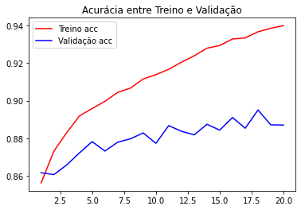

## Trabalho Prático - Módulo 1: Fundamentos de Deep Learning

## Objetivos de Ensino:


* **Exercitar os seguintes conceitos trabalhados no Módulo:**
  * **1. Interpretar arquiteturas de rede a partir de desenho.**
  * **2. Criar redes utilizando o Keras.**


## Enunciado:

**Neste trabalho, você utilizará duas redes para resolver o problema de classificação Fashion
MNIST, que pode ser importado através do módulo ‘datasets’ do Keras. As redes a serem
utilizadas são:**
* **1.VGG-16, que pode ser importada através do módulo ‘keras.applications.vgg16’. A VGG-16 é
uma rede já pronta (ou seja, o número de camadas e neurônios em cada camada, por
exemplo, já estão pré-definidos) que resolve o problema de classificação de imagens. Ou seja,
nós não iremos criar uma rede do zero: ao invés disso, usaremos uma rede que já foi
experimentada antes em outros problemas, e inclusive já podem vir com um conjunto de
pesos, obtidos dos seus treinamentos anteriores. Mais informações sobre a VGG-16 podem
ser obtidas em https://keras.io/api/applications/vgg/ e https://arxiv.org/abs/1409.1556.**

* **2.A segunda deve seguir a seguinte arquitetura, conforme já vimos nas aulas gravadas:**
  * a. Camada de entrada: um neurônio por pixel;
  * b. Camada oculta 1: número de neurônios igual ao número de pixels;
  * c. Camada oculta 2: 1024 neurônios;
  * d. Camada oculta 3: 2048 neurônios;
  * e. Camada oculta 4: 2048 neurônios;
  * f. Camada de saída.

* **Observações**:

  * 1) A VGG-16 inicialmente foi treinada para imagens coloridas. Portanto, é necessário que ela
receba imagens com canais de cor. Ou seja, cada pixel da imagem será representado por mais
de um valor. Tipicamente, utilizamos o sistema de cor RGB, ou seja, cada pixel da imagem é
composto por três valores. Podemos dizer, portanto, que uma imagem de 32 pixels de largura
e 32 pixels de altura no sistema RGB tem uma dimensionalidade de 32x32x3.
  * 2) Como as imagens do Fashion MNIST são em tons de cinza (ou seja, só possuem um canal de cor e, portanto, cada imagem tem o tamanho 28x28x1), é necessário redimensionar as imagens do dataset para 32x32x3, adicionando outros dois canais para usar o VGG-Net. Uma técnica possível é a seguinte:


```python
'''
from tensorflow.image import resize
# Adiciona eixo no último índice da lista
X_train_1 = np.expand_dims(X_train, axis=-1)
# Repete 3 vezes o último índice
X_train_1 = np.repeat(X_train_1, 3, axis=-1)
# Redimensiona as imagens para 32x32
X_train_resize = resize(X_train_1, [32,32])
'''
```


    '\nfrom tensorflow.image import resize\n# Adiciona eixo no último índice da lista\nX_train_1 = np.expand_dims(X_train, axis=-1)\n# Repete 3 vezes o último índice\nX_train_1 = np.repeat(X_train_1, 3, axis=-1)\n# Redimensiona as imagens para 32x32\nX_train_resize = resize(X_train_1, [32,32])\n'


  * 3) Para instanciar a VGG-Net, informe a dimensionalidade das amostras através do argumento
input_shape=(32,32,3). Além disso, preste atenção ao número de classes do problema.
  * 4) A rede VGG-Net deverá receber amostras com o tamanho (32,32,3). A segunda rede deverá
receber amostras (28,28,1). Para fazer isso, você pode importar o dataset duas vezes.
  * 5) Ao instanciar a VGG-Net, informe o parâmetro weights=None. Esse parâmetro informa que
os pesos da VGG-Net serão iniciados de forma aleatória e, portanto, não utilizaremos o
treinamento já realizado na VGG-16.
  * 6) Perceba que é muito mais fácil importar uma rede já existente do que criar a sua própria rede.

## Dicionário de dados:

Label	Description:
* **0	T-shirt/top**
* **1	Trouser**
* **2	Pullover**
* **3	Dress**
* **4	Coat**
* **5	Sandal**
* **6	Shirt**
* **7	Sneaker**
* **8	Bag**
* **9	Ankle boot**

# Exercício 01


```python
dic = {
        0 :'T-shirt/top',
        1 : 'Trouser',
        2 : 'Pullover',
        3 : 'Dress',
        4 : 'Coat',
        5 : 'Sandal',
        6 : 'Shirt',
        7 : 'Sneaker',
        8 : 'Bag',
        9 : 'Ankle boot',
      }
```

### Importando as Bibliotecas e carregando o dataset:


```python
import numpy as np #importa biblioteca para manipulação de matrizes
from matplotlib import pyplot as plt #importa bilbioteca para criação de gráficos

#início das importações de classes do Keras (modelos de Deep Learning)
from keras.datasets import fashion_mnist   #importa dataset fashion mnist
from keras.models import Sequential        #importa um modelo sequencial
from keras.layers import Dense, InputLayer #importa camadas totalmente conectadas
from keras.layers import Dropout           #importa a estrutura de dropout
from keras.utils import np_utils           #importa biblioteca de utilidades do Keras
from keras.applications import VGG16       #importando a rede já pré-treinada
from keras import models, layers
from tqdm import tqdm # for progress bar
from tensorflow.image import resize
import random
```


```python
# Carregando o dataset já divididos em treino e teste.
(X_train, y_train), (X_test, y_test) = fashion_mnist.load_data()
```


```python
# verificando o tamanho.
print(X_train.shape)
print(y_train.shape)
print(X_test.shape)
print(y_test.shape)

```

    (60000, 28, 28)
    (60000,)
    (10000, 28, 28)
    (10000,)
    

* **Temos um  total de 60mil imagens de tamanho 28x28 pixels para realizarmos o treinamento do modelo**.
* **Temos 10mil imagens 28x28 pixels para realizarmos o teste do modelo.**
* **Essas imagens estão em preto e branco(escala cinza) pois possuem apenas 2 dimensões.**

* **Para a primeira rede(modelo) precisamos redimensionar a imagem, pois o modelo VGG16 não aceita imagens de um canal e com pixels 28x28.**
* **O código abaixo irá converter a dimensão para 3 canais(Coloridos) e os pixels para 32x32**.

### Pré-processamento:


```python
# Adiciona eixo no último índice da lista
X_train_1 = np.expand_dims(X_train, axis=-1)
X_test_1 = np.expand_dims(X_test, axis=-1)
# resultado:
X_train_1.shape, X_test_1.shape
```


    ((60000, 28, 28, 1), (10000, 28, 28, 1))


```python
# Repete 3 vezes o último índice
X_train_1 = np.repeat(X_train_1, 3, axis=-1)
X_test_1 = np.repeat(X_test_1, 3, axis=-1)
# resultado:
X_train_1.shape, X_test_1.shape
```


    ((60000, 28, 28, 3), (10000, 28, 28, 3))


```python
# Redimensiona as imagens para 32x32
X_train_1 = resize(X_train_1, [32,32])
X_test_1 = resize(X_test_1, [32,32])
# resultado:
X_train_1.shape, X_test_1.shape 
```


    (TensorShape([60000, 32, 32, 3]), TensorShape([10000, 32, 32, 3]))


```python
# Convertendo as Labels para o formato one hot encod.
y_train_1 = np_utils.to_categorical(y_train)
y_test_1 = np_utils.to_categorical(y_test)
# Resultado
y_train_1.shape, y_test_1.shape

```


    ((60000, 10), (10000, 10))


```python
# Número de classes
n_classes = y_test_1.shape[1]
#resposta:
print(f"Quantidade de classes:{n_classes}")
```

    Quantidade de classes:10
    


```python
#calcula o total de pixels da imagem
num_pixels = X_train_1.shape[1] * X_train_1.shape[2] * X_train_1.shape[3]  
print(f"Total de pixels em uma imagem: {num_pixels}")
```

    Total de pixels em uma imagem: 3072
    

* **Agora que já redimensionamos o conjunto de treino e teste, temos os valores correspondentes ao tamanho de pixels de cada imagem, quantidade de classes e valor em formato de vetor(one hot enc) de cada classe, podemos começar a criar o nosso modelo.**


```python
print(f"total de pixel em uma imagem: {num_pixels}")
print(f"Classe da figura de índice 4000 do conjunto de treino: {dic[y_train[4000]]}")
print(f"Classe {y_train[4000]} transfomado em vetor do conjunto de treino: {y_train_1[4000]}")
```

    total de pixel em uma imagem: 3072
    Classe da figura de índice 4000 do conjunto de treino: Bag
    Classe 8 transfomado em vetor do conjunto de treino: [0. 0. 0. 0. 0. 0. 0. 0. 1. 0.]
    

### Criando o modelo com VGG16:


```python
#Instanciando o modelo e informando o shape conforme o enunciado.
model_vgg16 = VGG16(weights=None, input_shape=(32,32,3), classes=10)
model_vgg16.summary()
```

    Model: "vgg16"
    _________________________________________________________________
     Layer (type)                Output Shape              Param #   
    =================================================================
     input_5 (InputLayer)        [(None, 32, 32, 3)]       0         
                                                                     
     block1_conv1 (Conv2D)       (None, 32, 32, 64)        1792      
                                                                     
     block1_conv2 (Conv2D)       (None, 32, 32, 64)        36928     
                                                                     
     block1_pool (MaxPooling2D)  (None, 16, 16, 64)        0         
                                                                     
     block2_conv1 (Conv2D)       (None, 16, 16, 128)       73856     
                                                                     
     block2_conv2 (Conv2D)       (None, 16, 16, 128)       147584    
                                                                     
     block2_pool (MaxPooling2D)  (None, 8, 8, 128)         0         
                                                                     
     block3_conv1 (Conv2D)       (None, 8, 8, 256)         295168    
                                                                     
     block3_conv2 (Conv2D)       (None, 8, 8, 256)         590080    
                                                                     
     block3_conv3 (Conv2D)       (None, 8, 8, 256)         590080    
                                                                     
     block3_pool (MaxPooling2D)  (None, 4, 4, 256)         0         
                                                                     
     block4_conv1 (Conv2D)       (None, 4, 4, 512)         1180160   
                                                                     
     block4_conv2 (Conv2D)       (None, 4, 4, 512)         2359808   
                                                                     
     block4_conv3 (Conv2D)       (None, 4, 4, 512)         2359808   
                                                                     
     block4_pool (MaxPooling2D)  (None, 2, 2, 512)         0         
                                                                     
     block5_conv1 (Conv2D)       (None, 2, 2, 512)         2359808   
                                                                     
     block5_conv2 (Conv2D)       (None, 2, 2, 512)         2359808   
                                                                     
     block5_conv3 (Conv2D)       (None, 2, 2, 512)         2359808   
                                                                     
     block5_pool (MaxPooling2D)  (None, 1, 1, 512)         0         
                                                                     
     flatten (Flatten)           (None, 512)               0         
                                                                     
     fc1 (Dense)                 (None, 4096)              2101248   
                                                                     
     fc2 (Dense)                 (None, 4096)              16781312  
                                                                     
     predictions (Dense)         (None, 10)                40970     
                                                                     
    =================================================================
    Total params: 33,638,218
    Trainable params: 33,638,218
    Non-trainable params: 0
    _________________________________________________________________
    


```python
# Compilando o modelo
model_vgg16.compile(loss='categorical_crossentropy', optimizer='adam', metrics=['accuracy']) 
```


```python
# Executando o treinamento
result = model_vgg16.fit(X_train_1, y_train_1, validation_data=(X_test_1, y_test_1), epochs=10, verbose=1, batch_size = 100) 
```

    Epoch 1/10
    600/600 [==============================] - 36s 59ms/step - loss: 1.1058 - accuracy: 0.6215 - val_loss: 0.4610 - val_accuracy: 0.8435
    Epoch 2/10
    600/600 [==============================] - 35s 58ms/step - loss: 0.4034 - accuracy: 0.8577 - val_loss: 0.3783 - val_accuracy: 0.8655
    Epoch 3/10
    600/600 [==============================] - 35s 58ms/step - loss: 0.3559 - accuracy: 0.8735 - val_loss: 0.3916 - val_accuracy: 0.8657
    Epoch 4/10
    600/600 [==============================] - 36s 60ms/step - loss: 0.3176 - accuracy: 0.8879 - val_loss: 0.3067 - val_accuracy: 0.8918
    Epoch 5/10
    600/600 [==============================] - 36s 59ms/step - loss: 0.3093 - accuracy: 0.8928 - val_loss: 0.3532 - val_accuracy: 0.8851
    Epoch 6/10
    600/600 [==============================] - 36s 59ms/step - loss: 0.2738 - accuracy: 0.9047 - val_loss: 0.3109 - val_accuracy: 0.8953
    Epoch 7/10
    600/600 [==============================] - 35s 58ms/step - loss: 0.2581 - accuracy: 0.9098 - val_loss: 0.2994 - val_accuracy: 0.8982
    Epoch 8/10
    600/600 [==============================] - 36s 60ms/step - loss: 0.2383 - accuracy: 0.9151 - val_loss: 0.2913 - val_accuracy: 0.9010
    Epoch 9/10
    600/600 [==============================] - 36s 60ms/step - loss: 0.2307 - accuracy: 0.9208 - val_loss: 0.2766 - val_accuracy: 0.9111
    Epoch 10/10
    600/600 [==============================] - 36s 59ms/step - loss: 0.2102 - accuracy: 0.9256 - val_loss: 0.3731 - val_accuracy: 0.8981
    


```python
# Realizando a previsão de uma única imagem
#obtém a imagem número 1001
x = X_test_1[4000]
print(f"tamanho da imagem de índice 4000 do conjunto de teste: {x.shape}\n")

# Adiciona eixo no primeiro índice
x = np.expand_dims(x, axis=0)
print(f"Resultado após adição de eixo: {x.shape}\n")

# imprime a avaliação da amostra
print(f"Resultado das probabilidades de cada classe: {model_vgg16.predict(x)}\n")
print(f"Resultado da classe predita: {dic[np.argmax(model_vgg16.predict(x))]}\n")
```

    tamanho da imagem de índice 4000 do conjunto de teste: (32, 32, 3)
    
    Resultado após adição de eixo: (1, 32, 32, 3)
    
    1/1 [==============================] - 0s 406ms/step
    Resultado das probabilidades de cada classe: [[9.5136452e-01 2.4567605e-06 7.8622979e-04 2.8079734e-04 7.6515425e-06
      1.4520448e-07 4.7555152e-02 4.2303284e-08 2.9783730e-06 6.0693239e-08]]
    
    1/1 [==============================] - 0s 15ms/step
    Resultado da classe predita: T-shirt/top
    
    


```python
# Realizando a predição de todo conjunto de teste e adicionando os resultados em uma array.
predictions=[]

for img in tqdm(X_test_1):
    img = np.expand_dims(img, axis=0)
    predictions.append(model_vgg16.predict(img))
    time.sleep(0.1)
```


```python
# # listing the folders containing images

# preparing array that can be used later

class_names=['T-shirt/top', 'Trouser', 'Pullover', 'Dress', 'Coat', 'Sandal', 'Shirt', 'Sneaker', 'Bag', 'Ankle boot']
print(class_names)

val_class_names =['T-shirt/top', 'Trouser', 'Pullover', 'Dress', 'Coat', 'Sandal', 'Shirt', 'Sneaker', 'Bag', 'Ankle boot']
print(val_class_names)

test_class_names=['T-shirt/top', 'Trouser', 'Pullover', 'Dress', 'Coat', 'Sandal', 'Shirt', 'Sneaker', 'Bag', 'Ankle boot']
print(test_class_names)

# Function to know the name of the element

def Get_Element_Name(argument):
    switcher = {
        0 :'T-shirt/top',
        1 : 'Trouser',
        2 : 'Pullover',
        3 : 'Dress',
        4 : 'Coat',
        5 : 'Sandal',
        6 : 'Shirt',
        7 : 'Sneaker',
        8 : 'Bag',
        9 : 'Ankle boot',
    }
    return switcher.get(argument, "Invalid")

print(Get_Element_Name(0))
```

    ['T-shirt/top', 'Trouser', 'Pullover', 'Dress', 'Coat', 'Sandal', 'Shirt', 'Sneaker', 'Bag', 'Ankle boot']
    ['T-shirt/top', 'Trouser', 'Pullover', 'Dress', 'Coat', 'Sandal', 'Shirt', 'Sneaker', 'Bag', 'Ankle boot']
    ['T-shirt/top', 'Trouser', 'Pullover', 'Dress', 'Coat', 'Sandal', 'Shirt', 'Sneaker', 'Bag', 'Ankle boot']
    T-shirt/top
    


```python
from IPython.display import Image
from keras.applications.vgg16 import preprocess_input

# Esta função ajuda a prever a imagem individual fornecida a ela
# Função 1
def predict(img_name):
    img=image.load_img(img_name,target_size=(32,32))
    img=image.img_to_array(img)
    plt.imshow(img.astype('int32'))
    plt.show()
    img=preprocess_input(img)

    prediction=model.predict(img.reshape(1,32,32,3))
    output=np.argmax(prediction)

    print(class_names[output] + ": " + Get_Element_Name(class_names[output]))

    
# Função 2
# Esta função plota a imagem fornecida no array
def plot_image(i, predictions_array, true_label, img): 
    
    predictions_array, true_label, img = predictions_array[i], true_label[i], img[i]
    
    plt.grid(False)
    plt.xticks([])
    plt.yticks([])
    
    plt.imshow(img.astype('int32'))
    
    predicted_label=np.argmax(predictions_array)
    true_label=np.argmax(true_label)

    if predicted_label == true_label: 
        color='blue' 
    else:
        color='red'
    
    plt.xlabel("{} {:2.0f}% \n ({})".format(Get_Element_Name(predicted_label), 
                                            100*np.max(predictions_array), Get_Element_Name(true_label), 
                                            color=color, horizontalalignment='left'))        

# Função 3

# Esta função plota o gráfico de barras fornecido nos dados da matriz
def plot_value_array(i, predictions_array, true_label): 
    predictions_array, true_label = predictions_array[i], true_label[i]
    plt.grid(False)
    plt.xticks([])
    plt.yticks([])
    predicted_label=np.argmax(predictions_array)
    true_label=np.argmax(true_label)

    if predicted_label == 0:
        predicted_label=1
    if true_label == 0:
        true_label=1
    
    thisplot=plt.bar(range(10), predicted_label, color='seashell')
    plt.ylim([0,1])
    thisplot[predicted_label].set_color('red')
    thisplot[true_label].set_color('blue')
```


```python
# variaveis
num_rows=2
num_cols=5
num_images=num_rows*num_cols

plt.figure(figsize=(2*2*num_cols,2*num_rows))

print("Classificação com (VGG16)\n")
print("predito, Porcentagem, (real)\n")

for i in range(num_images):
    plt.subplot(num_rows, 2*num_cols, 2*i+1)
    ii=random.randrange(1,10000)
    plot_image(ii,predictions, y_test_1, X_test)
    
    plt.subplot(num_rows, 2*num_cols, 2*i+2)

    plot_value_array(i, predictions, y_test_1)
plt.subplots_adjust(hspace=0.5)
plt.show()
```

    Classificação com (VGG16)
    
    predito, Porcentagem, (real)
    
    


    

    


```python
# plot loss e accuracy

acc = result.history['accuracy']
val_acc = result.history['val_accuracy']
loss = result.history['loss']
val_loss = result.history['val_loss']
epochs = range(1, len(acc) + 1)

plt.title('Acurácia entre Treino e Validação')
plt.plot(epochs, acc, 'red', label='Treino acc')
plt.plot(epochs, val_acc, 'blue', label='Validação acc')
plt.legend()

plt.figure()
plt.title('Perda(loss) entre Treino e Validação')
plt.plot(epochs, loss, 'red', label='Treino - loss')
plt.plot(epochs, val_loss, 'blue', label='Validação - loss')

plt.legend()

plt.show()
```


    

    


    

    


```python

```


```python

```

# Exercício 2


```python
# Carregando o dataset
(X_train, y_train), (X_test, y_test) = fashion_mnist.load_data() #importa o dataset Mnist da biblioteca do Keras
print(X_train.shape) #imprime o tamanho do vetor

first_image = X_train[4000] #obtém a imagem de treino no índice 4000 do vetor
# realiza manipulação dos dados da imagem
first_image = np.array(first_image, dtype='float')
pixels = first_image.reshape((28, 28))
#exibe a imagem do vetor
plt.imshow(pixels, cmap='gray')
plt.show()

print(y_train[4000]) #imprime a classe da imagem de treino do índice 4000
```

    (60000, 28, 28)
    


    

    


    8
    


```python
# resposta da pergunta 8
first_image = X_test[4000] #obtém a imagem de treino no índice 4000 do vetor
# realiza manipulação dos dados da imagem
first_image = np.array(first_image, dtype='float')
pixels = first_image.reshape((28, 28))
#exibe a imagem do vetor
plt.imshow(pixels, cmap='gray')
plt.show()

print(y_test[4000]) #imprime a classe da imagem de treino do índice 4000
```


    

    


    0
    


```python
num_pixels = X_train.shape[1] * X_train.shape[2]  #calcula o total de pixels da imagem
print(num_pixels)

#transforma os valores dos pixels para float32
X_train2 = X_train.reshape(X_train.shape[0], num_pixels).astype('float32')
X_test2 = X_test.reshape(X_test.shape[0], num_pixels).astype('float32')

#normalizando os valores dos pixels entre 0 e 1
X_train2 = X_train2 / 255
X_test2 = X_test2 / 255
```


```python
# transforma os y em one-hot vector
y_train_h = np_utils.to_categorical(y_train)
y_test_h = np_utils.to_categorical(y_test)

#obtém o número de classes do problema
num_classes = y_test_h.shape[1]

print(f"Quantidade de pixels:{num_pixels}")
print(f"Classe correspondente ao índice 4000: {y_train[4000]}")
print(f"Vetor correspondente a classe {y_train[4000]}: {y_train_h[4000]}")
```

    Quantidade de pixels:784
    Classe correspondente ao índice 4000: 8
    Vetor correspondente a classe 8: [0. 0. 0. 0. 0. 0. 0. 0. 1. 0.]
    


```python
num_pixels
```


    784


```python
# Cria um modelo do tipo sequencial
model = Sequential()

model.add(InputLayer(input_shape = num_pixels)) # Camada de entrada: um neurônio por pixel;
model.add(Dense(num_pixels, kernel_initializer='normal', activation='relu')) # Camada oculta 1: número de neurônios igual ao número de pixels;
model.add(Dense(1024, kernel_initializer='normal', activation='relu')) # Camada oculta 2: 1024 neurônios;
model.add(Dense(2048, kernel_initializer='normal', activation='relu')) # Camada oculta 3: 2048 neurônios;
model.add(Dense(2048, kernel_initializer='normal', activation='relu')) # Camada oculta 4: 2048 neurônios;
model.add(Dense(num_classes, kernel_initializer='normal', activation='softmax')) # cria a camada de saída

model.summary() #imprime informações sobre o modelo
```

    Model: "sequential"
    _________________________________________________________________
     Layer (type)                Output Shape              Param #   
    =================================================================
     dense (Dense)               (None, 784)               615440    
                                                                     
     dense_1 (Dense)             (None, 1024)              803840    
                                                                     
     dense_2 (Dense)             (None, 2048)              2099200   
                                                                     
     dense_3 (Dense)             (None, 2048)              4196352   
                                                                     
     dense_4 (Dense)             (None, 10)                20490     
                                                                     
    =================================================================
    Total params: 7,735,322
    Trainable params: 7,735,322
    Non-trainable params: 0
    _________________________________________________________________
    


```python
# Cria um modelo do tipo sequencial
model = Sequential()

model.add(InputLayer(input_shape = num_pixels)) # Camada de entrada: um neurônio por pixel;
model.add(Dense(num_pixels, kernel_initializer='normal', activation='relu')) # Camada oculta 1: número de neurônios igual ao número de pixels;
model.add(Dense(1024, kernel_initializer='normal', activation='relu')) # Camada oculta 2: 1024 neurônios;
model.add(Dense(2048, kernel_initializer='normal', activation='relu')) # Camada oculta 3: 2048 neurônios;
model.add(Dense(2048, kernel_initializer='normal', activation='relu')) # Camada oculta 4: 2048 neurônios;
model.add(Dense(num_classes, kernel_initializer='normal', activation='softmax')) # cria a camada de saída

model.summary() #imprime informações sobre o modelo
```

    Model: "sequential_1"
    _________________________________________________________________
     Layer (type)                Output Shape              Param #   
    =================================================================
     dense_5 (Dense)             (None, 784)               615440    
                                                                     
     dense_6 (Dense)             (None, 1024)              803840    
                                                                     
     dense_7 (Dense)             (None, 2048)              2099200   
                                                                     
     dense_8 (Dense)             (None, 2048)              4196352   
                                                                     
     dense_9 (Dense)             (None, 10)                20490     
                                                                     
    =================================================================
    Total params: 7,735,322
    Trainable params: 7,735,322
    Non-trainable params: 0
    _________________________________________________________________
    


```python
#compilando o modelo criado.
model.compile(loss='categorical_crossentropy', optimizer='adam', metrics='accuracy') 
```


```python
# execulta o treinamento.
result = model.fit(X_train2,y_train_h, validation_data=(X_test2,y_test_h), epochs=20, verbose=1, batch_size=100) 
```

    Epoch 1/20
    600/600 [==============================] - 100s 166ms/step - loss: 0.3967 - accuracy: 0.8564 - val_loss: 0.3807 - val_accuracy: 0.8618
    Epoch 2/20
    600/600 [==============================] - 89s 148ms/step - loss: 0.3426 - accuracy: 0.8733 - val_loss: 0.3895 - val_accuracy: 0.8608
    Epoch 3/20
    600/600 [==============================] - 88s 147ms/step - loss: 0.3152 - accuracy: 0.8830 - val_loss: 0.3669 - val_accuracy: 0.8659
    Epoch 4/20
    600/600 [==============================] - 92s 154ms/step - loss: 0.2933 - accuracy: 0.8919 - val_loss: 0.3527 - val_accuracy: 0.8723
    Epoch 5/20
    600/600 [==============================] - 93s 155ms/step - loss: 0.2768 - accuracy: 0.8959 - val_loss: 0.3477 - val_accuracy: 0.8783
    Epoch 6/20
    600/600 [==============================] - 95s 158ms/step - loss: 0.2678 - accuracy: 0.8997 - val_loss: 0.3629 - val_accuracy: 0.8733
    Epoch 7/20
    600/600 [==============================] - 92s 154ms/step - loss: 0.2540 - accuracy: 0.9044 - val_loss: 0.3450 - val_accuracy: 0.8780
    Epoch 8/20
    600/600 [==============================] - 93s 156ms/step - loss: 0.2452 - accuracy: 0.9067 - val_loss: 0.3315 - val_accuracy: 0.8798
    Epoch 9/20
    600/600 [==============================] - 121s 201ms/step - loss: 0.2335 - accuracy: 0.9116 - val_loss: 0.3431 - val_accuracy: 0.8829
    Epoch 10/20
    600/600 [==============================] - 104s 173ms/step - loss: 0.2277 - accuracy: 0.9139 - val_loss: 0.3452 - val_accuracy: 0.8774
    Epoch 11/20
    600/600 [==============================] - 101s 169ms/step - loss: 0.2179 - accuracy: 0.9167 - val_loss: 0.3319 - val_accuracy: 0.8868
    Epoch 12/20
    600/600 [==============================] - 97s 161ms/step - loss: 0.2101 - accuracy: 0.9205 - val_loss: 0.3546 - val_accuracy: 0.8838
    Epoch 13/20
    600/600 [==============================] - 96s 160ms/step - loss: 0.2008 - accuracy: 0.9238 - val_loss: 0.3807 - val_accuracy: 0.8819
    Epoch 14/20
    600/600 [==============================] - 93s 156ms/step - loss: 0.1895 - accuracy: 0.9279 - val_loss: 0.3562 - val_accuracy: 0.8875
    Epoch 15/20
    600/600 [==============================] - 100s 167ms/step - loss: 0.1863 - accuracy: 0.9293 - val_loss: 0.3775 - val_accuracy: 0.8844
    Epoch 16/20
    600/600 [==============================] - 109s 181ms/step - loss: 0.1787 - accuracy: 0.9328 - val_loss: 0.3727 - val_accuracy: 0.8911
    Epoch 17/20
    600/600 [==============================] - 107s 179ms/step - loss: 0.1739 - accuracy: 0.9334 - val_loss: 0.4340 - val_accuracy: 0.8854
    Epoch 18/20
    600/600 [==============================] - 99s 166ms/step - loss: 0.1635 - accuracy: 0.9366 - val_loss: 0.3879 - val_accuracy: 0.8951
    Epoch 19/20
    600/600 [==============================] - 102s 171ms/step - loss: 0.1592 - accuracy: 0.9385 - val_loss: 0.3862 - val_accuracy: 0.8872
    Epoch 20/20
    600/600 [==============================] - 105s 176ms/step - loss: 0.1551 - accuracy: 0.9398 - val_loss: 0.3924 - val_accuracy: 0.8871
    


```python
# Realizando a previsão de uma única imagem
#obtém a imagem número 1001
x = X_test2[4000]
print(f"tamanho da imagem de índice 4000 do conjunto de teste: {x.shape}\n")

# Adiciona eixo no primeiro índice
x = np.expand_dims(x, axis=0)
print(f"Resultado após adição de eixo: {x.shape}\n")

# imprime a avaliação da amostra
print(f"Resultado das probabilidades de cada classe: {model.predict(x)}\n")
print(f"Resultado da classe predita: {dic[np.argmax(model.predict(x))]}\n")
```

    tamanho da imagem de índice 4000 do conjunto de teste: (784,)
    
    Resultado após adição de eixo: (1, 784)
    
    1/1 [==============================] - 0s 19ms/step
    Resultado das probabilidades de cada classe: [[9.8109150e-01 3.3639955e-09 8.6576375e-07 1.7096028e-05 8.0623056e-07
      1.7227844e-09 1.8889720e-02 1.0046431e-11 5.6882151e-08 7.8887374e-12]]
    
    1/1 [==============================] - 0s 18ms/step
    Resultado da classe predita: T-shirt/top
    
    


```python
# plot loss e accuracy

acc = result.history['accuracy']
val_acc = result.history['val_accuracy']
loss = result.history['loss']
val_loss = result.history['val_loss']
epochs = range(1, len(acc) + 1)

plt.title('Acurácia entre Treino e Validação')
plt.plot(epochs, acc, 'red', label='Treino acc')
plt.plot(epochs, val_acc, 'blue', label='Validação acc')
plt.legend()

plt.figure()
plt.title('Perda(loss) entre Treino e Validação')
plt.plot(epochs, loss, 'red', label='Treino - loss')
plt.plot(epochs, val_loss, 'blue', label='Validação - loss')

plt.legend()

plt.show()
```


    

    


    

    


```python

```

# Questões do Trabalho Prático 1

### 1- O elemento do índice 4000 do vetor de treinamento corresponde a qual classe? 


```python
first_image = X_train[4000] #obtém a imagem de treino no índice 4000 do vetor
# realiza manipulação dos dados da imagem
first_image = np.array(first_image, dtype='float')
pixels = first_image.reshape((28, 28))
#exibe a imagem do vetor
plt.imshow(pixels, cmap='gray')
plt.show()

print(y_train[4000]) #imprime a classe da imagem de treino do índice 4000
```


    

    


    8
    

### 2- Quantos são os parâmetros treináveis da VGG16? 


```python
#Instanciando o modelo e informando o shape conforme o enunciado.
model_vgg16 = VGG16(weights=None, input_shape=(32,32,3), classes=10)
model_vgg16.count_params()
```


    33638218


### 3- Quantos são os parâmetros treináveis da segunda rede criada? 


```python
# Cria um modelo do tipo sequencial
model = Sequential()

model.add(InputLayer(input_shape = num_pixels)) # Camada de entrada: um neurônio por pixel;
model.add(Dense(num_pixels, kernel_initializer='normal', activation='relu')) # Camada oculta 1: número de neurônios igual ao número de pixels;
model.add(Dense(1024, kernel_initializer='normal', activation='relu')) # Camada oculta 2: 1024 neurônios;
model.add(Dense(2048, kernel_initializer='normal', activation='relu')) # Camada oculta 3: 2048 neurônios;
model.add(Dense(2048, kernel_initializer='normal', activation='relu')) # Camada oculta 4: 2048 neurônios;
model.add(Dense(num_classes, kernel_initializer='normal', activation='softmax')) # cria a camada de saída

model.count_params() #imprime informações sobre o modelo
```


    7735322


### 4- Quantos são os pixels de cada amostra depois de transformadas para serem utilizadas na Vgg-Net?


```python
#calcula o total de pixels da imagem
num_pixels = X_train_1.shape[1] * X_train_1.shape[2] * X_train_1.shape[3]  
print(f"Total de pixels em uma imagem: {num_pixels}")
```

    Total de pixels em uma imagem: 3072
    

### 5- Caso você tente utilizar a VGG-Net com as imagens originais, sem redimensionamento, qual erro é obtido durante o treinamento?


```python
# Executando o treinamento
result = model_vgg16.fit(X_train, y_train, validation_data=(X_test, y_test), epochs=2, verbose=1, batch_size = 100)
```

    Epoch 1/2
    


    ---------------------------------------------------------------------------

    ValueError                                Traceback (most recent call last)

    <ipython-input-37-27a8efdb4c35> in <module>
          1 # Executando o treinamento
    ----> 2 result = model_vgg16.fit(X_train, y_train, validation_data=(X_test, y_test), epochs=2, verbose=1, batch_size = 100)
    

    /usr/local/lib/python3.8/dist-packages/keras/utils/traceback_utils.py in error_handler(*args, **kwargs)
         65     except Exception as e:  # pylint: disable=broad-except
         66       filtered_tb = _process_traceback_frames(e.__traceback__)
    ---> 67       raise e.with_traceback(filtered_tb) from None
         68     finally:
         69       del filtered_tb
    

    /usr/local/lib/python3.8/dist-packages/keras/engine/training.py in tf__train_function(iterator)
         13                 try:
         14                     do_return = True
    ---> 15                     retval_ = ag__.converted_call(ag__.ld(step_function), (ag__.ld(self), ag__.ld(iterator)), None, fscope)
         16                 except:
         17                     do_return = False
    

    ValueError: in user code:
    
        File "/usr/local/lib/python3.8/dist-packages/keras/engine/training.py", line 1051, in train_function  *
            return step_function(self, iterator)
        File "/usr/local/lib/python3.8/dist-packages/keras/engine/training.py", line 1040, in step_function  **
            outputs = model.distribute_strategy.run(run_step, args=(data,))
        File "/usr/local/lib/python3.8/dist-packages/keras/engine/training.py", line 1030, in run_step  **
            outputs = model.train_step(data)
        File "/usr/local/lib/python3.8/dist-packages/keras/engine/training.py", line 889, in train_step
            y_pred = self(x, training=True)
        File "/usr/local/lib/python3.8/dist-packages/keras/utils/traceback_utils.py", line 67, in error_handler
            raise e.with_traceback(filtered_tb) from None
        File "/usr/local/lib/python3.8/dist-packages/keras/engine/input_spec.py", line 264, in assert_input_compatibility
            raise ValueError(f'Input {input_index} of layer "{layer_name}" is '
    
        ValueError: Input 0 of layer "vgg16" is incompatible with the layer: expected shape=(None, 32, 32, 3), found shape=(100, 28, 28)
    


### 6- Quantas são as classes presentes no problema?


```python
np.unique(y_test).shape

```


    (10,)


### 7- Quantos são os pixels de cada amostra para serem utilizados na segunda rede?


```python
num_pixels = X_train.shape[1] * X_train.shape[2]  #calcula o total de pixels da imagem
print(f"Quantidade de pixels de cada amostra: {num_pixels}")
```

    Quantidade de pixels de cada amostra: 784
    

### 8- O elemento do índice 4000 do vetor de teste corresponde à qual classe?


```python
# resposta da pergunta 8
first_image = X_test[4000] #obtém a imagem de treino no índice 4000 do vetor
# realiza manipulação dos dados da imagem
first_image = np.array(first_image, dtype='float')
pixels = first_image.reshape((28, 28))
#exibe a imagem do vetor
plt.imshow(pixels, cmap='gray')
plt.show()

print(y_test[4000]) #imprime a classe da imagem de treino do índice 4000
```


    

    


    0
    

### 9- Se você utilizar a função de ativação relu na camada de saída da segunda rede, qual o valor obtido na loss?


```python
# Cria um modelo do tipo sequencial
question9 = Sequential()

question9.add(InputLayer(input_shape = num_pixels)) # Camada de entrada: um neurônio por pixel;
question9.add(Dense(num_pixels, kernel_initializer='normal', activation='relu')) # Camada oculta 1: número de neurônios igual ao número de pixels;
question9.add(Dense(1024, kernel_initializer='normal', activation='relu')) # Camada oculta 2: 1024 neurônios;
question9.add(Dense(2048, kernel_initializer='normal', activation='relu')) # Camada oculta 3: 2048 neurônios;
question9.add(Dense(2048, kernel_initializer='normal', activation='relu')) # Camada oculta 4: 2048 neurônios;
question9.add(Dense(num_classes, kernel_initializer='normal', activation='relu')) # cria a camada de saída
#compilando o modelo criado.
question9.compile(loss='categorical_crossentropy', optimizer='adam', metrics='accuracy') 
# execulta o treinamento.
res_question = question9.fit(X_train2,y_train_h, validation_data=(X_test2,y_test_h), epochs=2, verbose=1, batch_size=128) 
```

    Epoch 1/2
    469/469 [==============================] - 96s 203ms/step - loss: nan - accuracy: 0.1131 - val_loss: nan - val_accuracy: 0.1000
    Epoch 2/2
    469/469 [==============================] - 88s 188ms/step - loss: nan - accuracy: 0.1000 - val_loss: nan - val_accuracy: 0.1000
    

### 10- Quantos bias são presentes na segunda rede?


```python
bias = (784 + 1024 + 2048 + 2048 + 10)
print(f"Quantidade de bias da rede 2: {bias}")
```

    Quantidade de bias da rede 2: 5914
    

### 11- Quantas camadas do tipo ‘MaxPooling2D’ estão presentes na VGG-Net?


```python
model_vgg16.layers
#MaxPooling2D = 5
```


    [<keras.engine.input_layer.InputLayer at 0x7f7ac5946850>,
     <keras.layers.convolutional.conv2d.Conv2D at 0x7f7ac5991730>,
     <keras.layers.convolutional.conv2d.Conv2D at 0x7f7ac5946310>,
     <keras.layers.pooling.max_pooling2d.MaxPooling2D at 0x7f7ac5997280>,
     <keras.layers.convolutional.conv2d.Conv2D at 0x7f7ac5a87730>,
     <keras.layers.convolutional.conv2d.Conv2D at 0x7f7ac58e4a30>,
     <keras.layers.pooling.max_pooling2d.MaxPooling2D at 0x7f7ac594e280>,
     <keras.layers.convolutional.conv2d.Conv2D at 0x7f7ac5991550>,
     <keras.layers.convolutional.conv2d.Conv2D at 0x7f7ac5873130>,
     <keras.layers.convolutional.conv2d.Conv2D at 0x7f7ac58731c0>,
     <keras.layers.pooling.max_pooling2d.MaxPooling2D at 0x7f7ac59914c0>,
     <keras.layers.convolutional.conv2d.Conv2D at 0x7f7ac5986880>,
     <keras.layers.convolutional.conv2d.Conv2D at 0x7f7ac5867550>,
     <keras.layers.convolutional.conv2d.Conv2D at 0x7f7ac5867b80>,
     <keras.layers.pooling.max_pooling2d.MaxPooling2D at 0x7f7ac5856e50>,
     <keras.layers.convolutional.conv2d.Conv2D at 0x7f7ac5867280>,
     <keras.layers.convolutional.conv2d.Conv2D at 0x7f7ac73acf10>,
     <keras.layers.convolutional.conv2d.Conv2D at 0x7f7ac5867fa0>,
     <keras.layers.pooling.max_pooling2d.MaxPooling2D at 0x7f7ac7392310>,
     <keras.layers.reshaping.flatten.Flatten at 0x7f7ac73a9b20>,
     <keras.layers.core.dense.Dense at 0x7f7ac5a84b50>,
     <keras.layers.core.dense.Dense at 0x7f7ac73a9c40>,
     <keras.layers.core.dense.Dense at 0x7f7ac73a9d90>]


### 12- Quantas camadas totalmente conectadas estão presentes na VGG-Net? 


```python
# R: 3
```

### 13- Execute a Vgg-Net com um batch de 128. Quantas iterações são necessárias para completar uma época?


```python
# Executando o treinamento
result = model_vgg16.fit(X_train, y_train, validation_data=(X_test, y_test), epochs=1, verbose=1, batch_size = 128)
# 469
```

### 14- Quantas camadas do tipo ‘Conv2D’ estão presentes na VGG-Net? 


```python
model_vgg16.layers
#R: 13
```


    [<keras.engine.input_layer.InputLayer at 0x7f7ac5946850>,
     <keras.layers.convolutional.conv2d.Conv2D at 0x7f7ac5991730>,
     <keras.layers.convolutional.conv2d.Conv2D at 0x7f7ac5946310>,
     <keras.layers.pooling.max_pooling2d.MaxPooling2D at 0x7f7ac5997280>,
     <keras.layers.convolutional.conv2d.Conv2D at 0x7f7ac5a87730>,
     <keras.layers.convolutional.conv2d.Conv2D at 0x7f7ac58e4a30>,
     <keras.layers.pooling.max_pooling2d.MaxPooling2D at 0x7f7ac594e280>,
     <keras.layers.convolutional.conv2d.Conv2D at 0x7f7ac5991550>,
     <keras.layers.convolutional.conv2d.Conv2D at 0x7f7ac5873130>,
     <keras.layers.convolutional.conv2d.Conv2D at 0x7f7ac58731c0>,
     <keras.layers.pooling.max_pooling2d.MaxPooling2D at 0x7f7ac59914c0>,
     <keras.layers.convolutional.conv2d.Conv2D at 0x7f7ac5986880>,
     <keras.layers.convolutional.conv2d.Conv2D at 0x7f7ac5867550>,
     <keras.layers.convolutional.conv2d.Conv2D at 0x7f7ac5867b80>,
     <keras.layers.pooling.max_pooling2d.MaxPooling2D at 0x7f7ac5856e50>,
     <keras.layers.convolutional.conv2d.Conv2D at 0x7f7ac5867280>,
     <keras.layers.convolutional.conv2d.Conv2D at 0x7f7ac73acf10>,
     <keras.layers.convolutional.conv2d.Conv2D at 0x7f7ac5867fa0>,
     <keras.layers.pooling.max_pooling2d.MaxPooling2D at 0x7f7ac7392310>,
     <keras.layers.reshaping.flatten.Flatten at 0x7f7ac73a9b20>,
     <keras.layers.core.dense.Dense at 0x7f7ac5a84b50>,
     <keras.layers.core.dense.Dense at 0x7f7ac73a9c40>,
     <keras.layers.core.dense.Dense at 0x7f7ac73a9d90>]


### 15- Quantos pesos existem conectando a penúltima e última camadas da segunda rede?


```python
# Cria um modelo do tipo sequencial
question15 = Sequential()

question15.add(InputLayer(input_shape = num_pixels)) # Camada de entrada: um neurônio por pixel;
question15.add(Dense(num_pixels, kernel_initializer='normal', activation='relu')) # Camada oculta 1: número de neurônios igual ao número de pixels;
question15.add(Dense(1024, kernel_initializer='normal', activation='relu')) # Camada oculta 2: 1024 neurônios;
question15.add(Dense(2048, kernel_initializer='normal', activation='relu')) # Camada oculta 3: 2048 neurônios;
question15.add(Dense(2048, kernel_initializer='normal', activation='relu')) # Camada oculta 4: 2048 neurônios;
question15.add(Dense(num_classes, kernel_initializer='normal', activation='softmax')) # cria a camada de saída
question15.summary()
```

    Model: "sequential_7"
    _________________________________________________________________
     Layer (type)                Output Shape              Param #   
    =================================================================
     dense_35 (Dense)            (None, 784)               615440    
                                                                     
     dense_36 (Dense)            (None, 1024)              803840    
                                                                     
     dense_37 (Dense)            (None, 2048)              2099200   
                                                                     
     dense_38 (Dense)            (None, 2048)              4196352   
                                                                     
     dense_39 (Dense)            (None, 10)                20490     
                                                                     
    =================================================================
    Total params: 7,735,322
    Trainable params: 7,735,322
    Non-trainable params: 0
    _________________________________________________________________
    


```python
pesos = (10 * 2048)
pesos
```


    20480


