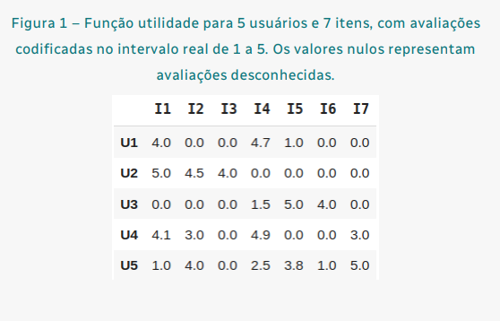

# Bootcamp XPe: Arquiteto de Machine Learning

## Desafio Prático
**Módulo 3: Sistemas de Recomendação**

## Objetivos de Ensino
**Exercitar os seguintes conceitos trabalhados no Módulo:**
  * 1. Recomendação por filtragem colaborativa.
  * 2. Avaliação de modelos.


## Enunciado
**Em um ambiente de desenvolvimento em Python (recomenda-se o Google
Colaboratory), implemente as funções descritas para responder às questões
objetivas relativas à seguinte função utilidade:**




```python
import pandas as pd
#criando um dicionario conforme os dados da figura
dict = {'I1':[4  ,5  ,0  ,4.1,1  ],
        'I2':[0  ,4.5,0  ,3  ,4  ],
        'I3':[0  ,4.0,0  ,0  ,0  ],
        'I4':[4.7,0  ,1.5,4.9,2.5],
        'I5':[1  ,0  ,5  ,0  ,3.8],
        'I6':[0  ,0  ,4.0,0  ,1.0],
        'I7':[0  ,0  ,0  ,3.0,5.0]}
#-------------------------------------#
user = pd.DataFrame(dict, index=['U1','U2','U3','U4','U5']) # Criando um dataframe igual a figura
user
```


<div>
<style scoped>
    .dataframe tbody tr th:only-of-type {
        vertical-align: middle;
    }

    .dataframe tbody tr th {
        vertical-align: top;
    }

    .dataframe thead th {
        text-align: right;
    }
</style>
<table border="1" class="dataframe">
  <thead>
    <tr style="text-align: right;">
      <th></th>
      <th>I1</th>
      <th>I2</th>
      <th>I3</th>
      <th>I4</th>
      <th>I5</th>
      <th>I6</th>
      <th>I7</th>
    </tr>
  </thead>
  <tbody>
    <tr>
      <th>U1</th>
      <td>4.0</td>
      <td>0.0</td>
      <td>0.0</td>
      <td>4.7</td>
      <td>1.0</td>
      <td>0.0</td>
      <td>0.0</td>
    </tr>
    <tr>
      <th>U2</th>
      <td>5.0</td>
      <td>4.5</td>
      <td>4.0</td>
      <td>0.0</td>
      <td>0.0</td>
      <td>0.0</td>
      <td>0.0</td>
    </tr>
    <tr>
      <th>U3</th>
      <td>0.0</td>
      <td>0.0</td>
      <td>0.0</td>
      <td>1.5</td>
      <td>5.0</td>
      <td>4.0</td>
      <td>0.0</td>
    </tr>
    <tr>
      <th>U4</th>
      <td>4.1</td>
      <td>3.0</td>
      <td>0.0</td>
      <td>4.9</td>
      <td>0.0</td>
      <td>0.0</td>
      <td>3.0</td>
    </tr>
    <tr>
      <th>U5</th>
      <td>1.0</td>
      <td>4.0</td>
      <td>0.0</td>
      <td>2.5</td>
      <td>3.8</td>
      <td>1.0</td>
      <td>5.0</td>
    </tr>
  </tbody>
</table>
</div>


## ATividades
**Os alunos deverão desempenhar as seguintes atividades:**

**1. Acessar o ambiente Google Colaboratory (recomendado) ou qualquer
ambiente de desenvolvimento em Python.**

**2. Implementar as seguintes funções em Python:**


```python
import numpy as np

# Função para o cálculo da simiraridade de cossenos.
def cosine_similarity(x: np.array, y: np.array):
  '''Calcula a similaridade de cossenos entre os arrays x e y.'''
  cosine_sim = np.dot(x,y)/(np.linalg.norm(x) * np.linalg.norm(y))
  return cosine_sim
#-------------------------------------------------------------------#

# Função para o cálculo da similaridade por cossenos centralizada.
def array_centering(v: np.array):
  '''Subtraindo dos elementos não nulos pela média'''
  #cópia para evitar a sobrescrita
  v = v.copy()
  #indexação para extrair elementos não nulos
  non_zeros = v > 0
  #substituição pela média
  v[non_zeros] = v[non_zeros] - np.mean(v[non_zeros]) + 1e-6
  return v
#-------------------------------------------------------------------#
def centered_cosine_similarity(x:np.array, y:np.array):
  '''Calcula a similaridade de cossenos centralizada entre os arrays x e y.'''
  #Subtraindo a média
  x = array_centering(x)
  y = array_centering(y)
  #Similaridade por cossenos
  centered_cosine_sim = cosine_similarity(x,y)
  return centered_cosine_sim

```

## 3. Responder às seguintes questões objetivas:


```python
user.loc['U1'].values # item do usuário u1
```


    array([4. , 0. , 0. , 4.7, 1. , 0. , 0. ])


```python
np.array(user.iloc[0]) # mesmo resultado acima.
```


    array([4. , 0. , 0. , 4.7, 1. , 0. , 0. ])


**a. Qual o valor da similaridade de cossenos entre os usuários U1 e U2?**


```python
x = user.loc['U1'].values # equivalente ao U1
y = user.loc['U2'].values # equivalente ao U2
print('='*70)
print(f'O valor da similaridade de cossenos entre os usuários U1 e U2 é:{cosine_similarity(x,y):.2f}.')
print('='*70)
```

    ======================================================================
    O valor da similaridade de cossenos entre os usuários U1 e U2 é:0.41.
    ======================================================================
    

**b. Qual o valor da similaridade de cossenos entre os usuários U1 e U3?**


```python
x = user.loc['U1'].values # equivalente ao U1
y = user.loc['U3'].values # equivalente ao U2
print('='*70)
print(f'O valor da similaridade de cossenos entre os usuários U1 e U3 é:{cosine_similarity(x,y):.2f}.')
print('='*70)
```

    ======================================================================
    O valor da similaridade de cossenos entre os usuários U1 e U3 é:0.29.
    ======================================================================
    

**c. Qual o valor da similaridade de cossenos entre os usuários U1 e U4?**


```python
x = user.loc['U1'].values # equivalente ao U1
y = user.loc['U4'].values # equivalente ao U4
print('='*70)
print(f'O valor da similaridade de cossenos entre os usuários U1 e U4 é:{cosine_similarity(x,y):.2f}.')
print('='*70)
```

    ======================================================================
    O valor da similaridade de cossenos entre os usuários U1 e U4 é:0.82.
    ======================================================================
    

**d. Qual o valor da similaridade de cossenos entre os usuários U1 e U5?**


```python
x = user.loc['U1'].values # equivalente ao U1
y = user.loc['U5'].values # equivalente ao U5
print('='*70)
print(f'O valor da similaridade de cossenos entre os usuários U1 e U5 é:{cosine_similarity(x,y):.2f}.')
print('='*70)
```

    ======================================================================
    O valor da similaridade de cossenos entre os usuários U1 e U5 é:0.39.
    ======================================================================
    

**e. Qual o valor da similaridade de cossenos centralizada entre os usuários U1 e U2?**


```python
x = user.loc['U1'].values # equivalente ao U1
y = user.loc['U2'].values # equivalente ao U2
print('='*83)
print(f'O valor da similaridade de cossenos centralizada entre os usuários U1 e U2 é:{centered_cosine_similarity(x,y):.2f}.')
print('='*83)
```

    ===================================================================================
    O valor da similaridade de cossenos centralizada entre os usuários U1 e U2 é:0.20.
    ===================================================================================
    

**f. Qual o valor da similaridade de cossenos centralizada entre os
usuários U1 e U3?**


```python
x = user.loc['U1'].values # equivalente ao U1
y = user.loc['U3'].values # equivalente ao U3
print('='*84)
print(f'O valor da similaridade de cossenos centralizada entre os usuários U1 e U3 é:{centered_cosine_similarity(x,y):.2f}.')
print('='*84)
```

    ====================================================================================
    O valor da similaridade de cossenos centralizada entre os usuários U1 e U3 é:-0.89.
    ====================================================================================
    

**g. Qual o valor da similaridade de cossenos centralizada entre os
usuários U1 e U4?**


```python
x = user.loc['U1'].values # equivalente ao U1
y = user.loc['U4'].values # equivalente ao U4
print('='*83)
print(f'O valor da similaridade de cossenos centralizada entre os usuários U1 e U4 é:{centered_cosine_similarity(x,y):.2f}.')
print('='*83)
```

    ===================================================================================
    O valor da similaridade de cossenos centralizada entre os usuários U1 e U4 é:0.44.
    ===================================================================================
    

**h. Qual o valor da similaridade de cossenos centralizada entre os
usuários U1 e U5?**


```python
x = user.loc['U1'].values # equivalente ao U1
y = user.loc['U5'].values # equivalente ao U5
print('='*84)
print(f'O valor da similaridade de cossenos centralizada entre os usuários U1 e U5 é:{centered_cosine_similarity(x,y):.2f}.')
print('='*84)
```

    ====================================================================================
    O valor da similaridade de cossenos centralizada entre os usuários U1 e U5 é:-0.39.
    ====================================================================================
    

**i. Considerando a similaridade de cossenos centralizada, qual o usuário
é mais similar ao usuário U1?**
  * R. U4 = 0.44

**j. Considerando a similaridade de cossenos centralizada, qual o
segundo usuário mais similar ao usuário U1?**
  * R: U2 = 0.20

**k. Considerando uma filtragem colaborativa User-User, com agregação
pela média simples e número de vizinhos igual a 2, qual a predição
para a avaliação do usuário U1 ao item I2?**

* **Criando a função para filtragem colaborativa User-User.**


```python
def user_user_cf(ratings, user_index=0, item_index=0, k=2,
                 similarity=centered_cosine_similarity, aggregation='mean'):
    """
    Estima a avaliação de um par (usuário, item) pela filtragem colaborativa
    User-User com a vizinhança de tamanho k.
    """
    
    # vetor de avaliações do usuário
    user_rating = ratings.iloc[user_index].values

    # calcula a similaridade entre user_index e os demais índices
    users_indexes = np.array([i for i in range(ratings.shape[0]) if i != user_index])
    similarities = np.array([similarity(x=user_rating, y=ratings.iloc[i].values) for i in users_indexes])

    # acha os k usuários mais semelhantes e que avaliaram o item
    users_rated = np.where(ratings.iloc[users_indexes,item_index] > 0)[0]
    sorted_similarities = np.argsort(-1 * similarities[users_rated])
    k_closest = users_indexes[users_rated[sorted_similarities]][:k]

    # agregação
    ratings_k_closest = ratings.iloc[k_closest, item_index]
    if aggregation == 'mean':
        prediction = np.mean(ratings_k_closest)
    elif aggregation == 'wmean':
        similarities_k_closest = similarities[users_rated][sorted_similarities][:k]
        prediction = np.dot(np.abs(similarities_k_closest), ratings_k_closest) / np.sum(np.abs(similarities_k_closest))
    else:
        raise ValueError(f"{aggregation} is an invalid value for aggregation!")

    # trata singularidades
    prediction = prediction if not np.isnan(prediction) else 3.

    # verbose
    print('='*100)
    print(f"Predição para avaliação do usuário:{ratings.iloc[user_index].name} ao Item:{ratings.columns[item_index]}, k={k}, "
          f"aggregation={aggregation} é: {prediction:.2f}")
    print('='*100)
    return prediction 

```

* **Conforme a solicitação:filtragem colaborativa User-User, com agregação pela média simples e número de vizinhos igual a 2, qual a predição para a avaliação do usuário U1 ao item I2?**


```python
# previsão para o usuário = U1, item = I2, k = 2, aggregation = mean
user_user_cf(user,user_index=0,item_index=1,aggregation='mean')
```

    ====================================================================================================
    Predição para avaliação do usuário:U1 ao Item:I2, k=2, aggregation=mean é: 3.75
    ====================================================================================================
    

**l. Considerando uma filtragem colaborativa User-User, com agregação
pela média simples e número de vizinhos igual a 2, qual a predição
para a avaliação do usuário U1 ao item I1? Suponha que a avaliação
(U1, I1) seja desconhecida.**


```python
# previsão para o usuário = U1, item = I2, k = 2, aggregation = mean
user_user_cf(user,user_index=0,item_index=0,aggregation='mean')
```

    ====================================================================================================
    Predição para avaliação do usuário:U1 ao Item:I1, k=2, aggregation=mean é: 4.55
    ====================================================================================================
    

**m. Qual o erro absoluto (|real-previsto|) da predição da tupla (U1, I1),
considerando uma filtragem colaborativa User-User, com agregação
pela média simples e número de vizinhos igual a 2?**


```python
predicted_rating = user_user_cf(user,user_index=0,item_index=0,aggregation='mean')
```

    ====================================================================================================
    Predição para avaliação do usuário:U1 ao Item:I1, k=2, aggregation=mean é: 4.55
    ====================================================================================================
    


```python
real_rating = user['I1'][0] # valor real do user U1 para o Item I1
absolute_error = abs(real_rating - predicted_rating)
print(f"Erro absoluto da predição: {absolute_error:.2f}")

```

    Erro absoluto da predição: 0.55
    

**n. Considere um sistema de recomendação cuja predição r é dada por r
= b_u + b_i - mu, onde b_u é a média simples das avaliações
conhecidas do usuário u, b_i é a média simples das avaliações
conhecidas do item i, mu é a média simples de todas avaliações
conhecidas. Quais os valores de b_u, b_i e mu para o usuário U1 e item
I2?**


```python
# obter as avaliações conhecidas para o usuário U1 e item I2
user_ratings = user.loc["U1", :]
item_ratings = user.loc[:, "I2"]

known_user_ratings = user_ratings[user_ratings != 0]
known_item_ratings = item_ratings[item_ratings != 0]

# calcular as médias simples de avaliações conhecidas
bu = known_user_ratings.mean()
bi = known_item_ratings.mean()
mu = user.values[user.values != 0].mean()
r = bu + bi - mu
print('='*50)
print(f'''Valores para usuário U1 item I2: 
          * b_u:{bu:.2f}
          * b_i:{bi:.2f}
          * mu: {mu:.2f}.''')
print('='*50)

```

    ==================================================
    Valores para usuário U1 item I2: 
              * b_u:3.23
              * b_i:3.83
              * mu: 3.47.
    ==================================================
    

**o. Considere um sistema de recomendação cuja predição r é dada por r
= b_u + b_i - mu, onde b_u é a média simples das avaliações
conhecidas do usuário u, b_i é a média simples das avaliações
conhecidas do item i, mu é a média simples de todas as avaliações
conhecidas. Considerando este modelo, qual a predição para a
avaliação do usuário U1 ao item I2?**


```python
print('='*80)
print(f'A predição para avaliação do usuário U1 ao item I2 é: {r:.2f}')
print('='*80)

```

    ================================================================================
    A predição para avaliação do usuário U1 ao item I2 é: 3.59
    ================================================================================
    


```python

```
