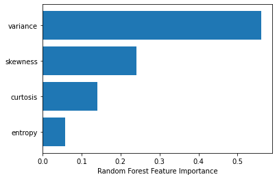

# Desafio2 -  Bootcamp IGTI: Engenheiro(a) de Machine Learning

**Este é o desafio do Módulo 2 - Modelos Preditivos e Séries Temporais, do Bootcamp de Engenheiro(a) de Machine Learning do IGTI. O objetivo deste desafio é exercitar conceitos apresentados durante o módulo, tais como análise exploratória de dados (EDA) e comparação e treinamento de modelos de classificação.**

## Dataset

**O dataset utilizado neste desafio é o "Banknote authentication", disponível no UCI Machine Learning Repository (https://archive.ics.uci.edu/ml/datasets/banknote+authentication). Este dataset consiste em atributos contínuos (variance, skewness, curtosis e entropy) extraídos de imagens de cédulas reais e falsificadas através de uma etapa de processamento de sinais (transformação de Wavelet), além da indicação se o exemplo é de uma cédula genuína (class = 0) ou falsificada (class = 1).**

## Atividades

**Os alunos deverão desempenhar as seguintes atividades:**
1. Acessar o ambiente Google Colaboratory (recomendado) ou qualquer ambiente de desenvolvimento em Python.
2. Carregar o dataset https://pycourse.s3.amazonaws.com/banknote_authentication.txt para análise utilizando o pandas.
3. Divida o dataset utilizando a função train_test_split, conforme:
    * Conjunto de treino (70%);
    * Conjunto de teste (30%);
    * random_state=1.
4. Utilize a variável “class” como saída e as demais como entrada dos modelos.
5. Para a implementação dos algoritmos, utilize as seguintes definições (do sklearn):
    * Algoritmo KNN:
        * clf_KNN = KNeighborsClassifier(n_neighbors=5)
    * Algoritmo Árvore de Decisão (Decision Tree):
        * clf_arvore = DecisionTreeClassifier(random_state=1)
    * Algoritmo Floresta Aleatória (Random Forest):
        * clf_floresta = RandomForestClassifier(max_depth=8, random_state=1)
    * Algoritmo SVM:
        * clf_svm = SVC(gamma='auto',kernel='rbf', random_state=1)
    * Algoritmo Rede MLP:
        * clf_mlp = MLPClassifier(hidden_layer_sizes=(2,), solver='lbfgs', random_state=1)
6. Treine os modelos com os dados de treino e avalie suas performances com os dados de teste. Utilize a acurácia como métrica de avaliação.
7. Responda às questões objetivas.


```python
# importação das libs
import pandas as pd 
import numpy as np 
import matplotlib.pyplot as plt
from sklearn.model_selection import train_test_split
from sklearn.neighbors import KNeighborsClassifier
from sklearn.tree import DecisionTreeClassifier
from sklearn.ensemble import RandomForestClassifier
from sklearn.svm import SVC
from sklearn.neural_network import MLPClassifier
from sklearn.metrics import accuracy_score
```


```python
link = "https://pycourse.s3.amazonaws.com/banknote_authentication.txt"
```


```python
df = pd.read_csv(link,header=None,names=['variance','skewness','curtosis','entropy','class'])
```


```python
df.head()
```


<div>
<style scoped>
    .dataframe tbody tr th:only-of-type {
        vertical-align: middle;
    }

    .dataframe tbody tr th {
        vertical-align: top;
    }

    .dataframe thead th {
        text-align: right;
    }
</style>
<table border="1" class="dataframe">
  <thead>
    <tr style="text-align: right;">
      <th></th>
      <th>variance</th>
      <th>skewness</th>
      <th>curtosis</th>
      <th>entropy</th>
      <th>class</th>
    </tr>
  </thead>
  <tbody>
    <tr>
      <th>0</th>
      <td>3.62160</td>
      <td>8.6661</td>
      <td>-2.8073</td>
      <td>-0.44699</td>
      <td>0</td>
    </tr>
    <tr>
      <th>1</th>
      <td>4.54590</td>
      <td>8.1674</td>
      <td>-2.4586</td>
      <td>-1.46210</td>
      <td>0</td>
    </tr>
    <tr>
      <th>2</th>
      <td>3.86600</td>
      <td>-2.6383</td>
      <td>1.9242</td>
      <td>0.10645</td>
      <td>0</td>
    </tr>
    <tr>
      <th>3</th>
      <td>3.45660</td>
      <td>9.5228</td>
      <td>-4.0112</td>
      <td>-3.59440</td>
      <td>0</td>
    </tr>
    <tr>
      <th>4</th>
      <td>0.32924</td>
      <td>-4.4552</td>
      <td>4.5718</td>
      <td>-0.98880</td>
      <td>0</td>
    </tr>
  </tbody>
</table>
</div>


### Qual o tamanho desse dataset (número de linhas, número de colunas)? 


```python
df.shape
```


    (1372, 5)


### Qual variável possui o maior range (diferença entre valor máximo e mínimo)? 


```python
df.describe()
#Skewness
```


<div>
<style scoped>
    .dataframe tbody tr th:only-of-type {
        vertical-align: middle;
    }

    .dataframe tbody tr th {
        vertical-align: top;
    }

    .dataframe thead th {
        text-align: right;
    }
</style>
<table border="1" class="dataframe">
  <thead>
    <tr style="text-align: right;">
      <th></th>
      <th>variance</th>
      <th>skewness</th>
      <th>curtosis</th>
      <th>entropy</th>
      <th>class</th>
    </tr>
  </thead>
  <tbody>
    <tr>
      <th>count</th>
      <td>1372.000000</td>
      <td>1372.000000</td>
      <td>1372.000000</td>
      <td>1372.000000</td>
      <td>1372.000000</td>
    </tr>
    <tr>
      <th>mean</th>
      <td>0.433735</td>
      <td>1.922353</td>
      <td>1.397627</td>
      <td>-1.191657</td>
      <td>0.444606</td>
    </tr>
    <tr>
      <th>std</th>
      <td>2.842763</td>
      <td>5.869047</td>
      <td>4.310030</td>
      <td>2.101013</td>
      <td>0.497103</td>
    </tr>
    <tr>
      <th>min</th>
      <td>-7.042100</td>
      <td>-13.773100</td>
      <td>-5.286100</td>
      <td>-8.548200</td>
      <td>0.000000</td>
    </tr>
    <tr>
      <th>25%</th>
      <td>-1.773000</td>
      <td>-1.708200</td>
      <td>-1.574975</td>
      <td>-2.413450</td>
      <td>0.000000</td>
    </tr>
    <tr>
      <th>50%</th>
      <td>0.496180</td>
      <td>2.319650</td>
      <td>0.616630</td>
      <td>-0.586650</td>
      <td>0.000000</td>
    </tr>
    <tr>
      <th>75%</th>
      <td>2.821475</td>
      <td>6.814625</td>
      <td>3.179250</td>
      <td>0.394810</td>
      <td>1.000000</td>
    </tr>
    <tr>
      <th>max</th>
      <td>6.824800</td>
      <td>12.951600</td>
      <td>17.927400</td>
      <td>2.449500</td>
      <td>1.000000</td>
    </tr>
  </tbody>
</table>
</div>


### Qual a média da coluna skewness? 

1.922353

### Qual a média da coluna entropy? 

-1.191657

Qual a mediana da coluna variance? 

0.496180

### Qual o desvio padrão da coluna curtosis? 

4.310030

### Qual a porcentagem de exemplos do dataset que são cédulas falsas (class=1)? 


```python
df['class'].value_counts() / df['class'].count() * 100
```


    0    55.539359
    1    44.460641
    Name: class, dtype: float64


### Qual o valor da correlação de Pearson entre as variáveis skewness e curtosis? 


```python
df[['skewness','curtosis']].corr(method='pearson')
```


<div>
<style scoped>
    .dataframe tbody tr th:only-of-type {
        vertical-align: middle;
    }

    .dataframe tbody tr th {
        vertical-align: top;
    }

    .dataframe thead th {
        text-align: right;
    }
</style>
<table border="1" class="dataframe">
  <thead>
    <tr style="text-align: right;">
      <th></th>
      <th>skewness</th>
      <th>curtosis</th>
    </tr>
  </thead>
  <tbody>
    <tr>
      <th>skewness</th>
      <td>1.000000</td>
      <td>-0.786895</td>
    </tr>
    <tr>
      <th>curtosis</th>
      <td>-0.786895</td>
      <td>1.000000</td>
    </tr>
  </tbody>
</table>
</div>


```python
X = df.drop('class', axis=1)
y = df['class']
```


```python
X_train, X_test, y_train, y_test = train_test_split(X, y, test_size=.30, random_state=1)
```


```python
X_train.shape, y_train.shape, X_test.shape, y_test.shape
```


    ((960, 4), (960,), (412, 4), (412,))


### Qual a acurácia do KNN no conjunto de teste? 

## a. Algoritmo KNN:


```python
n = 5
clf_KNN = KNeighborsClassifier(n_neighbors=n)
clf_KNN.fit(X_train,y_train)
```


    KNeighborsClassifier()


```python
y_pred_knn = clf_KNN.predict(X_test)
```


```python
Acc_knn = accuracy_score(y_test, y_pred_knn)
print(f'A acurácia para o modelo KNN é:{round(Acc_knn,5)}')
```

    A acurácia para o modelo KNN é:0.99757
    

## b. Algoritmo Árvore de Decisão (Decision Tree):


```python
clf_arvore = DecisionTreeClassifier(random_state=1)
clf_arvore.fit(X_train, y_train)
```


    DecisionTreeClassifier(random_state=1)


```python
y_pred_dtree = clf_arvore.predict(X_test)
```

### Qual a acurácia da Árvore de Decisão no conjunto de teste? 


```python
Acc_dtree = accuracy_score(y_test, y_pred_dtree)
print(f'A acurácia para o modelo KNN é:{round(Acc_dtree,5)}')
```

    A acurácia para o modelo KNN é:0.98786
    

## c. Algoritmo Floresta Aleatória (Random Forest):


```python
clf_floresta = RandomForestClassifier(max_depth=8, random_state=1)
clf_floresta.fit(X_train, y_train)
```


    RandomForestClassifier(max_depth=8, random_state=1)


```python
y_pred_rand_tree = clf_floresta.predict(X_test)
```

### Qual a acurácia do Random Forest no conjunto de teste? 


```python
Acc_rand_tree = accuracy_score(y_test, y_pred_rand_tree)
print(f'A acurácia para o modelo KNN é:{round(Acc_rand_tree,5)}')
```

    A acurácia para o modelo KNN é:0.99515
    

### Analisando o valor da importância relativa das features do Random Forest (atributo feature_importances_), qual feature melhor contribuiu para a predição de class? 


```python
feat_importances = clf_floresta.feature_importances_.argsort()
plt.barh(df.columns[feat_importances], clf_floresta.feature_importances_[feat_importances])
plt.xlabel('Random Forest Feature Importance')
```


    Text(0.5, 0, 'Random Forest Feature Importance')


    

    


### Qual o valor da importância relativa da feature skewness? 


```python
forest_importances = pd.Series(clf_floresta.feature_importances_, index=X_train.columns)
forest_importances
```


    variance    0.560667
    skewness    0.240586
    curtosis    0.140228
    entropy     0.058519
    dtype: float64


## d. Algoritmo SVM:


```python
clf_svm = SVC(gamma='auto',kernel='rbf', random_state=1)
clf_svm.fit(X_train,y_train)
```


    SVC(gamma='auto', random_state=1)


```python
y_pred_svm = clf_svm.predict(X_test)
```

### Qual a acurácia do SVM no conjunto de teste? 


```python
Acc_svm = accuracy_score(y_test, y_pred_svm)
print(f'A acurácia para o modelo KNN é:{round(Acc_svm,5)}')
```

    A acurácia para o modelo KNN é:1.0
    

## e. Algoritmo Rede MLP:


```python
clf_mlp = MLPClassifier(hidden_layer_sizes=(2,),
solver='lbfgs',
random_state=1)
clf_mlp.fit(X_train, y_train)

```


    MLPClassifier(hidden_layer_sizes=(2,), random_state=1, solver='lbfgs')


```python
y_pred_mlp = clf_mlp.predict(X_test)
```

### Qual a acurácia da rede MLP no conjunto de teste? 


```python
Acc_mpl = accuracy_score(y_test, y_pred_mlp)
print(f'A acurácia para o modelo KNN é:{round(Acc_mpl,5)}')
```

    A acurácia para o modelo KNN é:1.0
    


```python

```
